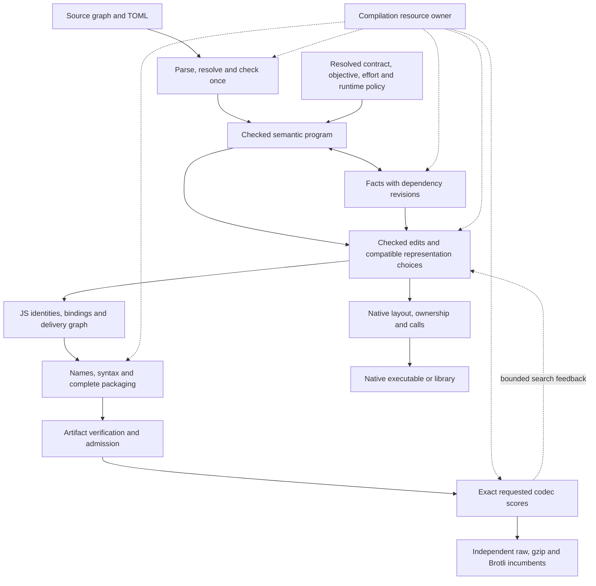

# LilScript: proposed compiler and language design

Revision: 2026-09-18, after the owner's design reset. This is the **single target architecture**; [migration/index.md](migration/index.md) is its only implementation coordinator. This is a proposal with testable contracts, not a claim of implementation or approval of unsettled language behavior. Existing code may be reused where it satisfies these contracts.

## Objective

Make LilScript exceptionally compression-friendly when compiling libraries and applications to JavaScript, aiming for world-leading results, particularly Brotli. For **each maintained equivalent library and each objective**, the release build must be no larger than the strongest eligible pinned competitor. Report raw, gzip and Brotli separately; choose separate artifacts. Aim to win almost always; the numerical strict-win threshold remains open. A finite corpus cannot establish superiority over every future program or tool.

Correctness, public APIs and complete library tests are mandatory. Count complete delivery: adapters, helpers, initialization and required dependencies. Preserve native executable/library support; native size is secondary. TOML controls compilation effort, memory and permitted implementation behaviors. Extra compiler effort and extra runtime work are distinct choices. Search intelligently within limits; a globally smallest compressed program is not promised. Exact old bytes are unnecessary. Package-specific patches do not meet the objective.

## Decisions and scope

| ID | Status | Contract or decision |
|---|---|---|
| D1 | Owner chose | Value structs; mutation of caller storage requires explicit mutable references. Flattening is an implementation, not assignment semantics. |
| D2 | Owner chose 2026-09-20 | Primary public-JS model: **explicitly declared boundaries around typed internals, with compatible adapters**. Each public surface declares its boundary; the adapter preserves the observations that boundary's callers already rely on — identity, mutation, enumeration, descriptors, serialization, callback retention and function observations. Types alone still do not establish privacy, and an undeclared surface keeps its existing supported observations. |
| D3 | Settled 2026-09-20 under the delegated resource policy; wording below | Preserve results, explicit throws, argument errors, host effects and divergence. Engine-dependent OOM/string-cap/stack-exhaustion timing need not match. Track resource risk and configured limits. This permits neither unbounded evaluation nor removing ordinary exceptions. The exact clauses are in *D3 in full* below. |
| D4 | Owner chose; threshold provisional 2026-09-20 | Independent raw/gzip/Brotli objectives and no per-row losses against eligible competitors. **Provisional strict-win threshold: 100 bytes or 1% of the competitor, whichever is larger.** It is the measured Brotli noise floor (about +/-100 bytes per rename), so a win under it survives re-measurement. No cell measured on 2026-09-20 lies inside that margin, so the threshold changes no current verdict; it is recorded as a choice and is cheap to revise. |
| D5 | Flag model adopted per owner guidance 2026-09-20; level 16 kept as a documented grant | Family flags permit or forbid exploration; enabling a family never forces its representation. Effort must not silently alter language/host assumptions or runtime-risk permissions. **Level 16** is the one level that grants startup-risk tactics their risk permission implicitly (`compilation_policy.rs`, `startup_at_level_16`). No maintained port uses it — nineteen set level 15 and eight set level 13 — so it is kept, unchanged, as an explicit and documented grant rather than a silent one: level 16 means level 15 plus startup-risk permission for the tactics that declare it, overridable per tactic under `[policy.tactics]`. New ports grant runtime risk through tactic permissions, not through effort. |

### D2 for value structs

Inside an artifact a value struct is whatever representation the compiler chooses: positional storage, scalars in locals, or fields passed as separate arguments. At a declared public boundary it is one documented shape. Milestone 006 implements this adapter for JavaScript ([javascript_public_structs.rs](../src/semantic_program/javascript_public_structs.rs)).

| Rule | Contract |
|---|---|
| Public shape | A plain object whose own enumerable data properties are the struct's fields in declaration order, with the ordinary object prototype. Nested structs are nested objects. `__proto__` as a field name is defined as data, never as a prototype. |
| Results | Every public return builds a fresh object. A caller that mutates it cannot reach internal storage. |
| Arguments | An incoming object is read once per field, depth first in declaration order, when the call starts; later mutation by the caller is not observed. A getter runs exactly once. A missing object throws the host's `TypeError` before the body runs. |
| Components | Field values transfer raw, as every adapter does. The body keeps its own normalization, so an ill-typed `int` field behaves as it would reaching an `int` parameter directly. |
| Reflection | The published function keeps the source function's `name` (not the export alias, as in JavaScript), its `length` and its callable kind (a declared function stays constructible). One source function exported under two names is one identity. |
| Refused | A struct inside an array, map, set, record, callable, union or nullable at the boundary; a generic struct instance; a struct parameter with a default; a function body that observes `this` or `arguments`. Each needs identity, aliasing or frame behavior a copying adapter cannot give. The refusal names the feature; there is no fallback. |

The wrapper and its codecs are hoisted declarations, so a wrapper reached through a module cycle before the module finishes evaluating behaves like the source declaration. Byte cost is paid only by exports whose signatures carry structs; the private function loses its now-unobservable name.

### D3 in full

Each clause is stated so it can become an executable case; clauses already exercised by 002's boundary table say so.

| Clause | Rule | Executable today |
|---|---|---|
| D3.1 Results | A terminating program produces the same result value on every target and at every effort. | 72-case census (`.out` equality), JS and C |
| D3.2 Explicit throws | An ordinary `throw`, including one raised inside a caller's accessor or callback, reaches the same handler with the same constructor, message and payload identity. | Boundary table: `d3/throws/*` |
| D3.3 Argument errors | An argument error a boundary raises for unusable input is the error upstream raises, at the same point, before the same effects. | Boundary table: `d3/errors/unknown-node-type` |
| D3.4 Host effects | Reads of caller accessors, writes to caller objects, host calls and console output occur in source order, each as many times as the source performs it. Coercions (`valueOf`, `toString`, `Symbol.toPrimitive`) and getters are effects. | Boundary table: `d3/effects/*` (read order) |
| D3.5 Short-circuiting | `&&`, `\|\|`, `??`, `?.` and conditional operands are evaluated only when the source evaluates them. | Census |
| D3.6 Divergence | A program that does not terminate still does not terminate; one that terminates still does. The compiler never evaluates a loop or recursion at compile time without a configured bound. | `d3_clause_tests::d3_6_*`: a diverging call still diverges with its result unused; recursion over constants is not evaluated while compiling |
| D3.7 Initialization | Module-level initialization runs once, in dependency order, before the first observable use; a read before initialization throws where the source would. | `d3_clause_tests::d3_7_*`: initialization runs once, in order; an early read is refused while checking |
| D3.8 Async and suspension | Settlement order of promises and the interleaving points of `await` and generators are preserved. | `d3_clause_tests::d3_8_*`: generator and `await` interleavings run in source order; native refuses suspension |
| D3.9 Frames | Script, strict and module frames are distinct: a closed world alone never implies strict mode, and `this`, `arguments` and sloppy-mode globals keep their frame's meaning. | `d3_clause_tests::d3_9_*`: `this` is the global object in a sloppy script and `undefined` in a module; a script frame needing strict mode is refused |
| D3.10 Resources | Exhausting memory, string length or stack is engine-dependent in *when* it happens and need not match; a program that stays within the configured limits must not start exhausting them. Every transformation that can increase peak memory, recursion depth or string size records that risk. | `d3_clause_tests::d3_10_*`: recursion 5,000 deep runs; helper inlining refuses a recursive helper |

D3.6-D3.10 each have a positive and a refusal case since 007 (`src/semantic_program/d3_clause_tests.rs`), run on the semantic route. A family that could affect one of them must keep its case passing before it is enabled by default.

**Owner guidance, 2026-09-20 — be pragmatic about strategies.** Optimization is not deterministic: a strategy that is better on average is often worse for some libraries, and the compiler's decisions are already controllable per port through `lilscript.toml`. So two different questions get two different rules. A *strategy default* is adopted when it wins on the fleet average; a library it hurts sets its own flag, and that loss is a tuning task for the library rather than a veto on the default. A *qualification cell* is still judged per library, but with that library's best configuration, not with whatever the default happens to be. This supports D5's model — flags permit or forbid a family, per port — without deciding D5's remaining questions.

Step 002 settles nested/generic/nullable copies, reference lifetimes and escape, callback retention, object identity, reflection, serialization and public function observations. Use Motion's mutating helpers and Micromark's snapshots with their actual callers. An unanswered design choice stays visible; independent baseline/tool work can proceed. Every currently supported source feature and delivery mode enters the support inventory. Narrowing an API cannot become an unrecorded compression win.

## Architecture

The fast route follows the same boxes with a small work schedule. Higher effort expands analysis and compatible alternatives. Native shares language meaning and relevant analysis, without JS codec search. The target tree exists to enforce JS binding, grammar and delivery invariants. Additional representations require demonstrated value.

### A1 — One owner of language meaning

`SemanticProgram` owns stable module/unit/value/place/field/call identities, checked types, evaluation order, captures, ownership/alias relationships, completion and boundary obligations. Mutable storage and computed values are distinct. Optimizers never recover language knowledge from emitted names. Retained frontend syntax may support diagnostics, but cannot become a second mutable semantic authority.

Immutable units and shared tables let candidates share unchanged work. Start with measured unit-granularity copying; refine it only when real edit workloads justify the complexity. Views, indexes and lowered target structures have declared owners and lifetimes. A pass needing existing CFG machinery must justify its lowering and information transport, not add a round trip by convenience.

### A2 — Facts describe meaning independently of output

`Fact<T> = Known(T, dependencies) | Unknown(reason) | Truncated(limit)`. Dependencies include semantic revisions and the observation/host contract. Exact strings may use bounded symbolic construction. Knowing a string can prove a branch while leaving computation, literal, pooling and reconstruction available as output alternatives.

Effects distinguish reads, writes, allocation/identity, throwing, divergence, reentry, suspension and control transfer. Separate queries answer `can_discard`, `can_duplicate`, `can_move(across, context)` and `can_speculate(context)`. No-write alone proves none of these. Unknown host calls/getters remain conservative. [MLIR's rationale](https://mlir.llvm.org/docs/Rationale/SideEffectsAndSpeculation/) likewise separates memory effects and speculation; using MLIR is not required.

### A3 — One edit and invalidation protocol

`EditBatch` carries expected revisions, fact dependencies, typed changes and changed domains. One owner validates legality, commits atomically, updates use/capture/module indexes and invalidates dependent facts. Failure or resource refusal publishes nothing. Unchanged analyses and units remain reusable.

Distinguish `SourceChange` from `EquivalentRewrite`. A user edit can intentionally change a result and creates a new semantic revision. An optimization additionally carries its rule/family's equivalence conditions for the exact old operations and evaluation context; the owner checks those preconditions before publication. Well-typed code and fresh facts alone do not establish equivalence. Candidates from different source meanings cannot compete as interchangeable implementations. This distinction uses the same transaction owner, without requiring a general theorem prover.

Semantic and target edits use the same protocol with domain-specific validators, not identical node types. Optimizations get no direct mutation escape hatch. Cache keys include relevant source, contract and analysis bounds; stronger cached analysis must not silently strengthen a lower-effort request. Compare incremental results with full recomputation, including callers affected by local edits.

### A4 — Compatible alternatives

`Choice` identifies its semantic component, implementation, required facts, affected producers/consumers, dependencies/conflicts and runtime-risk evidence. `Candidate` references a semantic revision and immutable compatible assignments, sharing unchanged storage. Identity follows checked content/choices, never allocation addresses or emitted names.

Candidates include scalar/object layouts; shared/inline helpers; computation/literal/shared-data/reconstruction. Change all affected consumers, captures and adapters together, or reject the choice. Combining choices may expose new opportunities. Permit locally worse candidates within bounded search because combinations can win. Each family supplies eligibility, alternatives and lowering through common interfaces. This does not require an exhaustive Cartesian product, universal e-graph or independent solver for each optimization.

### A5 — Target identities and complete delivery

`TargetProgram` owns bindings, properties, scopes, target syntax constraints and ordered effects. `DeliveryPlan` owns entrypoints, public adapters, imports/exports, helpers, chunks/resources and initialization dependencies. Name allocation uses these identities. Public names stay fixed unless the API contract permits changing them.

Names, helper placement, grammar and packaging are finalized before scoring. Chunk naming/hash/manifest finalization must terminate deterministically. Final artifacts are immutable: scored bytes equal delivered bytes. Independent JS parsing validates output; it is not a recurring mechanism for recovering language knowledge from generated text.

### A6 — One artifact authority and bounded search

`ArtifactRecord` binds source, contract, policy, complete recipe, artifact/dependency hashes and exact scores. One admission function checks obligations, enabled families, target/ABI validity and runtime constraints on **direct, edited, replayed and searched outputs**. Unknown runtime cost is not zero and cannot satisfy a required numeric limit. Static estimates and runtime measurements remain distinct evidence types.

Start with a valid direct artifact. Optional replacements must pass validation and exact requested-codec measurement. Retain independent raw/gzip/Brotli incumbents; never select by an average. Larger raw output may win Brotli unless an explicit raw constraint forbids it. Compress independent delivery files independently unless transport actually shares a stream. Count required manifests/resources under a frozen delivery definition.

Cheap estimates order work; bounded beams, combination search and diversity explore it; caches and artifact deduplication avoid repeated work. Exact codecs decide final winners. Heuristic pruning is not a proof of optimality. Charge failed proposals, discovery and proof work. Do not key heuristics on library names or benchmark inputs.

Resource ownership begins before parsing and includes discovery, checking, conversion, analyses, edits, rendering, codecs, queues, scratch, retained memory and concurrent reservations. Logical allocation accounting is not process RSS; measure both. Cancellation releases scratch and returns an admitted incumbent if available; baseline failure is an explicit resource error. Cooperative deadlines do not claim hard process guarantees. OS isolation may enforce hard time/RSS ceilings while compiler-owned stages acquire accounting coverage.

Incumbents never worsen within a resumed search under the same contract/schedule. A fresh larger-budget search may explore a different set. Effort presets must preserve lower-effort incumbents through replay/continuation or disclose and test a weaker guarantee. Deterministic work caps, stable tie-breaking and seeds enable reproducibility; time cutoffs may change the last explored candidate.

### A7 — Configuration and useful fast compilation

Resolve TOML once into the following independent axes. These are concepts, **not a newly implemented TOML schema**; 003 defines the compatible public schema.

| Axis | Controls |
|---|---|
| Contract | Language/host assumptions, API observations, target syntax, delivery |
| Objective | Raw, gzip or Brotli, with pinned codec settings |
| Effort/resources | Analysis work, candidates, codec calls, time, memory, concurrency |
| Family permissions | `auto/on/off`: scalarization, inlining, sharing, pooling, packing, reconstruction, mangling and other registered families |
| Runtime constraints | Startup, recurring work, allocation/memory limits, and unknown handling |

Explicit `off` is a hard veto on that optional transformation in direct lowering and search. Required semantic/ABI lowering remains available: source literals still emit when folding is off, necessary adapters still exist when optional helper sharing is off, and ordinary name allocation still creates legal temporary identifiers. The family registry records mandatory versus optional provenance so “required lowering” cannot conceal an optional optimization. `on` grants permission, not safety or profitability. Turning folding off does not erase exact-value facts needed elsewhere. Log stripping and pristine-builtin assumptions belong to the contract, not effort. Native ignores JS-only objectives. Unknown keys/conflicts require diagnostics; every flag has an owner and a behavior test.

The fast path avoids optional search/repeated global scans, demands useful facts and uses the same verifier. High effort reuses its result. Phase timings, whole-library compile costs, allocation/reuse counters and comparable output quality must establish speed improvements. Layer count alone proves nothing.

## Compression capabilities to preserve and exceed

These are our proposed mappings, informed by upstream documentation reviewed on 2026-09-18. They do not establish parity or wins; 001 pins competitor recipes and 013 measures outcomes.

| Capability and primary reference | Our mechanism | Proof stages |
|---|---|---|
| Reduction, inlining, joins, conditions, sequences, repeated passes: [Terser options](https://terser.org/docs/options/) | Demand-driven facts, checked edits and target compaction; retain alternatives when codec-sensitive | 004, 008, 009 |
| DCE, shorter/repetitive syntax, variable/property mangling: [Oxc minifier](https://oxc.rs/docs/guide/usage/minifier) | Cheap cleanup and hygienic target bindings/property allocation | 005, 008 |
| Scope hoisting and module DCE: [Rolldown bundling](https://rolldown.rs/in-depth/why-bundlers), [effects](https://rolldown.rs/in-depth/dead-code-elimination) | Rooted module liveness, initialization graph, explicit host effects, delivery planning | 008, 011 |
| Global renaming, DCE, inlining and external boundaries: [Closure ADVANCED](https://developers.google.com/closure/compiler/docs/api-tutorial3) | Typed ownership/call facts, specialization, scalarization, public adapters | 006–009 |
| Codec-dependent interactions beyond local byte counts | Compatible recipes, naming/layout/data alternatives, exact full-artifact winners | 006, 010, 013 |

Simple spelling tricks are ordinary checked target rewrites. Packing, outlining, merging, specialization and bounded expression search use the same family interfaces and cost permissions. Reusable correctness and measured benefit determine inclusion, not novelty or complexity.

## Integrated architectural test

Before the broad rewrite, compile one program combining a value struct and mutable-reference helper, closure capture, a throwing path, a public API adapter and a computed string. Through the public compilation service, exercise scalar/object and inline/shared choices; computation/literal/shared-data choices; combinations with final naming/packaging; JS/native observations; per-codec selection; flag vetoes; tiny-budget fallback; and local-edit reuse verified against full recomputation. Negative cases must prevent illegal flattening, movement and sharing.

Repeat relevant cases on maintained libraries. A fixture proves interfaces, not fleet support, compression or speed. **006 must stop expansion and revise the design** if integration needs special-case drivers, bypassed admission or duplicate fact owners.

## Current evidence and navigation

Inspect `src/compiler.rs`, `src/lib.rs`, `src/main.rs`, `src/semantic_program/{mod,facts,publication,implementations,search}.rs`, `src/structured_js/`, `src/{config,compilation_policy}.rs` and `examples/semantic-integrated.rs`. They contain useful mechanisms/tests. Prepared-output naming selection and broader semantic recipe search already exist separately. The public production route still uses the legacy CFG pipeline. Direct/edit admission and frontend resource accounting have gaps; the example driver does not establish production integration. See [current status](current-status.md).

Use [migration/index.md](migration/index.md) for progress. Old plans remain retired under `/home/azureuser/lilscript-planning-archive/2026-09-18-reset`; do not load them as implementation authority. `/home/azureuser/compiler-design.md` points here. Keep large receipts in benchmark output storage, outside these context packets.
