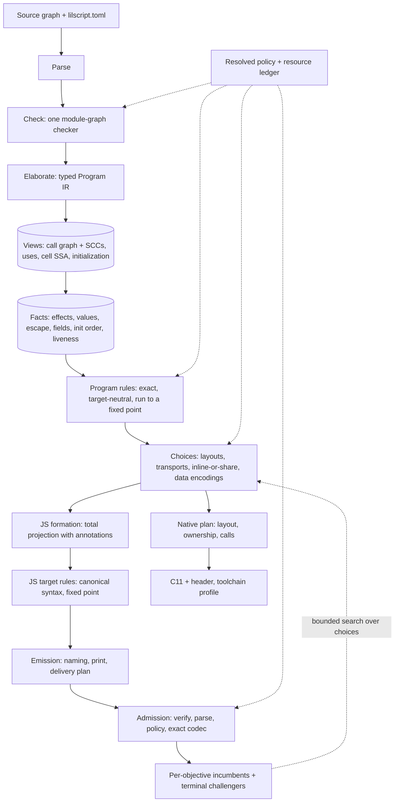

# LilScript: one compiler, designed for size

Revision 2026-09-23. **This is the architecture of the LilScript compiler and the size-relevant parts of the language.** It supersedes `docs/compiler-design.md` (2026-09-18), whose owner decisions D1–D5 and contracts A1–A7 are carried here unchanged in meaning (appendix A and §4). [migration/index.md](migration/index.md) is the only plan for reaching it. Owner briefs: [finer/intent/2026-09-23.md](../finer/intent/2026-09-23.md).

The design is written from a full read of the codebase on 2026-09-23. That was eleven area reports, kept at `~/lilscript-work/out/arch/*.md` with file-and-line evidence. Where this document states a fact about today's code, the reports hold the citation.

---

## 1. The answer in one screen

- **There is one compiler.** Two complete compilers currently share one binary behind `[compiler] backend` / `--backend`. That distinction ends: the plan deletes one of them and removes the switch.
- **What "legacy" was.** It is the first compiler, dated 2026-08-05: a typed CFG/SSA IR, an IR optimizer, an emitter that prints strings, a 47.7K-line text peephole that re-parses its own output, and a search that re-emits the whole program 267–381 times per build.
  - It is well engineered in its algorithms: effect summaries, escape analysis, value ranges, parameter and return optimization, inlining, and function folding. Its typed optimization is still ahead on small programs.
  - Its architecture throws facts away at the print boundary and guesses them back from text. That seam produced every wrong program it shipped, and its search had saturated.
- **What "semantic" was.** It is the replacement the 2026-09-18 reset chose.
  - It has a checked, typed, region-structured program model with stable identities, a verifier on every edit, a structured JS target tree that cannot capture names, and exact codec selection.
  - It is 3–12× faster per candidate, has zero miscompiles on the census, and is ahead on the maintained libraries: 11 of 13 beat their original minified builds.
  - It has not yet realized typed interprocedural optimization, so small closed programs still compile smaller on the old route.
- **The future compiler is the second architecture, carrying the first one's algorithms.**
  - Every typed optimization the old route had is rebuilt as a fact and a rule on the program model, where both JavaScript and native C benefit. The migration plan lists them one by one.
  - The old code is deleted. It is read as prior art, never linked.
  - A frozen reference binary keeps its numbers measurable, as "the first bar to clear".
- **After the migration**, "backend" means a *target* (JavaScript or native C) and nothing else. The words "legacy route" and "semantic route" appear only in history.

---

## 2. What the compiler is for

**Objective.** For each maintained library and each selected objective, deliver the smallest correct program. The objectives are:
- Brotli, the primary one;
- gzip;
- raw bytes.

It must beat the strongest pinned competitor: Terser, Oxc/Rolldown, esbuild, SWC and Google Closure Compiler ADVANCED.

**Other requirements.**
- The public API and every behavior are preserved (D3), and complete delivery is counted (A5).
- The same checked program also compiles to portable native C, with identical results (cross-target).
- Search aims at as global an optimum as the configured compile budget allows. No finite search is promised optimal.
- Numeric strict-win threshold (D4, provisional): 100 bytes or 1% of the competitor, whichever is larger.

**Standing rules from the owner.**
- No accepted losses.
- Generic changes only, never keyed to a library.
- By design, never glued.
- Size over runtime speed, unless a contract says otherwise.
- Single host, no worker pool.
- The delivered file must be the compiler's own artifact: no post-minifier.

---

## 3. Design laws

Each law exists because the codebase's history measured what happens without it.

| # | Law | Why (evidence) |
|---|---|---|
| L1 | **One owner per fact.** Meaning is decided once, on typed identities, and never recovered from names, spellings or emitted text | The old route's text peephole produced at least six wrong programs by reasoning over mangled tokens. Today's tree passes hold four effect models, five value-domain authorities and five initialization owners that can disagree |
| L2 | **Decide where the knowledge is.** Meaning-level optimizations run on the program; the JavaScript tree owns syntax, spelling, naming and delivery | 009–013 put whole-program optimizations on the JS tree. There they re-derive legality from syntax, and native C gets none of them |
| L3 | **Remove operations by rule; choose spellings by codec** | All 13 of Closure's late peepholes: −13,197 raw, **+930** Brotli. Terser's local compressor over our output: −15,776 raw, −8 Brotli. Rules that remove calls, fields, branches and arguments pay under every codec |
| L4 | **Emit canonical forms; never un-emit** | Formation emits shapes that later passes pattern-match back, in five known pairs. The first migration's diagnosis: 84 of 142 folds existed only to undo the emitter |
| L5 | **Facts live on the nodes that use them** | Side tables keyed by expression ids need nine hand remaps in formation; a missed remap silently drops a decision (live-16) |
| L6 | **Every optional transformation is a registered family** with a written legality condition, an `off` veto, provenance, and a veto lane in the tests | One umbrella tactic (`TargetCompaction`) hides about 35 passes today; `inlining = false` changes nothing |
| L7 | **Selection is monotone** | Chaotic plan choice moved fleet results by ±50–400 bytes per port. A change is kept only when the exact codec, on the final artifact, says the artifact shrank |
| L8 | **Budgets, not magic constants.** Estimators order work; codecs decide | Inline limit 6, table thresholds 64 / 0.85, rounds 3 and 4, and pooling that assumes 2-character names were each tuned against three ports, inside the measurement noise |
| L9 | **The language states what the compiler must not guess** | Typed ports compile smaller; untyped `JsValue` transliterations lose. `pure`, nominal identity and boundaries are facts the author knows |
| L10 | **One meaning, several targets** | The same checked program feeds JavaScript and C. Target plans choose representation, never semantics |
| L11 | **Verification is part of the pipeline** | Structural verification after every edit batch, an independent parse of every delivered file, and stdout/trace oracles that never come from the compiler under test |
| L12 | **Per-library configuration is contract, objective, effort and permission, nothing else** | Per-port strategy flags turned fleet noise into configuration (react-markdownlil gained −2,287 Brotli by flipping an unexplained flag). A legal strategy is the codec's per-artifact choice |
| L13 | **A typed form never costs more than its untyped equivalent** | The ports' winning rewrites deleted 98 structs and added 50 untyped "views" because typed forms cost bytes (`\|0`, decode copies, `??null`, double initialization). Types are how authors hand the compiler facts |

---

## 4. Contracts carried from the 2026-09-18 design

These are unchanged in meaning; appendix A has D1–D5 verbatim.

| ID | Contract |
|---|---|
| A1 | One owner of language meaning: the checked program. Syntax is dropped after checking. Optimizers never recover language knowledge from emitted names |
| A2 | Facts describe meaning independently of output: `Known(T, deps) \| Unknown(reason) \| Truncated(limit)`. Separate queries: `can_discard`, `can_duplicate`, `can_move(across, context)`, `can_speculate` |
| A3 | One edit protocol: atomic batches with expected revisions, verification and dependent invalidation. `SourceChange` differs from `EquivalentRewrite`. No optimization mutates outside it |
| A4 | Compatible alternatives: a choice changes all affected producers, consumers, captures and adapters together, or is rejected. Candidates share unchanged storage |
| A5 | Target identities and complete delivery: names, helpers, grammar and packaging are final before scoring. Scored bytes are delivered bytes. An independent parse validates output |
| A6 | One artifact authority and bounded search: one admission function for direct, edited, replayed and searched outputs; exact requested-codec scores; independent raw/gzip/Brotli incumbents; a resource owner from the first byte |
| A7 | Configuration is independent axes: contract, objective, effort and resources, family permissions, runtime constraints. `off` is a hard veto; `on` permits and never forces |

---

## 5. The pipeline



| Stage | Owns | Must not |
|---|---|---|
| **Parse** | Tokens, syntax, spans, node ids on every identifier, declaration and statement | Carry linker or optimizer data |
| **Check** | Name resolution by identity, types, nominal ids for every nominal kind, definite initialization, checked `pure`, operator meaning, boundary and frame contracts (D2, D3.9) against the requested targets | Be entered twice with different phase orders |
| **Elaborate** | Converting checked syntax once into the Program IR; the syntax is then dropped | Re-derive what the checker decided |
| **Views and facts** | Derived, revision-keyed analyses. Each fact has one owner | Be edited directly; exist twice |
| **Program rules** | Operation-removing, meaning-level optimizations, exact under the contract, shared by every target | Depend on a codec or a target |
| **Choices** | Representation alternatives whose value depends on the objective or the target | Change meaning |
| **JS formation** | A total, deterministic projection to the JS tree, applying chosen recipes and writing annotations | Optimize; emit a shape a later pass must undo |
| **JS target rules** | Canonical JS syntax: expression forming, declaration merging, typed operator algebra, literal folds | Reason about effects or identity beyond node annotations |
| **Emission** | Naming, pure printing, delivery plan (files, chunks, adapters, manifest) | Change structure at print time |
| **Admission and selection** | Verification, the independent parse, policy admission, exact codec scores, incumbents, challengers | Depend on a score for legality |
| **Native plan** | C layout, ownership, calling convention, helpers, ABI; the writer only spells | Run a codec search |

---

## 6. The Program IR

The Program IR is today's `SemanticProgram`, kept as **the one optimizer IR**, with its identities repaired.

**Shape (kept).**
- **Units:** module initializers, functions and closures.
- **Operations:** each unit holds ordered operations in nested **regions** (`If`, `Loop{test, body, update}`, `Try`, `Block`, `ShortCircuit`, `Select`, `ForIn`, `ForOf`).
- **Values:** each has one definition, scoped like nested-region SSA.
- **Cells:** mutable storage, captures and references. Merges go through cells.
- **Places:** a cell, a value, a field, a member or an index.
- **Calls:** split into prepare and call, with an explicit target and a checked contract.
- **Frozen units:** shared through `Arc`, so candidates copy only what they edit.

It maps 1:1 to structured JavaScript and to C. **There is no CFG.** A CFG forced the old route to re-structure its output with a relooper, expression reconstruction from phis, a state-machine fallback and a text peephole to repair the result.

**Identities (repaired).**

| Today | Target |
|---|---|
| Classes and enums identified by name (`Type::Class(&str)`); class fields lowered to name-keyed members; class instances as anonymous objects | `NominalId` for every nominal kind (struct, class, enum, extern class, object). Every field access is a `FieldRef{nominal, slot}`. Allocations carry their nominal |
| `JsValue` encoded as `TypeParameter("$js")` | A first-class `Type::JsValue`; type parameters by id; interned types without source lifetimes |
| `this`/`arguments`/`debugLog` recognized by cell name | `CellBinding::Ambient(This \| Arguments)`; declared effect classes on declarations (`pure`, `debug`) |
| Standard globals recognized by spelling on the tree | One operation catalog: each builtin and host global has an identity, a signature, an effect class, a fold function and JS and C spellings |
| Method-ness recovered from cell arena order | `UnitData.origin = ClassMethod{nominal} \| Function \| Closure \| ModuleInit` |

**Derived views.** They are computed on demand, keyed by unit revision, and never edited:
- the `UseIndex` (kept, incremental);
- the **call graph** with SCCs, generalized from `CallableInputs`. It holds the complete call set per private unit, value calls resolved to sealed producers, and the address-taken set;
- **cell SSA**: reaching definitions for promotable locals, for flow-sensitive rules;
- **initialization**: structured dominance plus module order.

---

## 7. Facts

```rust
enum Fact<T> { Known(T, Deps), Unknown(Reason), Truncated(Limit) }
struct Deps { units: SmallVec<[(UnitId, RevisionId); 4]>, tables: RevisionId, contract: ContractFingerprint }
```

One region-structured dataflow framework runs forward and backward over regions, with loop fixed points and widening. It is interprocedural through call-graph SCC summaries.

| Fact | Content | Replaces (today's duplicates) | Unlocks |
|---|---|---|---|
| **Effects** | Per operation and per unit: reads and writes by region (cells, own allocations, fields, host), may throw, may diverge, runs user code, creates identity, reenters, suspends. Also parameter mutation and retention | `facts.rs` (every call unknown), `demand.rs`'s private model, `helper_family`'s composition, `structured_js/analysis.rs`, `quiet.rs`, `inline.rs:inert` | Removing discarded pure calls, argument motion, forwarding past calls, dead stores, the `pure` contract check |
| **Values** | One lattice: exact ⊂ finite set (≤4) ⊂ int32 range ⊂ primitive class ⊂ unknown. Held per value, per formal (joined over complete call sets), per result, and per `(nominal, slot)` | `facts.rs` exact values, `raw_domains`, `javascript_int32`, `NumberFacts`, `binding_classes`, `simplify::known` | Folded branches, constant arguments and fields, `\|0` elision, typed peepholes |
| **Escape** | Per allocation site: local < typed < host | none today on this compiler | Scalar replacement, layout choice, positional classes, native stack storage |
| **Field facts** | Per `(nominal, slot)`: whether it is read, the join of written values, and whether it is host-reachable, reflective or part of an exported shape | none | Dead fields, constant fields, typed property renaming, ambiguation |
| **Initialization order** | Per root binding, the statement that settles it; per function, "not invoked before root statement S" | five owners, including the tree's syntactic `quiet.rs` order and its body-shape "factory" rule | Root constants, aliases, namespace collapse, TDZ guards in C |
| **Liveness** | Demand's observation lattice, mark and sweep | JS-only `DemandPlan` | DCE for both targets |

**Termination (D3.6).** A call may be removed as effect-free only when it also terminates.
- A **declared** `pure` function or `pure extern` asserts termination as part of its contract. This is Closure's `@nosideeffects` and Terser's `pure_funcs`, made a checked language declaration.
- An **inferred** effect-free function counts as terminating only with a proof: no loops without a counted bound, and no recursion outside a proven-terminating SCC.
- The old route assumed termination and removed a call that never returns. That is exactly what this rule forbids.

**Publication to targets.** Formation writes the facts JS rules need onto tree nodes (§10). The native plan reads them from the program. No fact is recomputed from JavaScript syntax.

---

## 8. Edits and the rule scheduler

**Program edits.** The existing transaction is kept: expected revisions, prepare, apply, verify, incremental `UseIndex` update, and commit with undo. Its vocabulary grows so an optimization can be expressed:

```rust
enum Edit { ReplaceOp, InsertOps{region, at, ops}, RemoveOps{..}, SpliceInline{call, body, remap},
            CloneUnit{..}, DeleteUnit, ChangeSignature{unit, drop, constant, drop_result},
            RetypeAllocation{site, layout}, ReplacePlace }
struct EditBatch { expected: Vec<(UnitId, RevisionId)>, meaning: SourceChange | EquivalentRewrite(RuleId), edits: Vec<Edit> }
```

**Target edits.** Every JS tree mutation goes through typed helpers that journal the nodes they removed and added and the functions they dirtied. This is Oxc's `PassChanges`. Annotation columns move with the arena's own renumbering, so no caller remaps anything. Debug builds check that the journal equals the actual difference.

**Scheduler.** One scheduler serves both levels:
- Rules declare the facts they read, the domains they change, and whether they are fact-free or fact-driven.
- A worklist runs `(rule, dirty unit)` pairs until the journal is empty or the budget ends.
- Every rule decreases a declared measure, such as the operation count, and debug builds assert it.
- The verifier runs after each rule set in debug builds and in the case runner.
- The low-effort path runs only the fact-free and removal rules.

This replaces the hand-ordered chain of about 40 calls in `javascript.rs:663-966`, with repeats written by hand. It is Closure's PhaseOptimizer and Oxc's `run_in_loop`, driven by an edit journal instead of an AST-size proxy.

**Program rules.** These are exact, operation-removing, target-neutral, and one owner each:

| Rule | Closure / old-route counterpart | Needs |
|---|---|---|
| Dead code (values, units, cells) | RemoveUnusedCode | Liveness |
| Discarded effect-free calls | PureFunctionIdentifier + PeepholeRemoveDeadCode | Effects, termination |
| Unused and constant parameters; unused results | OptimizeParameters, OptimizeReturns | Complete call sets, effects |
| Root constants and build-time defines | InlineVariables, InferConsts, ProcessDefines | Initialization order |
| Direct and block inlining, including runtime adapters | InlineFunctions, J2CL adapter inlining | Effects, call counts, SCCs, the splice edit |
| Known-closure calls, constant-capture cloning | old route (beyond Closure) | Call graph |
| Namespace collapse; devirtualization of emulated method tables | CollapseProperties, DevirtualizeMethods (made sound) | Initialization order, allocation identity |
| Dead and constant fields; dead stores | RemoveUnusedCode (properties), InlineProperties, DeadPropertyAssignmentElimination | Field facts |
| Construction fused into a literal | OptimizeConstructors (old route: constructor bodies at `new`) | Field facts, escape |
| Constant folding, branch folding, value-range normalization elision | PeepholeFoldConstants, SCCP (old route) | Values |

**Cost model for inlining and similar rules.** Candidates are ordered by an exact local print-size delta measured with the current name plan. The constants Closure and Terser guess (identifier = 2 bytes, mangled name = 1 byte) are not used. When a rule's sign depends on the codec, it is not a rule; it is a choice (§9).

---

## 9. Choices, search and the objective

**Choices.** A choice is a representation alternative that preserves meaning, where the best option depends on the objective or on the rest of the program.

```rust
trait Choice { fn key(&self) -> ChoiceKey; fn alternatives(&self, facts: &Facts) -> Alternatives;
               fn conflicts(&self, other: &ChoiceKey) -> bool; fn lower(&self, alt: Alt) -> Lowering; }
// Lowering = EditBatch | FormationDirective | PrintDecision
struct ChoiceMap(BTreeMap<ChoiceKey, AltId>)   // immutable per candidate; shares storage
```

The five hand-enumerated families of today (record, product, helper, string, function layout) become implementations of this one interface. A new family is one file, not eight.

| Choice family | Alternatives |
|---|---|
| Layout, per nominal or allocation | scalars, positional array, named object, real JS class (identity observed or a measured win) |
| Parameter transport | packed, fields, dropped, constant |
| Inline or share | inline at each site, one shared function |
| Literal placement | at each use, one shared binding, pooled |
| Data encoding | object literal, front-coded string table, columnar or integer table, computed |
| `JS.assume` of a struct | decode a copy, view in place |
| Function folding | separate, folded (identical, permuted, one-constant) |
| Spellings (tree attributes) | statement forms (`if`, `&&`, `?:`), exit points, loop heads, compound assignment, quotes, regex literal against `RegExp`, `new Error` against `Error` |
| Naming seed | declaration order, printed order, frequency with same-length names in source order; alphabet per objective |
| Private property names | keep, rename, ambiguate by coloring |

**The objective is a judge, not a rule.** Today `raw_structure` and `raw_spelling` turn whole families on only under the raw objective. That blocked a real win: katexlil's raw-objective build scored lower under Brotli than its Brotli build. In the future:
- every family is available to every objective;
- the objective supplies each family's *seed*, the alternative tried first;
- the exact codec picks the winner.

**Search.**
- A cheap, per-objective estimator ranks candidates. Exact codec scores (Brotli quality 11 / window 22; gzip level 9; raw) decide only among finalists.
- Raw, gzip and Brotli keep independent incumbents; nothing selects by an average (A6).
- A **terminal challenger stage** offers choice assignments on the final artifact. Each is kept only if the whole artifact shrinks under the requested codec. This is how codec-sensitive shapes ship without regressing any library (the terminal challenger law).
- Incumbents never worsen within a search, and lower-effort incumbents are replayed into higher-effort searches.
- Codec work runs on a bounded thread pool with deterministic batch order. Thread counts never enter the fingerprint.
- **Effort** (levels 0–16, 13 the default) maps to a versioned schedule of proposals, codec probes, beam width and budgets. The schedule prints in the receipt. It is re-derived on this compiler; today's tables were calibrated on the old search.

**Why the search had nothing to do.** Both searches saturated because they lacked alternatives, not budget. The old one flipped whole-program flags; the current one scores 3 naming styles × 2 literal modes. Alternatives come from the choice families above, with rules supplying the canonical base they vary.

---

## 10. The JavaScript target

**Tree.** The structured JS arena is kept:
- one owner per node;
- identities for bindings, scopes, functions and regions;
- retained language operations (`IntBinary`, `ToInt32`, `Intrinsic`) until printing;
- a verifier, including edition checks;
- no raw-text nodes.

It gains **annotation columns** that formation writes and the arena moves on renumbering:

| Annotation | On | Replaces |
|---|---|---|
| Value domain | every value-producing expression and every binding, including rule-created ones (by transfer) | `binding_classes`, `defined_parameters`, the typed-peephole guesses |
| `FieldRef{nominal, slot}` | `Member` and object-literal keys | name-keyed field logic |
| `AllocSite{site, nominal, escape}` | `Object`, `Array` | syntactic escape tests |
| `UnitId` and function facts (complete call set, `arguments`-free, name and length observed, constructible, effects) | `Function` | call-only scans, name-observability recovery |
| Callee `UnitId` | `Call` | syntactic callee resolution |
| Initialization order | root bindings | `quiet.rs` order and factories |
| `GlobalId` | `Host` | `STANDARD_GLOBALS.contains(name)` |
| Observation (truthy / nullish) | literals | the `literal_alternatives` side table and its nine remaps |
| Spelling decision | `If`, assignments, loops, strings, functions | print-time rewrites and module-wide print booleans |

**Formation** becomes a total projection:
- It applies the chosen recipes.
- It forms `JS.call` and `JS.methodN` directly as method calls where the receiver is the same value.
- It never emits the defaults, `init` calls, adapters or IIFEs that a later pass would remove.

**JS target rules** are the canonical syntax rules only, run by the same scheduler:
- forming expressions from single-use bindings;
- merging declarations;
- typed operator algebra;
- literal folds;
- dead-syntax cleanup.

**Printing** is a pure renderer of the tree and its decisions. Integer normalization is decided before printing, from value facts.

**Naming** is one allocator:
- bindings by interference within the scope tree;
- names handed out in printed order within a scope, so structurally identical functions spell identically;
- seeds and the alphabet chosen per objective. An output-frequency alphabet is a gzip lever: −0.37%, and noise under Brotli;
- private `FieldRef`s renamed by the same allocator. This is Closure's RenameProperties and AmbiguateProperties, sound because identity comes from the checker, not from name clustering.

**Delivery plan.**
- It owns entries, chunks by entry reachability, imports and exports, D2 public adapters, preload, and the manifest.
- Per-file sizes come from the artifact record; nothing is re-encoded.
- Deploy cost uses the requested objective's codec only.
- `preserve-modules` is a contract (every source module stays a file); split is a scored plan.

**Host modules** (foreign JS/TS delivered with the program) are parsed by a typed Oxc visitor into host units, not walked as ESTree JSON by string keys. Their effects are unknown unless declared.

---

## 11. Native and cross-target

**One meaning, many plans.**
- The same checked program, after the target-neutral program rules, feeds the native plan.
- The native plan chooses representation: layout, reference-counted ownership, callable records, boxing, calling convention and runtime helpers. The C writer only spells.
- D3.1 holds across targets: every corpus case runs as JS under Node and as C under GCC and Clang (with sanitizers) against the same expected trace.

**Shared facts pay natively.**
- Liveness gives DCE, which native lacks today.
- Initialization order removes the runtime guard on every module-binding read.
- Escape gives stack storage and refcount elision.
- Effects let calls proven throw-free skip exception status checks.
- Specialization replaces boxing where it pays for speed.

**Portability.**
- C11 with a pinned numeric ABI: static asserts plus a runtime check. Plain arithmetic; no per-operation `volatile`.
- One toolchain owner: compiler discovery, flags, strictness and sanitizer profiles, used by the CLI, the tests, the census and the scripts.
- Cross triples are profiles. **WebAssembly is a toolchain profile on the C path** (wasm32-wasi), not a new emitter.

**Capabilities, not deny-lists.**
- Every operation and type declares the targets that support it.
- The checker diagnoses non-portable use against the requested target set, with a source span.
- Externs carry per-target bindings: a JS host name or a C link name. Target-specific code is declared, not discovered.

**Native scope to restore, beyond today:**
- `Record<T>`/JSON, which the spec calls portable;
- the user-facing C extern ABI;
- a C library ABI (exports plus a generated header);
- exceptions, via status propagation driven by effects;
- a string ABI that reclaims memory;
- regex.

---

## 12. The language, designed for size

**What the language already gets right.** It has the skeleton a compiler needs to beat Closure on typed code:
- a closed world with explicit `extern` and `export` edges;
- static dispatch (no overriding), so devirtualization is free;
- integer enums with no metadata object;
- erased unions and nullables;
- value structs;
- declared public boundaries (D2);
- one table of primitive semantics (`primitive.rs`) shared by both targets and the reference interpreter.

**What the ports actually do.** They do not use that skeleton:
- The 27 ports hold 42,936 `JsValue` mentions and 38,354 `JS.*` calls in 339K lines, and use `ref`, `object`, `export constructor` and `@pool` 0 times.
- The rewrites that made katex, jquery, posthog and the markdown family win *removed* typed forms: they deleted 98 structs and added 50 `extern class` "views" of objects the program itself creates.
- The authors were rational. On today's compiler each typed form costs bytes:
  - `|0` on every `int` read;
  - struct decode copies;
  - `??null` normalization;
  - named objects initialized twice.

  A typed micromark helper is 378 bytes against 304 for its `JsValue` form.

**Hence the language law: a typed form must never cost more than its untyped equivalent.**
- Typing is how the author gives the compiler facts. A language whose typed idioms lose bytes teaches authors to hide facts.
- Every addition below is judged by two questions. Does it state a fact the compiler otherwise guesses? Is its JavaScript lowering the bare JS operation?
- Native emulates JS-cheap semantics, not the other way round; native size is secondary.

**Additions, ranked by measured or estimated effect × generality.** The full evidence is in `~/lilscript-work/out/arch/language.md`.

| Rank | Addition | Evidence | What the compiler gains |
|---|---|---|---|
| L1 | **Declared object shapes.** A reference type with a known property set:<ul><li>fields marked `data` (reads are pure) or `accessor`;</li><li>optional fields (absent = `undefined`);</li><li>a construction literal;</li><li>legal nesting in arrays, maps and nullables at boundaries;</li><li>names that are ABI only where the shape reaches a declared boundary.</li></ul>`extern class` stays for host-constructed objects | The pure-reads assumption as a *global flag* is worth −6,359 Brotli on the markdown stack. 4 of 7 reference ports set it; zod cannot, because a few of its objects have getters. The rewrites added 50 views | Pure reads, forwarding and CSE on data; dead fields and renaming on known property sets; layout choice when a shape does not escape. `assume_pure_property_reads`, `public_aggregate_abi` and `preserve_properties` become type facts |
| L2 | **Const data and tables with bounded compile-time evaluation.**<ul><li>Deep-immutable `const` arrays, records and struct arrays;</li><li>exported const objects with exact keys;</li><li>hex, exponent and leading-dot numeric literals;</li><li>`const` functions evaluated under a configured bound (D3.6).</li></ul> | Table re-encoding measured katex −2,529 and micromark −1,054 Brotli. katex's 57,656-byte font metrics are foreign JS today. micromark builds its public tables with 372 `JS.set` statements | The data-encoding choices (front-coded, columnar, delta) become legal on declared data, not recognized shapes. Constant forwarding needs no store folds |
| L3 | **Receiver-typed functions, constructibility and rest parameters.**<ul><li>`fn(this: T, …)`;</li><li>`fn` (never constructible) against `function`;</li><li>methods in shape and object literals;</li><li>`T... rest`.</li></ul> | katex −240 Brotli from 97 unwrapped callbacks. Adapter counts: zod 487, micromark 378, katex 142. jquery has 22 files of `extern JsValue this` | No adapter factories; arrows where legal. `assume_unconstructed_callbacks` becomes a type fact |
| L4 | **Sealed hierarchies with virtual methods, interfaces and sum types** (enum variants with payloads). Per call the compiler picks a static call, a tag switch, or a prototype method only when identity escapes | motion emulates overriding with 15 hook fields and 56 nullable callable fields, estimated at ≈ −700. marked allocates all 26 fields for 22 token kinds | Per-variant layouts, no per-instance closures, exhaustive-match DCE over classes |
| L5 | **Enums with ABI values and ordinals** (`enum T: string {…}`, explicit int values, `ordinal`/`from`, flag sets). Ints internally, ABI values at boundaries | micromark keeps 104 string constants plus a duplicate public table; zod uses 41 int constants and 170 compares | Closure `@enum` parity, with int layout beyond it |
| L6 | **Immutable value structs with functional update** (`p with {column: c}`); shared mutable state is a class or shape. **This revises D1 and needs an owner ruling** | `ref` is used 0 times. A field write through a struct rebuilds the tuple and ships a lens runtime (737 bytes for 20 lines). The rewrites deleted 98 structs | Sharing equals copying, so every layout (scalars, positional, shared, hash-consed constant) is legal with no copy analysis |
| L7 | **A JS-cheap contract for absence, numbers and strings.**<ul><li>`T?` is nullish on JS (null or undefined), normalized only at declared boundaries;</li><li>`charCodeAt` returns `number` or a range-proven index;</li><li>an index/count type that cannot overflow;</li><li>native emulates.</li></ul>**Needs an owner ruling** | `??null` on every `Map.get`; `(s.charCodeAt(i)\|0)`; `c=c+1\|0` counters; micromark moved its counters off `int`. Removing every `\|0` measured only −4 to −79 Brotli, so this ranks higher for raw than for Brotli | Normalization text disappears; typed numbers stop costing |
| L8 | **A first-class dynamic type** with JS member, call, `new` and operator syntax. The 63 `JS.*` builtins collapse into it plus a typed host catalog; equality is defined (strict against primitive literals, explicit `looseEquals` otherwise) | Output-neutral alone. It deletes the recovery folds (`self_method_calls`, `array_receiver_calls`, `dissolve_receiver_adapters`) and fixes today's route divergence on `JsValue == "x"` | Per-operation facts instead of name-matched builtins |
| L9 | **Checked downcasts and views** (`as?` with a brand test only where identity is kept; an explicit unsafe view), a **non-null assertion**, **float `%`**, `is` on classes and shapes | motion imports TypeScript identity functions as casts (11 externs); the missing operators force verbose motion code | Removes identity hacks that pin classes as host-observable |
| L10 | **Author pins and build-time defines.** `inline for`, `@pool` and region-scoped policy (owner, 2026-09-04) become pinned choices; `[target.javascript.effects] define` gives build constants | Ignored by the compiler today | Honored instead of dropped; dead development branches |

**Identity repairs the checker needs first** (prerequisites for L1, L4 and field identity):
- `NominalId` for classes and enums (today name-keyed, so two modules' private `class Node` collide);
- one module-graph checker entry;
- `export constructor` in module mode;
- node ids on identifiers;
- one operation catalog;
- target capabilities checked in the checker, with spans.

**`object` singletons.** The feature has 0 uses and does not compile on the current compiler. The recommendation is to delete it in favour of module namespaces plus L2 const records. The owner can instead keep it and have the checker implement it.

**`pure` and logging.**
- `pure` is checked by the effect engine (§7), and a declared `pure` includes termination. `pure extern` is trusted.
- Logging that `strip_console` may remove is declared as a `debug` effect class; `print` is a program effect and is never stripped.

**What the language avoids.**
- JS lowerings that need runtime normalization on every use: wrap-by-default arithmetic without range proof, sentinel-normalizing string APIs, null-only absence, null-prototype-by-default records, mutable value semantics.
- Facts about values asserted program-wide in configuration.
- Meaning keyed on names or spellings.
- Features implemented for one target without a checker capability.
- Implicit reflection: `name`, `length` and enumeration order are ABI only where declared.
- Two spellings of "plain object" that differ in hidden prototype semantics.

## 13. Correctness by design

- **Contracts D2 and D3** define what may change. Each clause has an executable case.
- **Inside the compiler:**
  - the program verifier after every edit batch;
  - the tree verifier after every rule set in debug and test builds;
  - journal completeness checks;
  - an independent Oxc parse of every delivered file in admission (the old route had one; the current route lacks it).
- **No reasoning over text.** No stage parses our own output to optimize it (A1, A5).
- **Oracles independent of the compiler under test:**
  - upstream library suites on the ports;
  - original JavaScript as the stdout and host-trace oracle in `comparison/`;
  - the reference interpreter, extended over time to structs, classes, enums, generics and collections, so it covers every size-critical typed feature;
  - JS against C agreement.
  - Expected outputs are never blessed from the compiler being tested.
- **Family veto lanes.** Every optional family gets a lane with only that family vetoed; behavior must match exactly. Bisection is by policy veto, never by environment variables.
- **The case runner.** Every corpus case and harvested regression runs in each lane: `{formation-only, production} × {brotli, gzip, raw} × {script, module, C}`.

---

## 14. Configuration and interfaces

**`lilscript.toml` (schema v3)**:

```toml
[target.javascript]            # contract: what the output must preserve
execution = "module"           # module | script
world = "library"              # library (exports are the API) | application (closed)
format = "esm"                 # esm | iife | bare
ecmascript = "es2022"
[target.javascript.abi]        # keep_function_names, keep_published_function_names, preserve_properties
[target.javascript.assume]     # pristine_builtins, pure_property_reads, unconstructed_callbacks, numeric_lengths: foreign values only
[target.javascript.effects]    # strip_console, define = { DEBUG = false }
[target.native]                # abi, toolchain profile
[delivery]                     # mode, preload, host_modules, split rule, request/depth/cache costs
[objective]  codecs = ["brotli"]   # any of raw | gzip | brotli; one winner each
[effort]     level = 13            # a versioned schedule, printed in the receipt
[resources]                    # hard ceilings: logical work, retained bytes, wall time
[execution]                    # threads, codec workers: never fingerprinted
[families]                     # generated from producers: auto | on | off per family
```

- There is **no `[compiler] backend`**.
- Each old key maps to exactly one outcome: a new key, a "no effect in this compiler" warning, or a refusal. Nothing is accepted silently.
- `--print-policy` prints the exact request the build uses.

**Public API** (the only stable Rust surface):
- `check(input, config) -> Diagnostics`, for the LSP and lint;
- `build(input, config, request) -> Build`, for the CLI, playground and Lilpack;
- `with_session(…)`, for edits, replay and tests.

`Build` holds per-objective delivered files whose bytes equal their scored bytes, native artifacts, and a typed receipt.

**CLI:**

```
lilscript <input> [--target js|js-module|c|native|all] [--objective raw,gzip,brotli] [--effort N] [--config] [-j N] [--explain] [--print-policy] [--check]
```

---

## 15. Source layout at the end of the migration

| Directory | Holds | Today |
|---|---|---|
| `src/syntax/` | lexer, parser, AST, spans, literals, admission | `lexer.rs`, `parser*.rs`, `ast.rs`, `span.rs`, `literal.rs` |
| `src/check/` | the checker, module graph, packages, operation catalog | `semantic.rs`, `semantic/`, `module.rs`, `package.rs`, `primitive.rs`, `typed_array.rs` |
| `src/program/` | the Program IR, elaboration, verifier, views, facts, edits, rules, choices, compilation owner, artifacts, search | `semantic_program/` minus targets |
| `src/js/` | formation, target tree, target rules, naming, print, delivery, host modules | `semantic_program/javascript*.rs`, `structured_js/`, `host_modules.rs`, `js_*.rs` |
| `src/native/` | native plan, C writer, runtime, toolchain | `semantic_program/native*.rs`, `artifact_native.rs` |
| `src/policy/` | configuration schema and resolver, resolved policy, contract, ledger, codecs, budgets | `config.rs`, `compilation_policy.rs`, `compilation_contract.rs`, `compression.rs`, `output_budget.rs`, `arena_budget.rs`, `timing.rs` |
| `src/build.rs` | the public API | `compiler_service.rs` |
| `src/tools/` | lint, formatter, reference interpreter | `lint.rs`, `formatter.rs`, `interpreter.rs` |

**Deleted:**
- the old route: `compiler.rs`, `lower.rs`, `ir.rs`, `optimizer.rs`, `value_analysis.rs`, `compress_passes.rs`, `codegen_ir_js.rs`, `codegen_js.rs`, `codegen_native.rs`, `js_peephole/`, `decision_registry.rs`, `artifact_memo.rs`, `profile.rs`, `js_externs.rs` (its data moves to the catalog) and `for_of_family.rs`, about 148K lines with tests;
- the module linker;
- the test-only annotated-tree experiment in `structured_js` (about 6.5K lines);
- the fixed two-file resource cut.

---

## 16. What we learn from each competitor, and where each is blind

| Competitor | Learned (in our terms) | Its blindness | How we beat it |
|---|---|---|---|
| Closure ADVANCED | Normal form with an asserting checker; loopable passes with change stamps; facts on call nodes; one call graph shared by call passes; a minimal type lattice for properties; name reuse by coloring; same-length names in source order | Types unsound or trusted; effect summaries merged by name; collapse "intentionally unsafe"; byte-cost guesses; no codec | Identity from the checker makes its unsafe passes sound; codec-judged choices; objective-specific programs; data encodings |
| Terser | Assumption axes (`pure_getters`, `unsafe_*`); `reduce_vars`-style single-use forwarding | No types; local effects only; `pure_funcs` matched on printed text; loop stops on node count | Facts per receiver; interprocedural summaries; exact codec |
| Oxc | The edit journal with prune asserts; one traversal loop until no revisit; slot-based mangler | Local effect model; static alphabet; regex property mangling | The same journal, over typed identities |
| Rolldown | Module-level tree shaking by worklist; chunking by entry bitsets | Renders, re-parses and minifies per chunk, losing link-time facts | One tree from checking to delivery |
| esbuild | Few passes; flat symbol arrays; constants substituted by the printer from a table | TDZ solved only for leading `const`s; per-file mangling | Definite initialization from the checker |
| SWC | Fact-free and fact-driven rules kept apart | Facts rebuilt each iteration; a known-buggy pass behind a constant | Revision-keyed facts; every family owned and verified |

---

## 17. Decisions taken in this design

The owner can revise any of these; each has a recommended default. Rows marked **needs an owner ruling** change language semantics and wait for the owner.

| Question | Decision |
|---|---|
| Where do optimizations live? | Meaning-level on the program (both targets); syntax and spelling on the JS tree |
| CFG or regions? | Regions with derived views; no CFG |
| Termination of pure calls (D3.6) | Declared `pure` asserts termination; inferred purity needs a proof |
| Public primitive arguments | Bodies keep their own normalization (D2 as written). Normalizing once at entry is a choice the compiler may take where it pays. A contract assumption `typed_arguments` (callers respect declared primitive types, as Closure assumes) is available per library, default off |
| Per-library strategy flags | Removed. Per-library configuration is contract, objective, effort and family permission |
| `print` and `strip_console` | `print` is a program effect and never stripped; `strip_console` removes declared debug logging and `console.*` host calls |
| Post-minifiers in port builds | Forbidden. Only the compiler's own delivered file counts |
| Runtime-performance axis (`priority`, constraints) | Refused at configuration load until runtime estimators exist; size is the objective (owner, 2026-09-23) |
| Profile-guided optimization, `[native]` switches, `function_scope` | Removed with a diagnostic; a module wrapper is the `format` contract axis |
| Fixed two-file resources; test-only tree experiment | Deleted; code splitting belongs to the delivery plan |
| Lint API | Breaking change allowed: rules run on the checked program and its facts |
| Reference interpreter | Kept independent of the compiler; extended to the typed language over time |
| Old route | Deleted from the product. One frozen reference binary remains for measurement |
| Effort numbering | Levels 0–16 kept (ports use 13 and 15); each maps to a published schedule |
| `object` singletons | Recommended: delete (0 uses; module namespaces and const records cover them). Owner may keep them instead |
| **Needs an owner ruling:** D1 value structs | Recommended: immutable value structs with functional update (L6); `ref` removed or limited to local places |
| **Needs an owner ruling:** absence on JS | Recommended: `T?` is nullish on JS and normalized only at declared boundaries (L7) |
| **Needs an owner ruling:** the `int` contract | Recommended: keep wrapping `int` for exactness and add a non-overflowing index/count type (L7) |
| Equality on the dynamic type | Strict against primitive literals; explicit `looseEquals` otherwise (L8) |

---

## 18. Non-goals

- Promising a global optimum for arbitrary programs. The search is bounded and reports why it stopped.
- Copying competitor code or heuristics. We restate what we learn in our own terms.
- A universal e-graph, or a solver per optimization.
- Keeping two compilers for comparison. The comparison uses a frozen binary.

---

## Appendix A. Owner decisions D1–D5 (verbatim from the 2026-09-18 design)

| ID | Status | Contract or decision |
|---|---|---|
| D1 | Owner chose | Value structs; mutation of caller storage requires explicit mutable references. Flattening is an implementation, not assignment semantics. |
| D2 | Owner chose 2026-09-20 | Primary public-JS model: **explicitly declared boundaries around typed internals, with compatible adapters**. Each public surface declares its boundary; the adapter preserves the observations that boundary's callers already rely on — identity, mutation, enumeration, descriptors, serialization, callback retention and function observations. Types alone still do not establish privacy, and an undeclared surface keeps its existing supported observations. |
| D3 | Settled 2026-09-20 | Preserve results, explicit throws, argument errors, host effects and divergence. Engine-dependent OOM/string-cap/stack-exhaustion timing need not match. Track resource risk and configured limits. This permits neither unbounded evaluation nor removing ordinary exceptions. |
| D4 | Owner chose; threshold provisional 2026-09-20 | Independent raw/gzip/Brotli objectives and no per-row losses against eligible competitors. **Provisional strict-win threshold: 100 bytes or 1% of the competitor, whichever is larger.** |
| D5 | Flag model adopted 2026-09-20 | Family flags permit or forbid exploration; enabling a family never forces its representation. Effort must not silently alter language/host assumptions or runtime-risk permissions. Level 16 grants startup-risk tactics their permission implicitly and is documented as such. |

**D2 for value structs.**

| Rule | Contract |
|---|---|
| Public shape | A plain object whose own enumerable data properties are the struct's fields in declaration order, with the ordinary object prototype. Nested structs are nested objects. `__proto__` as a field name is data. |
| Results | Every public return builds a fresh object. |
| Arguments | An incoming object is read once per field, depth first in declaration order, when the call starts; a getter runs exactly once; a missing object throws the host's `TypeError` before the body runs. |
| Components | Field values transfer raw; the body keeps its own normalization. |
| Reflection | The published function keeps the source function's `name`, its `length` and its callable kind. One source function exported under two names is one identity. |
| Refused | A struct inside an array, map, set, record, callable, union or nullable at the boundary; a generic struct instance; a struct parameter with a default; a body that observes `this` or `arguments`. |

**D3 clauses.**
- **D3.1** Results are equal on every target and at every effort.
- **D3.2** Explicit throws reach the same handler.
- **D3.3** Argument errors happen at the same point.
- **D3.4** Host effects keep their source order and count, coercions and getters included.
- **D3.5** Short-circuit operands are evaluated only when the source evaluates them.
- **D3.6** Divergence is preserved.
- **D3.7** Initialization runs once, in order, with early reads throwing where the source would.
- **D3.8** Async and suspension interleavings are kept.
- **D3.9** Script, strict and module frames stay distinct.
- **D3.10** Resource exhaustion timing may differ, but a program within configured limits must not start exhausting them.

Each clause has positive and refusal cases in `d3_clause_tests`.

## Appendix B. Measurement laws

| Law | Rule |
|---|---|
| Brotli noise | About ±100 bytes per rename; single-build deltas below that are not evidence |
| Raw cuts on repeated text do not convert to Brotli | Spellings are choices, not rules |
| Repetition is load-bearing | Remove operations; do not shorten repeated text by rule |
| The search is saturated when it has no alternatives | Effort without choice families is fake |
| A fleet A/B cannot judge a change under about 400 bytes | Selection must be monotone by construction; small changes are judged on micro gates or the terminal slot |
| Reprint-baseline trap | Price an idiom net of the printer's own reprint |
| Codec cost dominates compile time | Estimators rank; exact Brotli-11 on finalists only |
| Data layout is a compile target | Tables and columns are codec-judged choices |
| Shipped is not compiled | Only compiler-written delivered files count |

## Appendix C. Old names and new names

| Old | New |
|---|---|
| legacy route, default route (before 2026-09-23) | deleted; a frozen reference binary for measurement |
| semantic route, semantic backend | the compiler |
| `--backend`, `[compiler] backend`, `CompilerBackend` | removed |
| backend (meaning a route) | target (JavaScript, native C) |
| `SemanticProgram` / `semantic_program` | Program IR / `src/program` |
| `semantic.rs` (the checker) | `src/check` |
| `structured_js` | `src/js` |
| `compiler_service` | `build` |
| `TargetCompaction` | the individual JS rule families |
