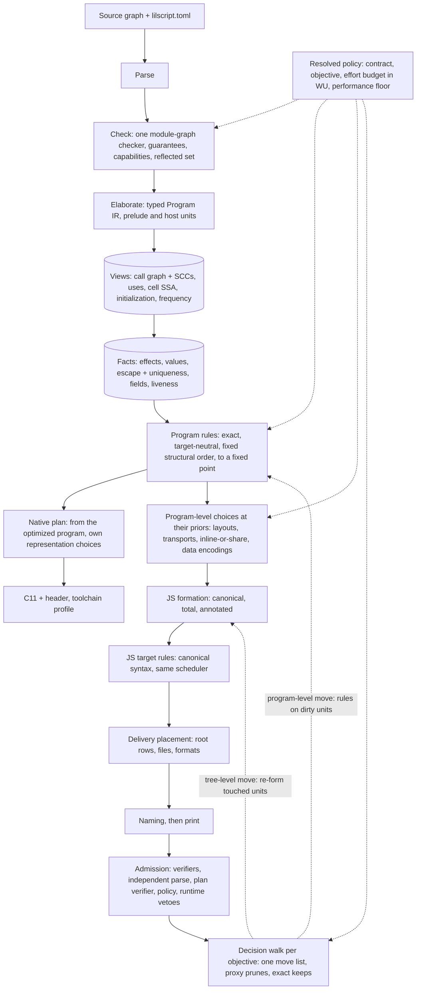

# LilScript: the design of the language and the compiler

**Version 1, 2026-09-27.** This page is the design of the LilScript language and its one compiler, written as a whole in answer to the owner's brief of 2026-09-27 ([finer/intent/2026-09-27.md](../finer/intent/2026-09-27.md)). It changes only by an amendment the owner approves (§22). Three documents go with it:
- [migration/index.md](migration/index.md) is the only plan for reaching it, including what changed against the 2026-09-23 page;
- [language.md](language.md) is the target language contract (version 1), each clause tagged with the task that implements it;
- [language-v0.1.md](language-v0.1.md) is what the compiler accepts today; a clause leaves it when its v1 replacement lands.

Inputs, all on this host and read-only:
- seven reviews, `~/lilscript-work/out/design/review-*.md`: Closure ADVANCED pass by pass; the language; per-objective decisions; compile time and flags; runtime and native; code against design; competitors and fairness;
- the verified loss diagnosis `~/lilscript-work/out/diagnosis/2026-09-27-losing-entries.md` (items C1–C21, with its addendum);
- the katexlil runtime bisection and its independent re-measurement, `~/lilscript-work/out/diagnosis/katex-perf-2026-09-27.md`;
- `~/lilscript-work/out/design/measurements-2026-09-27.md`;
- the judged M3.3 delivery design `~/lilscript-work/out/design/m3.3/design.md`, which §10.6 adopts;
- three adversarial critiques of this page's first draft, whose blockers and major issues this version resolves.

Code citations are `path:line` at `d1d48c4c`. Competitor citations are `repo@commit path:line` from `~/competitors`.

---

## 1. The answer

### 1.1 Is the migration being done properly?

**Partly no.** The direction was right: one compiler, one Program IR, identities from the checker, one effect engine, data as a compile target. Four things went wrong, and each is measured.

1. **Mechanisms were deleted before their replacements existed.** M1 deleted the old route while its program rules and its real-class emission had no successor. `comparison/apps` went from 571 to 945 Brotli (Closure ADVANCED: 834) and `comparison/algorithms` from 2,305 to 3,250 (Closure: 2,756); all 18 cases now lose to Closure (review-closure-advanced §2). katexlil's steady-state Node ratio to upstream went from 1.041 before M1 to 1.102 after it, mostly through shared receiver adapters that M1 introduced (katex-perf, verification §4).
2. **Choices were built before rules.** Batches T and D added codec-judged selection (terminal challengers, choice trials) while the program-rule layer held only liveness. They cost about 2.7× compile time on katexlil (4.3 s → 11.9 s on the same source, `measurements-2026-09-27.md`); outside katexlil's one data-table move, the extra time bought −88 to +7 bytes per port (review-compile-time §2.5).
3. **Gates reported instead of blocking.** Rule 3's compile-time gate failed on five of six ports, and both batches landed "open against rule 3" (plan, M5.4 evidence). Rule 2 was waived in `ff27361f`, so facts landed without consumers. Runtime was never gated per batch, which is how the adapter regression shipped unnoticed.
4. **The language was left unfinished while the compiler recovered facts.** None of the 11 language items of the 2026-09-23 revision started (review-code-reality §5.1), while about 1,040 of the roughly 1,800 verified recoverable Brotli bytes on the five losing entries are ceremony the language forces (review-language §2.3).

**What changes so it cannot recur.**
- *Replace, then delete* (L20): a mechanism stays, marked transitional, until its replacement lands and passes the gates (M5.3a/b).
- *Order* (L14, L15, plan rule 9): a language slice and an exact-rule floor slice come before any new codec-judged family; the budget model comes before any new family.
- *Gates block* (L21): every gate is a ratchet with an expected-failure ledger; no gate has an "unless the ledger says why" clause; a loss is carried only as a ledger row with an owner task.
- *The language moves first*: language slice 1 needs no owner ruling and is scheduled right after the floor slice; the rest of the core is split into batches keyed to the few rulings that remain (§21).
- *Stability* (§22): laws, IR, pipeline stages and the decision procedure change only by owner-approved amendment; task and rule ids are frozen.

### 1.2 The owner's seven points

| # | The brief asks | The design's answer | Where |
|---|---|---|---|
| 1 | One final design, architected; Closure ADVANCED's thought patterns in the language and the compiler by design | One compiler, one IR, one owner per fact, one rule scheduler, one decision procedure, one budget. What Closure recovers by analysis, the language states or the checker decides once; what Closure guesses (byte costs, "better gzip"), the requested codec judges. Every Closure pass family has a named home | §3, §8, §9.6, §12.3, §22 |
| 2 | Smallest JavaScript under the configured objective; decisions differ per objective | The objective is a codec with its parameters. A transformation that removes operations with a codec-stable sign is a rule under every objective; every other representation is a choice judged per objective, seeded by per-objective priors | §9 |
| 3 | Directly executable native output | A native-complete language: every checked construct lowers to C, or is a JavaScript-only capability the checker reports with a span. Native forms from the optimized program and must run at least as fast as our JavaScript under Node | §11 |
| 4 | Static and semantic analysis at Closure ADVANCED depth and beyond | Identity-based facts on the Program IR (effects over call-graph SCCs, values, escape and uniqueness, fields, initialization, frequency), consumed by both targets; a floor of every exact rule Terser, Oxc, esbuild and SWC ship legally; program-level moves re-run the rules on what they change | §7, §8, §9.6 |
| 5 | Same or better runtime performance | Runtime is a floor: parity means the upper CI bound of the steady-state ratio is at or below 1.00 plus the no-op control's spread, on every declared workload. Laws forbid transformations that add polymorphism or hot allocations; a static frequency fact orders hot-site alternatives by runtime class before bytes | §16 |
| 6 | Beat Rolldown, Terser, Oxc and every JS toolchain on the cloned libraries, without overfitting | A floor of competitor rules gated on a library-independent corpus; one pinned benchmark contract (SWC and the Rolldown bundler included; bars matched in assumptions and reflection; the same oracle; consumer lanes); a held-out set with a failure procedure; a closure ledger per losing cell | §8.4, §18 |
| 7 | Compile time is first class; flags, effort and codec settings change it | One work currency; one move list walked as a prefix whose length, exact budget and work budget the level sets; a proxy that prunes and the exact codec that keeps; codec settings as objective configuration; deterministic parallelism; caches; targets per entry and per package build | §9.6, §13, §14 |

### 1.3 Built and to build

| Built (landed, with evidence in the plan) | To build (plan task) |
|---|---|
| One compiler; the old route deleted, a frozen reference binary kept (M1) | Benchmark contract, held-out set, perf runner, generic ratchet, frozen baselines, calibration corpus (M2.10–M2.15) |
| Region-structured Program IR; nominal identity, `FieldRef` places, `export constructor` (M4.1) | Canonical formation, batch A1: methods as their own functions, class bodies, no operand spills, one decoder per schema (M8.2) |
| Effect engine with SCC summaries and the `pure` check; call graph; initialization order (M6.1–M6.3, M6.5; computed, not yet consumed by the tree) | Program edit kernel and the exact-rule floor (M5.1, M6.4a, M7.x) |
| Discarded effect-free calls (M7.2) | The budget model: work units, one move list, proxy and exact judges (M3.5) |
| The terminal challenger stage (M5.4); the choice kernel's first slice and data tables (M9.1, M9.8); the first spelling families (M9.3) | The language: v1's eighteen rules (M4.2, M4.6, M10) |
| The delivery design (M3.3, in flight) | Tree annotations and one scheduler (M5.2, M5.3); the rest of the facts (M6.4, M6.6–M6.8) |
| | One choice system (M9); native from the optimized program and native-complete (M11); qualification (M12) |

**Owner decisions.** Seven yes/no questions remain, each reversing an earlier owner choice or contract; everything else is decided here, with its reversal cost (§21).

---

## 2. What the compiler is for

**Objective.** For each maintained library, each export condition and each selected objective, deliver the smallest correct program that is at least as fast as the original. The objective is lexicographic:

1. **Correct.** The public API and every behaviour are preserved (D2, D3). Complete delivery is counted (A5).
2. **Not slower.** Parity or better with upstream on every declared workload, as defined in §16.4.
3. **Smallest.** The fewest bytes under the configured objective: a codec (Brotli first, then gzip, then raw) with its parameters. Each objective has its own winner (A6), in the open world (the developer-facing API preserved, per the mangling fairness contract) and in the closed world.
4. **Within budget.** All of this within the work budget the effort level sets (§13). Compile time is a budget, not a term traded against bytes.

It must beat the strongest pinned competitor in every cell of the benchmark contract (§18): Terser, SWC, Oxc, the Rolldown bundler, esbuild, upstream's own minified file, and Closure ADVANCED where the surface can be declared.

**Other requirements.**
- The same checked program compiles to directly executable native code with identical results (§11).
- Search aims at as global an optimum as the work budget allows. No finite search is promised optimal.
- The win threshold (D4) is per cell (§18.1, amendment Y6).

**Standing rules from the owner.**
- No accepted losses, in size or in the runtime floor (2026-09-22, 2026-09-27). Until M12 closes, a known loss is carried only as an expected-failure row with an owner task, and phase gates are ratchets over those rows (plan rule 3); M12.3's exit has no losing cell.
- Generic changes only, never keyed to a library; enforced by §18.3.
- By design, never glued.
- Single host, no worker pool.
- Only compiler-written delivered files count: no post-minifier.
- Same code, same performance or better (2026-09-02: "exact same performance or even better is needed for sure"; 2026-09-27). This supersedes the 2026-09-23 ruling "size over runtime speed". Size is the objective inside the runtime floor: on cold code the smaller form wins; on hot code the floor wins (§16).

---

## 3. Design laws

Each law exists because the codebase's history measured what happens without it.

| # | Law | Why (evidence) |
|---|---|---|
| L1 | **One owner per fact.** Meaning is decided once, on typed identities, and never recovered from names, spellings or emitted text | The old route's text peephole produced at least six wrong programs by reasoning over mangled tokens. Today the program has one effect owner (`src/program/effects.rs`), and the tree still keeps its own models in `src/js/quiet.rs`, `src/js/inline.rs:565,609` and `src/js/mod.rs:1293` |
| L2 | **Decide where the knowledge is.** Meaning-level optimizations run on the program; the JavaScript tree owns syntax, spelling, naming and delivery | About 5,100 lines of meaning-level optimization run on the JS tree (`src/js/{inline,blocks,quiet,initializers,calls,typed,scalar_objects,root_constants}.rs`), where they re-derive legality from syntax and native C gets none of them |
| L3 | **A rule removes operations with a codec-stable sign; everything else is a choice.** A transformation is a rule only when it removes operations (calls, allocations, statements, fields, branches, arguments) without duplicating a body, *and* its Brotli, gzip and raw deltas are non-positive on every program of the calibration corpus under seeded re-mangling. Its sign distribution is published in its registry entry. A removal that fails the second test is a coupled choice whose prior is "apply" | Closure's 13 late peepholes: −13,197 raw, **+930** Brotli. Removals can raise Brotli too: assignment inlining +292, a proven partial `\|0` elision +24, coercion elision whose "partial sets go positive" (diagnosis C8) |
| L4 | **Emit canonical forms; never un-emit** | 84 of the old route's 142 folds existed only to undo its emitter. Today formation emits receiver adapters, spilled operands and double field initialization that later passes partly undo (diagnosis C1–C3) |
| L5 | **Facts live on the nodes that use them**, with a declared transfer for every edit | `literal_alternatives` is remapped by hand at ten sites in `src/program/javascript.rs:797-1259`; live-16 was a print decision read from thread-local policy |
| L6 | **Every optional transformation is a registered family** with a written legality condition, an `off` veto, provenance and a veto lane | One umbrella tactic (`TargetCompaction`, `src/compilation_policy.rs:90`) gates 54 calls to 39 passes |
| L7 | **Choices are kept only on an exact whole-artifact win, and selection is monotone within a build and across effort levels by construction** (§9.6). Rules are admitted by L3's measurement, not by a per-build codec verdict | Chaotic plan choice moved fleet results by ±50–400 bytes per port. katexlil's level 13 is 98 bytes larger than its level 8 because two budgets interleave (`src/config.rs:1339-1366`), although the code states the prefix argument (`src/config.rs:1335-1337`) |
| L8 | **Budgets, not magic constants.** Work is measured in one calibrated currency; every constant of the schedule is versioned data with its calibration source | Inline limit 6 (`src/program/javascript.rs:749-751,791`), rounds 3 and 4, seven effort ladders calibrated on the deleted route (`src/config.rs:1183-1366`) |
| L9 | **The language states what the compiler must not guess** | Typed ports win; untyped `JsValue` transliterations lose. The fleet holds 38,586 `JsValue` and 46,053 `JS.*` mentions |
| L10 | **One meaning, several targets** | The same checked program feeds JavaScript and C. Target plans choose representation, never semantics |
| L11 | **Verification is part of the pipeline** | Structural verification after every edit batch, an independent parse of every delivered file, oracles that never come from the compiler under test |
| L12 | **Per-library configuration is contract, objective, effort, performance floor and permission, nothing else**; every contract assumption carries a recorded reason | Per-port strategy knobs turned noise into strategy: 16 port configs set `candidate_search = "always"` and 13 tune beam widths ("picks which basin") |
| L13 | **A typed form never costs more than its untyped equivalent, in bytes or in time** | The ports' winning rewrites deleted 98 structs and added 50 untyped views. Typed structs run 4× slower than mutable JavaScript on a cursor loop today, because every field write rebuilds a tuple (`src/program/javascript_structs.rs:1-3`; review-performance-native §3.3) |
| L14 | **Language before recognizers.** A fact the author knows is stated by a type or a declaration before the compiler builds an analysis or a pattern to recover it | M9.8 recognizes tables from `let` shapes (`src/js/tables.rs:2-4`); `prove_int32_cells` proves from producers what `int` should guarantee (`src/program/javascript_int32.rs:1-6`) |
| L15 | **Rules before choices.** Exact rules produce the canonical base to a fixed point before any codec-judged alternative varies it, and a program-level choice re-runs the rules on what it changes | The search saturates when rules have not supplied the base; choices built first vary a non-canonical base and pay exact codec trials a rule never needs (§1.1) |
| L16 | **A fact has landed only when it is consumed.** Its publication channel reaches every target layer that decides with it, and each re-derivation is deleted in the same batch | Batch E deferred the deletions "until M5.2" (`ff27361f`); the tree's 54 passes still reason from syntax |
| L17 | **Compile time is designed.** One work currency, one move list walked as a prefix, a proxy that only prunes, an exact codec that only keeps, threads that never change bytes, and hard work ceilings per level (§13) | 55–74% of every production compile is exact Brotli-11, paid once per candidate and ordered by raw bytes |
| L18 | **The runtime floor holds by construction.** No transformation makes one function body serve more receivers or callees than the source did, adds a per-evaluation allocation in a loop, or makes a typed form slower (§16, P1–P9) | Shared adapters: one SharedFunctionInfo for 141 methods, 9.6–10.0% of katex's JS self time |
| L19 | **Benchmarks are contracts.** Bars are generated from the declared surface, pinned, matched in assumptions and reflection, and pass the same oracle; held-out libraries gate phase ends (§18) | SWC unpinned; Terser versions and pass counts drift per port; one port's win can live in one lever while its code loses |
| L20 | **Replace, then delete.** A mechanism is deleted only in the batch its replacement lands and passes the gates; until then it runs as a marked transitional rule with its deletion task | M1 deleted the old route's program rules and real-class emission with no successor: `comparison/apps` 571 → 945, katexlil's Node ratio 1.041 → 1.102 |
| L21 | **Gates block.** Every gate is a ratchet over an expected-failure ledger. A failing gate stops the merge; a loss is carried only as a ledger row with an owner task; no gate has an escape clause | Rule 3 failed on five of six ports while batches T and D landed; rule 2 was waived (`ff27361f`) |

---

## 4. Contracts carried from the 2026-09-18 design

A2–A5 are unchanged from the 2026-09-18 design. A1 was amended on 2026-09-23 (no stage keeps a CFG). A6 and A7 read as below; Appendix A records the amendment and D1–D5 verbatim.

| ID | Contract |
|---|---|
| A1 | One owner of language meaning: the checked program. Syntax is dropped after checking. Optimizers never recover language knowledge from emitted names |
| A2 | Facts describe meaning independently of output: `Known(T, deps) \| Unknown(reason) \| Truncated(limit)`. Separate queries: `can_discard`, `can_duplicate`, `can_move(across, context)`, `can_speculate` |
| A3 | One edit protocol: atomic batches with expected revisions, verification and dependent invalidation. `SourceChange` differs from `EquivalentRewrite`. No optimization mutates outside it |
| A4 | Compatible alternatives: a choice changes all affected producers, consumers, captures and adapters together, or is rejected. Candidates share unchanged storage |
| A5 | Target identities and complete delivery: names, helpers, grammar and packaging are final before scoring. Scored bytes are delivered bytes. An independent parse validates output |
| A6 | One artifact authority and bounded search: one admission function for direct, edited, replayed and searched outputs. **A move is kept only on the exact score of the requested codec with its configured parameters; proxies only prune.** Level 0 keeps nothing and its receipt may report an estimate, marked as such. Independent raw/gzip/Brotli incumbents. A resource owner from the first byte |
| A7 | Configuration is independent axes: contract (including `checks`, §17), objective (codec and parameters), effort (a work budget only, Y7), resources, performance floor, family permissions. `off` is a hard veto; `on` permits and never forces |

---

## 5. The pipeline


```mermaid
flowchart TD
  S[Source graph + lilscript.toml] --> P[Parse]
  P --> C[Check: one module-graph checker, guarantees, capabilities, reflected set]
  C --> E[Elaborate: typed Program IR, prelude and host units]
  E --> V[(Views: call graph + SCCs, uses, cell SSA, initialization, frequency)]
  V --> F[(Facts: effects, values, escape + uniqueness, fields, liveness)]
  F --> R[Program rules: exact, target-neutral, fixed structural order, to a fixed point]
  R --> N[Native plan: from the optimized program, own representation choices]
  R --> H[Program-level choices at their priors: layouts, transports, inline-or-share, data encodings]
  H --> J[JS formation: canonical, total, annotated]
  J --> T[JS target rules: canonical syntax, same scheduler]
  T --> D[Delivery placement: root rows, files, formats]
  D --> M[Naming, then print]
  M --> A[Admission: verifiers, independent parse, plan verifier, policy, runtime vetoes]
  A --> W[Decision walk per objective: one move list, proxy prunes, exact keeps]
  W -. program-level move: rules on dirty units .-> R
  W -. tree-level move: re-form touched units .-> J
  N --> X[C11 + header, toolchain profile]
  L[Resolved policy: contract, objective, effort budget in WU, performance floor] -.-> C
  L -.-> R
  L -.-> H
  L -.-> W
```

| Stage | Owns | Must not |
|---|---|---|
| **Parse** | Tokens, syntax, spans, node ids on every identifier, declaration and statement | Carry linker or optimizer data |
| **Check** | Name resolution by identity; types; nominal ids; definite assignment; checked `pure`; the reflected set (R6); target capabilities with spans; boundary, frame and delivery contracts (D2, D3.9, DL1–DL10) | Be entered twice with different phase orders |
| **Elaborate** | Converting checked syntax once into the Program IR, together with prelude units (runtime helpers written in LilScript) and host units (delivered foreign JavaScript) | Re-derive what the checker decided |
| **Views and facts** | Derived, revision-keyed analyses, one owner each | Be edited directly; exist twice |
| **Program rules** | Operation-removing, meaning-level optimizations that pass L3, shared by every target, in a fixed structural order | Depend on a codec, a target, the name plan or the effort level |
| **Program-level choices** | Representation alternatives whose value depends on the objective or the target | Change meaning |
| **JS formation** | A total, deterministic projection to the JS tree that applies chosen recipes and writes annotations | Optimize; emit a shape a later pass must undo |
| **JS target rules** | Canonical JavaScript syntax, reading node annotations | Reason about effects or identity beyond annotations |
| **Delivery placement** | Files, labels, links, setters, formats (M3.3), once per formed tree, before naming | Re-derive effects from syntax |
| **Naming and print** | One name allocator; a pure renderer of the tree and its decisions | Change structure at print time |
| **Admission** | Verification, the independent parse, the plan verifier, policy admission, runtime vetoes on hot sites (§16.3), the exact score of compared artifacts | Depend on a score for legality |
| **Decision walk** | The one procedure of §9.6: the move list per objective, the proxy and exact judges, incumbents | Keep a move the exact codec has not judged |
| **Native plan** | C layout, ownership, calling convention, helpers, ABIs, its own representation choices; the writer only spells | Run a codec search; plan undemanded code |

---

## 6. The Program IR

The Program IR is the one optimizer IR. Its shape is kept.
- **Units:** module initializers, functions, closures, prelude units and host units.
- **Operations** live in nested **regions** (`If`, `Loop{test, body, update}`, `Try`, `Block`, `ShortCircuit`, `Select`, `ForIn`, `ForOf`).
- **Values** have one definition each, scoped like nested-region SSA. **Cells** hold mutable storage, captures and references; merges go through cells.
- **Places** are a cell, a value, a class field (`FieldRef{nominal, slot}`), a member or an index.
- **Calls** are split into prepare and call, with an explicit target and a checked contract.
- **Frozen units** are shared through `Arc`, so candidates copy only what they edit.

It maps one to one to structured JavaScript and to C. **There is no CFG.** A CFG forced the old route to re-structure its output with a relooper, phi reconstruction and a text peephole.

**Identities.**

| Identity | State |
|---|---|
| `NominalId` for struct, class (with extern classes) and enum; per-module type scopes; `FieldRef{nominal, slot}` places; `Instance{class}` allocations | **Landed** (M4.1). Formation still prints a field as a string key with no annotation (`src/program/javascript.rs:2745-2756`); the `FieldRef` column (M5.2) carries it to the tree |
| `Type::Dynamic` replacing `TypeParameter("$js")` (`src/check.rs:9515`) | M4.2, with the dynamic-type rule R12 |
| `CellBinding::Ambient(This \| Arguments)`; declared effect classes (`pure`, `debug`) on declarations; `reassigned` and creation-moment binding facts | M4.3 |
| Node ids on identifiers, declarations and statements; span-keyed maps deleted | M4.4 |
| One operation catalog: every builtin and host global has an identity (`GlobalId`), a signature, an effect class, a fold with its exactness class (§7), JS and C spellings and a target capability | M4.6. Replaces `BuiltinCall` (`src/check.rs:43-118`) and the tree's `STANDARD_GLOBALS` (`src/js/inline.rs:20-55`) |
| `UnitData.origin = ClassMethod{nominal} \| Function \| Closure \| ModuleInit \| Prelude \| Host` | M4.3, M8.4, M8.5 |
| `ChoiceKey`: a program identity (root binding, `UnitId`, `NominalId`, allocation site) plus, for a tree-level site, its ordinal in its unit's canonical formation | Landed for data (M9.1: the root binding a table initializes). Stable across moves because a move re-forms only the units it touches; node ids (M4.4) later make the ordinal a source identity |

**Derived views,** computed on demand, keyed by unit revision, never edited: the `UseIndex`; the call graph with SCCs and complete call sets (`src/program/call_graph.rs`, landed); cell SSA for flow-sensitive rules (M5.5); initialization (`src/program/initialization.rs`, landed); and the static frequency view (§16.2, P8).

---

## 7. Facts

```rust
enum Fact<T> { Known(T, Deps), Unknown(Reason), Truncated(Limit) }
struct Deps { units: SmallVec<[(UnitId, RevisionId); 4]>, tables: RevisionId, contract: ContractFingerprint }
```

One region-structured dataflow framework runs forward and backward over regions, with loop fixed points and widening, interprocedurally through call-graph SCC summaries (`src/program/views.rs`).

**Facts rest on guarantees.** Under R1 a value of type `T` inhabits `T` inside the program; host values are admitted at declared crossings. Facts therefore start from declared types and prove only what types do not say (ranges, constants, escape). Until R1 lands (it needs owner answer Y1), the exact and finite-set tier of the value lattice runs on literals, `const` and `define` alone, which needs no language rule; only the int32-range tier waits.

| Fact | Content | State | Replaces | Unlocks |
|---|---|---|---|---|
| **Effects** | Per operation and per unit: reads and writes by region (cells, own allocations, fields, host), may throw, may diverge, runs user code, creates identity, reenters, suspends; parameter mutation and retention. `discardable()` (`src/program/effects.rs:1262-1270`: no observable write, no throw, no divergence, no user code, no reentry, no suspension) is the one test for removing or annotating a call | Computed (M6.2). Consumed only by liveness and the `pure` check | `quiet.rs`, `inline.rs` `inert`/`runs_no_user_code`, `mod.rs` `inert_value`, `initializers.rs` `same_inert`, `javascript.rs:207-224`, the `debugLog` name tests | Discarded calls, argument motion, forwarding past calls, dead stores, consumer annotations (§10.6) |
| **Values** | One lattice: exact ⊂ finite set ⊂ int32 range ⊂ primitive class ⊂ unknown (the finite-set width is schedule data); per value, formal (joined over complete call sets), result and `(nominal, slot)`; array class of parameters | M6.4a (exact and finite set over literals, `const`, `define`) now; M6.4b (int32 range, array class) after R1/R11 | `javascript_int32.rs`, `NumberFacts`, `raw_domains`, `binding_classes`, `simplify::known` | Branch and constant folding, `\|0` only where a result can leave int32, receiver calls on proven arrays (diagnosis C15) |
| **Escape and uniqueness** | Per allocation site: local, typed or host; per struct store: whether the source value is dead after it (a move) | M6.6 | `scalar_objects.rs`'s syntactic test | Scalar replacement, copy elision on stores (P2), layout choice, native stack storage |
| **Field facts** | Per `(nominal, slot)`: read or not, the join of written values, host-reachable; the reflected set comes from the checker (R6) | M6.7 | name-keyed field logic | Dead and constant fields, renaming and ambiguation |
| **Bindings** | Per binding: reassigned, written anywhere (closures included), creation moment relative to the first code-running root statement | M4.3 (checker), M6.5 | `quiet.rs`'s binding tests, `mod.rs` `initialized_at`/`settled_reads` | Forwarding legality on the tree (§10.1) |
| **Initialization order** | Per root binding, the statement that settles it; per function, "not invoked before root statement S" | Computed (M6.5). Consumed only by demand | `quiet.rs`'s `Order`, `js/mod.rs:2650-2787`, `root_constants.rs`, `native_plan.rs:1102-1217` | Root constants, namespace collapse, native init guards removed, cross-entry initialization (M3.3 §5.4) |
| **Liveness** | Demand's observation lattice, mark and sweep | JS-only today (`src/program/demand.rs`) | `drop_unreferenced_functions` (`js/mod.rs:1536`) | DCE for both targets, native planning of demanded code only |
| **Frequency** | Per operation: cold, warm or hot (§16.2, P8) | New (M6.8) | nothing | Runtime ordering and vetoes on hot sites |

**Folding is exact or it is not done.** Every catalog operation carries an exactness class. `exact`: IEEE-754 basic operations with correct rounding, integer operations, and ECMAScript-specified algorithms (Number-to-String, string operations). `host-precision`: operations whose precision ECMAScript leaves to the implementation (`Math.sin`, `exp`, `log`, `pow` and the rest). Rules and `const` evaluation fold only `exact` operations; the interpreter's Rust `libm` (`src/interpreter.rs:1460-1464`) is not V8's, so a `host-precision` fold would produce values upstream never computes. Closure draws the same line (`closure-compiler@0da58e1 PeepholeReplaceKnownMethods.java:194-196`).

**Termination (D3.6).** A call is removed only when `discardable()` holds, which includes termination. The termination proof (no unbounded loop, recursion only in a proven-terminating SCC) is the rule for inferred purity. Whether a declared `pure` asserts termination, as Closure's `@nosideeffects` does (`closure-compiler@0da58e1 PureFunctionIdentifier.java:546`), is owner question Y4; `DECLARED_PURE_ASSERTS_TERMINATION` (`src/program/effects.rs:47-48`) holds the switch.

**Publication.** Formation writes the facts JS rules need onto tree nodes, each with a declared transfer function for every target-rule edit (§10.1). The native plan reads them from the program. No fact is recomputed from JavaScript syntax (L16).

---

## 8. Edits and the rule scheduler

### 8.1 Edits

**Program edits.** The existing transaction is kept: expected revisions, prepare, apply, verify, incremental `UseIndex` update, commit with undo. Its vocabulary grows so every rule can be expressed:

```rust
enum Edit { ReplaceOp, InsertOps{region, at, ops}, RemoveOps{..}, SpliceInline{call, body, remap},
            CloneUnit{..}, DeleteUnit, MergeUnits{keep, drop}, ChangeSignature{unit, drop, constant, drop_result},
            RetypeAllocation{site, layout}, ReplacePlace }
struct EditBatch { expected: Vec<(UnitId, RevisionId)>, meaning: SourceChange | EquivalentRewrite(RuleId), edits: Vec<Edit> }
```

Today only two program rewrites exist and neither has a production caller (`src/program/publication_rewrites.rs:132,159`).

**Target edits.** Every JS tree mutation goes through typed helpers that journal the nodes removed and added and the functions dirtied (Oxc's `PassChanges`). Annotation columns move with the arena's own renumbering and are updated by their declared transfers, so no caller remaps anything. Debug builds check that the journal equals the actual difference.

### 8.2 The scheduler

One scheduler serves program rules and JS target rules.
- Rules declare the facts they read, the domains they change, and whether they are fact-free or fact-driven.
- **One measure for all rules.** Every rule edit strictly decreases one lexicographic, well-founded measure: (units, allocations, operations, nodes). Debug builds assert it per edit. Rules that trade one component for another (a splice removes a unit and adds operations; scalar replacement removes an allocation and adds cells) terminate jointly because the measure is shared.
- **Fixed structural order.** Program rules run in a declared order over the call graph's SCCs, bottom-up, with a worklist of `(rule, dirty unit)` pairs. The order depends on no printed size, name plan, codec or effort level.
- **Always to the fixed point.** Rule phases are never truncated by effort or work budget. A ceiling on rounds (Closure's `MAX_LOOPS`, `closure-compiler@0da58e1 PhaseOptimizer.java:270-277`) aborts the build with a diagnostic if reached; it never delivers a partial base. The base, and so level 0's artifact, is level-independent.
- The verifier runs after each rule set in debug builds and in the case runner.
- Level 0 runs every rule (B5).
- **Transitional rules (L20).** A pass that today's chain runs and whose replacement has not landed is hosted as a marked transitional rule, in its current relative order, with the task that deletes it. It is not a byte-identical mode: nothing requires identical output, and each transitional rule is deleted in the batch its replacement lands (M5.3a/b).

This is Closure's PhaseOptimizer and Oxc's `run_in_loop` (`oxc@591966d crates/oxc_minifier/src/compressor.rs:106-140`), driven by an edit journal instead of change stamps or AST size.

**Each of today's 39 passes (54 calls in `src/program/javascript.rs:744-986` and `:1073-1211`) has one final home and one deleting batch:**

| Today's passes | Final home | Transitional until |
|---|---|---|
| `self_method_calls`, `dissolve_receiver_adapters` (`src/js/calls.rs:26,119`), `array_receiver_calls` (`src/js/typed.rs:111`) | **Deleted.** Formation emits methods and receiver calls (§10.2); receiver types and the dynamic type are language (R7, R12, R13) | `dissolve_receiver_adapters`: batch A1. The others: M10.4/M10.7 (receivers) and M6.4b (array class) |
| `inline_expression_functions` (limit 6), `inline_statement_functions` (3 rounds), `inline_single_calls`, `place_single_calls` | Program rule M7.5a for the removing case; the inline-or-share choice (M9) for the duplicating case, ordered by its estimate | M7.5a deletes the removing half; M9.1's rest the rest |
| `eliminate_aliases`, `forward_root_constants` | Program rule M7.4 (constants of a few tokens); longer values and aliases are a coupled choice (L3) | M7.4 |
| `flatten_constant_objects`, `unobserve_called_names` | Program rule M7.6; mostly unnecessary under R9 and R16 | M7.6 |
| `inline_initializers`, `drop_redundant_init_stores`, `fold_object_stores` | Construction by the layout choice (M9.7) and formation (§10.2); overwritten stores are M7.7 | M9.7 and M7.7 |
| `drop_typed_default_checks`, `drop_default_arguments`, `native_default_lengths` | Defaults by transport (M7.3) and formation | M7.3 |
| `scalarize_member_objects` | Program rule M7.9 on escape | M7.9 |
| `drop_unreferenced_functions` | DCE as a program edit | M5.1 |
| `forward_single_uses`, `merge_declarations`, `elide_undefined`, `drop_double_negations`, `join_empty_declarations`, `drop_bare_blocks`, `simplify_operators`, `truthy_null_tests`, `drop_unreachable` | **JS target rules**, kept on the tree, with legality from annotations instead of `quiet.rs`. `forward_single_uses` keeps only temporaries formation creates; single-use forwarding of program values is M7.4's | M5.2 (annotations) |
| `fold_logical_assignments`, `fold_logical_returns` | Canonical formation of the constructs they recover | M8.2 A2 |
| `compress_statements` exits; spellings, loop heads, logical statements | Exit removal is a JS rule; each spelling is a per-site choice (§9) | M8.3 |
| `encode_tables`, `pack_string_arrays`, `pool_strings` | Choices on declared data (R9) and literal placement at naming time | M9.8's rest |
| `group_prototype_stores` | Generic legality or deleted (plan inventory M8.7) | M8.7 |
| `lower_hosts` | Host units in the Program IR (M8.4) | M8.4 |

### 8.3 Program rules

These pass L3, run in the fixed structural order of §8.2, and are target-neutral. Native gets every one of them (§11).

| Rule | Closure / old-route counterpart | Needs | Plan |
|---|---|---|---|
| Dead code: values, units, cells, trailing unused formals | RemoveUnusedCode | Liveness | M5.1, M7.1 |
| Discarded calls (`discardable()`) | PureFunctionIdentifier + PeepholeRemoveDeadCode | Effects, termination | M7.2 (landed) |
| Unused and constant parameters; unused results | OptimizeParameters, OptimizeReturns | Complete call sets (landed) | M7.3 |
| Root constants and build-time defines; flow-sensitive forwarding of constants | InlineVariables, InferConsts, ProcessDefines, FlowSensitiveInlineVariables | Initialization, bindings, cell SSA | M7.4 |
| Inlining that removes operations: every call site replaced and the unit deleted, with no operation growth; known-closure calls; constructor chains | InlineFunctions (removal half), old route | Effects, call graph, splice edit | M7.5a, M7.5 |
| Namespace collapse; devirtualization of emulated method tables | CollapseProperties (made exact), DevirtualizeMethods | Initialization, allocation identity | M7.6 |
| Dead, constant and overwritten fields (legality below) | RemoveUnusedCode (properties), InlineProperties, DeadPropertyAssignmentElimination | Field facts, effects | M7.7 |
| Constant and branch folding, SCCP, `exact` known-method folds, store collection into literals | PeepholeFoldConstants, PeepholeRemoveDeadCode, PeepholeReplaceKnownMethods, PeepholeCollectPropertyAssignments | Values, catalog folds | M7.8a (literal and branch), M7.8 |
| Scalar replacement of classes, control-flow aggregates and loop-carried structs; store-copy elision for struct moves | InlineObjectLiterals, old route `scalar_replace_*` | Escape, uniqueness | M7.9 |
| Merging identical compiler-generated units that pass P1's static test (legality below) | Closure `injectRuntimeLibraries` injects each runtime once | Unit equality modulo names | M7.10 |

**Growth and duplication are choices.** An inline, a clone or a forward that duplicates a body, grows operations, or fails L3's sign test is a choice (§9), ordered by its tier-0 estimate, never by a print-size delta inside the rule phase: program rules run before naming exists, so a print-size order would couple rules to names. Constant-capture cloning duplicates a body and is part of the inline-or-share choice. The constants Closure and Terser guess (identifier = 2 bytes, `closure-compiler@0da58e1 InlineCostEstimator.java:28-30`) are not used.

**Field-store legality (M7.7).** A store `a.n = x` overwritten by `a.n = y` before any read is removed only when all of these hold: nothing evaluated between the two stores can observe `a` or throw (effects fact); the object's key order is unchanged, or its nominal is neither reflected (R6) nor published; and no accessor for that key exists on its base chain (from extern and catalog declarations; a host-derived class's `this.x = v` is a `[[Set]]` that can call an inherited setter). The proving cases include a published class and a host-derived class.

**Unit-merge legality (M7.10).** Two compiler-generated units equal modulo names merge by rule only when the merged body makes no call whose callee is a parameter or a capture, and no member access whose set of receiver nominals grows (law P1). Receiver adapters and D2 adapters that call a parameter never merge by rule; sharing them is the helper-sharing choice with P1's hot-site veto. Table decoders qualify (they run at startup and call nothing); M8.5 makes them prelude units.

### 8.4 The floor inventory

Beating the competitors by design means doing everything they do that is legal under our facts, then more. Every exact, operation-removing transformation in the union of Terser (`reduce_vars`, `evaluate`, `inline`, `unused`, `collapse_vars`), Oxc's peephole passes, esbuild's `mangleStmts`/`mangleIf` and SWC's compressor has one home here. Its mode (rule or choice) follows L3's measurement, not an argument.

| Floor transformation | Who has it | Home and mode | Proving cases |
|---|---|---|---|
| Constant-condition branch folding, and dead code after folding | all five | M7.8a, M5.1: rule | `comparison/cases` `control/dead-branch` (58 against 19); `comparison/apps/optimizer-pressure` keeps `!1&&console.log(c(9))` |
| Interprocedural evaluation of small pure functions with constant arguments (`exact` operations only) | Terser, SWC, Closure | M7.8 + M7.5: rule | `functions/nested-local` (51 against 20: `print(scale(5))` should print 16); `optimizer-pressure` keeps `threeSteps(1)` as calls |
| Dead functions and units after folding | all five | M5.1: rule | `functions/dce-unused` (37 against 19) |
| `let x; x = E` fusion; a dead `let` whose initializer is discardable | esbuild, Oxc, Terser | JS target rules (M8.2 A2): rule | diagnosis C4a (part of katex core −104) |
| Single-use forwarding of non-constant values; copy coalescing | Terser `collapse_vars` | M7.4: coupled choice, prior "apply", until its sign distribution passes L3 | diagnosis C4a (rest); assignment inlining +292 on the old route |
| Small-function inlining; arrow IIFEs with once-read parameters | Terser, SWC, Closure | M7.5a (removing case): rule | diagnosis C16; `comparison/algorithms` residue |
| Unused and constant parameters | Closure, Terser | M7.3: rule | Today every parameter list is kept as an ABI obligation even when unused (`src/program/javascript.rs:2086-2087`) |
| Dead and overwritten field stores | Closure, Terser (partly) | M7.7: rule, with the legality of §8.3 | diagnosis C4b (`a.n=0;a.n=b` in every published class with fields) |
| Property and array store collection into literals | Closure, esbuild | M7.8: rule | diagnosis C17 |
| Known pure builtin constructions dropped (`new RegExp(valid literal)`) | Oxc, esbuild known globals | M4.6 catalog + M7.1: rule | diagnosis C9 (posthog replay-core −104) |
| Known-method folds (`"ab".length`, `Math` on constants where `exact`) | Closure, Oxc | M4.6 folds: rule | catalog cases |
| Coercion elision (`\|0`, unary `+`, `x+""`) from value facts | Oxc, Terser | M9.12: coupled choice (whole set) | diagnosis C8 ("partial sets go positive") |

**The gate.** The generic corpus (`comparison/cases`: 54 canonical cases and 570 catalog variants; `comparison/apps`; `comparison/algorithms`) is a per-change ratchet: its loss count against the smallest competitor and against Closure ADVANCED never rises, and each rule names the cases it wins. The floor slice's interim exit is no loss to the frozen old route on `apps` and `algorithms` (558 and 2,305 Brotli, the ratchet's bars); M7's exit is no loss to Closure ADVANCED there (§18.3, NO2).

---

## 9. Choices, search and the objective

### 9.1 The objective is a codec with parameters

```rust
struct Objective { codec: Codec, unit: DeliveryUnit /* per file, summed over rows (§10.6) */ }
enum Codec {
    Raw,
    Gzip   { level: u8, window_bits: u8, encoder: EncoderPin },      // zlib 1.3.1 pinned
    Brotli { quality: u8, lgwin: u8, mode: BrotliMode, encoder: EncoderPin }, // Brotli 1.1.0 pinned
}
```

- The defaults are today's constants, now configuration: Brotli quality 11, window 22, generic mode (`src/compression.rs:379-383`); gzip level 9, window 15 (`src/compression.rs:290-300`).
- Settings are in the fingerprint and the receipt. The best program depends on them: pairs flip order between Brotli q5 and q11 (review-compile-time §3.3), and posthoglil's win against Terser is −139 at q11 and a tie at q5 (review-competitors §1.3).
- Several requested objectives build in one process and share parse, check and formation (M3.4). Each keeps its own incumbent (A6); §9.6 says how they offer incumbents to each other without breaking monotonicity.

### 9.2 What differs per objective, and what does not

**What may differ.** Representation choices only. The measured decision table (review-objectives §2.2):

| Decision | raw wants | gzip wants | Brotli wants |
|---|---|---|---|
| Root naming order | most-read name shortest | frequency by length bucket, source order within a bucket | declaration or printed order, per artifact |
| Name alphabet | frequency-sorted | frequency-sorted | fixed; noise |
| String pooling and aliasing | pool every repeat | pool repeats more than 32 KiB apart | almost never |
| Statement spellings (conditional values, exits, loop fusion, conditional returns, logical branches) | on | often on | usually off, per site class |
| Block inlining | usually off on large ports | mixed | on for some ports |
| Data encoding | value dictionary or columns | columns | columns or literal, per site |
| Shared or specialized helpers | shared | shared | specialized can win |
| Function folding and outlining | fold, outline | fold when far apart | rarely |
| Coercion text (`\|0`, unary `+`), non-constant forwarding, copy coalescing | remove | remove | mixed; judged as coupled classes |
| Order and locality of hoistable declarations and data | irrelevant | matters (32 KiB window: katex +4.5% out of reach) | small |
| Literal placement (a regex at its use or shared)¹ | shared when repeated | shared when far | at the use |
| Enum representation at unreflected positions (R8) | smallest | codec-judged | codec-judged |

¹ Sharing or sinking a regex literal is legal only when it has no `g` or `y` flag (or no use reads `exec`, `test` or `lastIndex`) and its identity is never observed: a literal creates a fresh object per evaluation, and typed `Regex` exposes a mutable `lastIndex` (`src/check.rs:5723`). Otherwise the site is fixed.

**What must not differ.** Legality, meaning, facts, contracts, the runtime floor, and the rule set. Whether a transformation is a rule is decided once, by L3's measurement over all three codecs; a rule runs under every objective.

### 9.3 One decision substrate

Every optional representation is a **choice family** of one kernel. Today's `OutputFamilies` booleans (`src/js/families.rs:69-89`), the `raw_spelling` bundle (`src/js/naming.rs:20-28`), the naming style, the structural search's five bespoke family analyses (`helper_family`, `product_family`, `record_family`, `string_family`, `function_layout`: 8,393 lines) and the data sites all become families.

```rust
trait ChoiceFamily<IR> {                       // IR = Program (program-level) or Tree (tree-level)
    fn sites(&self, ir: &IR, facts: &Facts) -> Vec<Site>;                    // ChoiceKeys by program identity (§6)
    fn legality(&self, site: &Site, alt: AltId) -> Legal;                    // codec-free, like tables.rs:33-44
    fn prior(&self, objective: &Objective, site: &Site) -> AltId;            // versioned schedule data (§9.4)
    fn estimate(&self, objective: &Objective, site: &Site, alt: AltId, names: &NamePlan) -> Estimate;
    fn coupling(&self, site: &Site) -> CouplingClass;                        // sites judged as one unit
    fn runtime(&self, site: &Site, alt: AltId) -> RuntimeClass;              // §16.3
    fn lower(&self, site: &Site, alt: AltId) -> Lowering;                    // EditBatch | FormationDirective | PrintDecision
}
```

- **Program-level families** (layouts, transports, inline-or-share, data encodings) key sites by program identities (`UnitId`, `NominalId`, allocation site, root binding), because formation renumbers tree nodes. **Tree-level families** (spellings, literal placement) key by the owning unit and the site's ordinal in its canonical formation.
- **Sites are hierarchical:** a family default plus per-structural-class overrides. A whole-artifact boolean is the degenerate case of one class. This lets conditional returns be judged per site class (diagnosis C14) and root naming by use count be tried outside the bundle (diagnosis katex F1).
- **`raw_spelling` is dissolved** into its members: root naming order, self-named functions, compound assignment, statement-consuming conditionals, logical statements and quotes. The printer stops consulting the naming plan (`src/js/print.rs:1701-1704,1744-1747`).
- **The family list:** layout per nominal or allocation (scalars, positional, named, class); parameter transport; inline or share; non-constant forwarding and copy coalescing; coercion text; literal placement; data encoding (literal, front-coded, columns, value dictionary, lazy decode); helper sharing (shared or specialized); function folding and outlining; statement spellings; loop-head spelling (index loop or `for…of`, R14); naming seeds; private property names (keep, rename, ambiguate); order and locality (gzip); delivery placement moves (M3.3c).

### 9.4 Priors, estimates and judges

- **Priors.** A prior is the alternative a site takes before any trial. It is a function of (family, objective, structural site class), never of a library. It is calibrated as the median decision over the **calibration corpus**: the case corpus plus a corpus of medium-size generic programs that belong to neither the development nor the held-out set (plan M2.15). Ports never calibrate priors; agreement with the ports is reported as a validation lane. gzip gets its own row; today it reuses Brotli's (`src/js/families.rs:116-119`). A decision whose estimated stake is below the level's **decision floor** F is settled by the prior and never enters the move list. Priors make small decisions stable across source edits, which keeps small compiler changes measurable.
- **Estimates.** Tier 0 is the printed-size delta of a site under the current name plan and helper sharing, plus a novelty estimate for codecs. It orders moves. Today's estimator is raw bytes before naming (`src/js/choices.rs:145-157`), and it mis-seeds 5 of 6 katex data sites under Brotli.
- **Judges.** Three, and only the exact one keeps:

| Tier | Judge | Cost on katexlil (262 KB) | Used for |
|---|---|---|---|
| 0 | Analytic estimate | microseconds | Ordering moves; pruning structurally dominated alternatives |
| 1 | Proxy codec on the whole candidate: Brotli at min(q, 5) for a Brotli objective; gzip and raw are cheap enough to be their own proxy | about 12 ms, against about 450 ms for Brotli-11 | Pruning: a move whose proxy delta exceeds the margin M is not judged exactly |
| 2 | The exact codec with the configured parameters | about 450 ms | Keeping; the delivered artifact |

Every codec proxy agrees in sign with Brotli-11 on every measured pair more than about 150–200 bytes apart, at 1/27 to 1/60 of the cost; raw length does not (review-objectives §1.2, review-compile-time §4). Below 50 bytes every judge is a coin flip (appendix B). So the proxy prunes only clear losers; most small moves reach the exact judge, and the **exact budget** e(L) of §9.6, not the proxy, bounds exact work. The margin M and the error bands are schedule data calibrated on the calibration corpus's challenger pairs (leave-one-out), with the proxy's miss rate measured by a periodic no-prune lane. A wrong margin only forgoes bytes, because the proxy never keeps.

### 9.5 Interactions

- **Coupling classes.** Sites that print shared text are judged as one unit first, and individually only when their own stake exceeds F: every decoder of one schema, every site of one spelling class, the naming order of one scope class, every coercion of one class. This generalizes the hard-coded "every site canonical" move (`src/program/search_terminal.rs:336-364`) and explains diagnosis C14 (the five a11y functions win only together).
- **Naming locality, by algorithm.** The allocator assigns each scope's bindings slots by interference, in printed order within the scope, top-down: a scope's names are drawn from the slots that its enclosing scopes' bindings referenced inside it do not occupy. So adding, removing or re-ordering a binding inside scope X renames only bindings in X's subtree. Locality is claimed for the declaration-order and printed-order seeds only. Frequency-based seeds and frequency-sorted alphabets rank root names by global counts, so any site change can renumber every root; they are **whole-artifact joint moves** at fixed positions after every site move (§9.6), never the seed a site walk runs under.
- **Joint moves** at fixed positions: each family's all-prior and all-canonical assignments after the family's sites; whole-artifact naming seeds and alphabets after all site moves; cross-objective checkpoints (§9.6).

### 9.6 The decision procedure, once

This is the only statement of the procedure. §13.4 gives only its parameters per level.

```
Given objective o, schedule version v, level L with parameters p(L), e(L), W(L) (§13.4),
each non-decreasing in L, and p(0) = e(0) = 0.

P*  := program rules to their fixed point                 (§8.2: codec-, name- and level-free, never truncated)
A0  := every program-level site at prior(o) → rules on dirty units → formation → JS target rules
       to their fixed point → placement → naming seed → print          (the level-0 artifact)
S   := the move list, a function of (P*, A0's sites and tier-0 estimates, o, v) only:
       coupling classes by stake, then their sites by stake, stable tie key; joint moves at fixed
       positions (§9.5); cross-objective checkpoints at fixed positions (below); moves reserved
       for level 16 at the tail. Sites below F are not in S.
walk:
  I := A0; judged := 0
  for i in 0 .. p(L):
      if work(i) > W(L) or judged = e(L): stop
      m := S[i]
      C := apply m to I:
             a program-level move edits P and re-runs the rule scheduler on its dirty units to their
             local fixed point, then re-forms the units it touched;
             a tree-level move re-forms the units it touches and re-runs JS target rules on them
      admit C (verifiers, independent parse, policy, runtime vetoes on hot sites, §16.3)
      if proxy(C) − proxy(I) > +M: record "pruned"; continue
      judged += 1
      if exact(C) < exact(I): I := C                      (strict whole-artifact win)
  deliver I
```

**Why this is monotone, by construction.** Nothing the walk reads depends on L: P*, A0, S, M, admission, the runtime vetoes and both codecs are level-independent, and work is charged by a deterministic tariff (§13.3). The walk at level L stops at the first position where the prefix, the exact budget or the work budget runs out. The walk at level L+1 has limits at least as large, so it passes through the same states up to that position and then continues; every later change is a strict exact win. Therefore size(L+1) ≤ size(L) for every L ≥ 0, and size(1) ≤ size(0) because level 1 starts from A0. The replay of the lower level's result, which the compile-time review proposed as a guard (review-compile-time §7.4, §7.7), is structural here: the incumbent at the point where level L stops *is* level L's artifact. A test checks it at every tier boundary on the case corpus and the reference ports: debug builds record the incumbent at each lower level's stopping point and compare it byte for byte with a build at that level.

**What would break it, and is therefore forbidden:** a proxy keep; a list whose content or order depends on the budget; a rule phase truncated by the budget; a stop rule that fires differently at L and L+1 before L's stopping point; a thread count that changes a verdict. Today's code states the prefix argument (`src/config.rs:1335-1337`) but interleaves two budgets and a budget-dependent beam, and katexlil's level 13 is 98 bytes larger than its level 8 (review-compile-time §2.3).

**Several objectives.** Requested objectives walk in lockstep, each on its own list. At each checkpoint position, every objective is offered the other objectives' incumbents as they stood at the start of that checkpoint, in the declared order raw, gzip, Brotli; an offer is judged by the receiver's exact codec, consumes its exact budget, and is kept only on a strict win. Each walk's state at a checkpoint is level-independent, so the offers are too, and the prefix argument holds for the joint walk. **The gzip shadow:** a Brotli-only build also walks a gzip objective to a fixed position c_s of its own list, and offers its incumbent at c_s; the shadow is computed only when the Brotli walk reaches c_s, and its work is charged in WU. It captures katexlil's case: the gzip-built artifact is 188 Brotli bytes smaller than the Brotli-built one (60,137 against 60,325; review-objectives §1.1).

**Hot sites.** Admission vetoes an alternative whose runtime class is worse than the prior's on a site the frequency fact marks hot, and the prior on a hot site is the alternative with the best runtime class, bytes breaking ties (§16.3). Both are level-independent.

**The structural beam, until M9.1's rest deletes it.** The beam runs at one fixed schedule (today's level-13 schedule), ranks its candidates with the proxy, and appears in S as one move at a fixed late position: its winning recipe, formed with the incumbent's `ChoiceMap` applied where its sites exist, judged exactly, kept on a strict win. Its winner is not byte-identical across levels on every port: on jquerylil the search winner is 25,466 at level 8 and 25,421 at level 13 (`~/lilscript-work/out/design/compile-time-data/jquery-L{8,13}-production.explain.json`). M3.5's size gate states what is compared (plan M3.5).

**Delivery rows.** With several entries (M3.3), each entry's row is the codec bytes of its closure; a move is kept only if the sum of rows shrinks and no row grows (dominance; M3.3 design §10).

**Receipts.** `--explain json` records per move: family, site, coupling class, prior, each judgement's tier, proxy and exact deltas, runtime class, work units, and the position where each level would stop. Calibration (M9.10) reads these receipts.

**The decision lock** (§13.6) adds one move at position 0: the locked assignment, judged exactly. Given the same lock, the argument above holds unchanged.

**Deleted by this section:** the structural recipe beam, its diversity clock and render batches (after M9.1's rest); `implementations.rs`; the five bespoke family analyses once their families are kernel families; `OutputFamilies` and `Challenger`; the seven effort ladders and the two interleaved terminal budgets; the `raw_structure`/`raw_spelling` objective switches. Search stays: one walk replaces two, and level 16 adds a beam over joint assignments at the list's tail.

---

## 10. The JavaScript target

### 10.1 The tree and its annotations

The structured JS arena is kept: one owner per node; identities for bindings, scopes, functions and regions; retained language operations (`IntBinary`, `ToInt32`, `Intrinsic`) until printing; a verifier with edition checks; no raw-text nodes.

It gains **annotation columns** that formation writes and the arena renumbers itself (M5.2, which absorbs M8.1). Every column declares its transfer for each target-rule edit: a join where statements merge, a conservative top for a node a rule creates, and a recomputation from program facts where the rule names one. Debug builds verify every column against a recomputation after each rule set.

| Annotation | On | Replaces |
|---|---|---|
| Value domain | every value-producing expression and binding | `binding_classes`, `defined_parameters` (`src/js/mod.rs:1041,1045`) |
| Binding facts: reassigned, written anywhere (closures included), creation moment relative to the first code-running root statement | bindings | `quiet.rs`'s binding tests; `mod.rs` `initialized_at`, `settled_reads` |
| Evaluation behaviour: may throw, reads, writes, runs code, evaluated exactly once (short-circuit position) | expressions | `quiet.rs`'s quiet-value classification (`src/js/quiet.rs:1-25`); `facts.rs:179-235`'s local behaviour |
| `FieldRef{nominal, slot}` | `Member` and object-literal keys | name-keyed field logic; the string key of `javascript.rs:2745-2756` |
| `AllocSite{site, nominal, escape}` | `Object`, `Array` | syntactic escape tests |
| `UnitId` and function facts (complete call set, `arguments`-free, name and length observed, constructible, effects) | `Function` | call-only scans, name-observability recovery |
| Callee `UnitId` | `Call` | syntactic callee resolution |
| Effects summary and initialization order | calls, root statements | `quiet.rs`'s `Order`; M3.3's root rows ride this column |
| `GlobalId` | `Host` | `Expr::Host(String)` name tests |
| Observation (truthy, nullish) | literals | `literal_alternatives` and its ten remaps |
| Spelling decision | `If`, assignments, loops, strings, functions | print-time rewrites and module-wide print booleans (`src/js/mod.rs:1055-1064`) |
| Frequency class | statements, calls | nothing (new, §16.2, P8) |

`quiet.rs` is deleted only when the binding-fact and evaluation-behaviour columns exist and pass their debug verification (L20).

### 10.2 Canonical formation

Formation is a total projection that applies chosen recipes and never emits a shape a later pass must undo (L4).
- **A method is its own function** (law P1). `JS.methodN`/`methodRest` of a private lambda becomes a function whose receiver parameter reads `this`. A rest parameter read only at constant indices, with `length` unobserved or declared, becomes named formals (katex-perf B2); otherwise it reads `arguments`. Shared receiver-adapter factories (`src/program/javascript_host.rs:43,538-555`) are never emitted for private lambdas. Legality: the receiver and rest parameters are never assigned or captured by a nested non-arrow function or by a nested class's methods, the lambda has no own `this`/`arguments`, and arity is kept. A method that gains an inferred `.name` where it had none is covered by R6 (names unobservable unless reflected); a case pins it. Measured on katexlil (independent re-measurement, katex-perf verification): the adapter change alone is −62 Brotli, +2 gzip, +2,379 raw, and Node steady-state −0.041 [−0.058, −0.029] (1.102 → about 1.06), Chromium −0.019 to −0.034; micromarklil −283 Brotli; zodlil +1. The constructor form without formals costs mobxlil +130 Brotli (129 `arguments[i]` reads), so constructors take the formals form or keep a private, unshared function per constructor. Under R7 the adapters leave the language.
- **Observed classes print as ES classes with their bodies** (diagnosis C1), within these legality limits: class bodies are strict, so under `execution = "script"` a static body moves into a method only when the frame facts prove it insensitive to strictness (no fallible host writes, no plain call reading `this`, no `arguments`), as formation already guards (`src/program/javascript.rs:4610-4615`, `strict: strict && constructor_of.is_none()` at `:4636`); a constructor is omitted only for a base class with no parameters and an empty body, or a derived class whose constructor is exactly `constructor(...a){super(...a)}`; a dead receiver alias is dropped.
- **Construction initializes each slot once, in the nominal's fixed order.** It is one literal in that order when the field initializers' evaluations commute (effects fact) or already run in that order; otherwise it evaluates the initializers into temporaries in source order and then builds the literal. An observed class's constructor assigns every slot once, in one fixed order (P3). Implicit defaults leave with R3.
- **Operands are not spilled.** Call arguments and object and array literal operands evaluate in argument order and are never threaded through temporaries or a computed key (diagnosis C3, mhchem −250 ± 21). Construction's temporaries above are the one exception, required by source order.
- **Loads are not normalized** once R1 and R11 land (`src/program/javascript.rs:98-131`).
- **Runtime helpers.** Table decoders are keyed by schema digest at formation, so each schema is emitted once (katexlil ships two byte-identical decoders, `ll` and `nl`, today, from one `columns_decoder` call per table at `src/js/tables.rs:1471-1474`). Decoders, D2 adapters and reference helpers become LilScript prelude units (M8.5), compiled through the pipeline, merged by M7.10 where P1 allows, and pruned by liveness.
- **Imports.** Import identity is `(source, imported)`; a default import prints `import x from` (diagnosis C18).

### 10.3 JS target rules

Canonical syntax rules only, run by the same scheduler: expression forming from formation's own temporaries, declaration merging, typed operator algebra, literal folds, exit removal, dead-syntax cleanup. They read annotations and never reason about effects or identity beyond them.

### 10.4 Printing

A pure renderer of the tree, its spelling attributes and `Names`. Structure rewrites leave the printer (`src/js/print.rs:1744-1795` consumes the next statement today; `:523-560` tests loop-head legality at print time). Integer normalization and `++` come from value facts, decided before printing (M8.3's second half, after M6.4b).

### 10.5 Naming

One allocator:
- bindings by interference within the scope tree, with the locality algorithm of §9.5, so structurally identical functions spell identically;
- **the allocator's seed runs at every level**, including level 0: today naming search is gated at level 8 (`src/compilation_policy.rs:240`), which makes level 0 ship 20–28% larger than level 8 (review-compile-time §2.4);
- frequency seeds and alphabets are whole-artifact joint moves (§9.5); Closure's frequency scheme measured +86 to +1,171 Brotli worse on the ports, so it is never the seed;
- root names are allocated over printed bindings only (diagnosis C11);
- private `FieldRef`s outside the reflected set (R6) are renamed by the same allocator, and ambiguation by coloring is a choice (M9.6). The allocator reserves every property name that extern declarations and the platform catalog declare on any host prototype chain, as Closure's RenameProperties does from externs. Identity comes from the checker, not from name clustering;
- a function prints as an arrow only when its body reads no `this`, `arguments`, `super` or `new.target` and its constructibility and `.name` are unobservable (R6). Terser keeps this behind `unsafe_arrows` (`terser@8fa44c8 lib/compress/index.js:273,3876-3880,4034`), and finer/hypotheses/061 records this project's own miscompile from it.

### 10.6 Delivery: the M3.3 design, adopted

The delivery plan is the judged M3.3 design (`~/lilscript-work/out/design/m3.3/design.md`):
- **contract clauses DL1–DL10** (instances, order, closure, initialization, lazy loads, public surface, frames, preserve-modules, complete delivery, determinism);
- **one program, several roots**; one canonical schedule with the cross-entry initialization rules;
- **root rows** written by formation from the program's effects facts (a tree column, §10.1), never a syntactic re-derivation;
- **placement** once per formed tree, after the target rules and before naming: a fallback plan legal by construction, improved only by merges the per-entry ESM simulator accepts; `preserve-modules` as the reference; setters for cross-file writes; the plan verifier in admission;
- **formats** as containers over one placement (`esm | cjs | iife | umd | bare`), with the CJS surface rules and the cjs-module-lexer test;
- **scoring** per file by the objective's codec, rows per entry, dominance acceptance, manifest v3; the blended gzip-and-Brotli chunk cost (`src/config.rs:1530-1540`) is deleted;
- the schema of its §4 (`[delivery]`, `[delivery.entries]`, `[[delivery.also]]`) and its batches M3.3a–e.

**Three overrides and one delta.**
1. **Consumer shakeability, in two steps.** *M3.8a, with M3.3b's formats:* in the bundler-facing export condition only (the npm `module` file; not the CDN or full-surface file that the benchmark scores), `/*#__PURE__*/` marks a top-level call only when the call is `discardable()` for every argument its declared signature admits, which is exactly what M3.3a's `Definition` rows already require (M3.3 design §6: no throw, no divergence, no user code, no reentry, no suspension); `sideEffects: false` is listed for a file only when every root row of the file is `Definition`; exports are bound by declaration-initialized bindings instead of `let X; X = class{}` only where the initialization fact proves no read in the binding's temporal dead zone (D3.7). *M3.8b, after M5.2 and M3.3c:* `/*#__NO_SIDE_EFFECTS__*/` on functions whose effect summary is `discardable()` for every admitted argument and which call no parameter, and the choice between annotations and export granularity. Declared `pure` (which may throw, `src/program/effects.rs:1272-1276`) is never enough: a consumer's bundler deletes an annotated call even when it throws (`esbuild@f6058f8 internal/js_parser/js_parser.go:15429-15432`). Throwing assertions such as motionlil's `invariant` are handled by the `debug` class, never by purity. *Why:* a consumer importing one zod export bundles 28,006 Brotli from zodlil against 11,749 from upstream with Rolldown (2.38×), and posthog's error-tracking pack costs a consumer 4,765 against 166 (review-competitors §1.4). The consumer lanes (BC9) gate at M3.3c's exit.
2. **Application scripts default to `format = "iife"`** once formats land, with the frames amendment (owner question Y5). The wrapper is spelled as an arrow or with `.call(this)`, so top-level `this` keeps its meaning. In `world = "application"`, root bindings are unobservable to other scripts (reads by later scripts and by inline HTML handlers included) unless declared global by an export to a named global; the checker refuses a declared global-facing binding under `format = "iife"`. Today script execution disables block inlining and root sealing (`src/js/blocks.rs:187-191`, `src/program/call_graph.rs:10-17`), and the same algorithms sources built as modules are 256 Brotli smaller (review-closure-advanced §2.2); the lab gives Closure `--assume_function_wrapper`. `bare` stays available by explicit request.
3. **Chunk plans are moves** of §9.6: proxy-ranked, exact on the final plan, with a per-file codec memo keyed by content digest.

**Delta for the M3.3 session** (to be handed over before M3.3b starts): score files only when the level's judge needs a score (level 0 records estimates, A6); `-j` is the one parallelism flag and `--codec-jobs` is removed (M3.5), so the determinism tests vary `-j` only; every rule that creates a root statement (the one decoder per schema of batch A1 included) goes through the `RootRow` helpers; M3.8a's annotation rule above replaces the design's placement of consumer shaking in M3.3c for the `Definition` subset.

### 10.7 Host modules

Foreign JS/TS delivered with the program is parsed by a typed Oxc visitor into host units (M8.4), not walked as ESTree JSON by string keys (52 `.get("…")` calls in `src/host_modules.rs`). Host units get program facts; their effects are unknown unless declared.

---

## 11. Native and cross-target

### 11.1 The native-complete language

**Definition.** Every construct of the checked, typed language has a native lowering with the same observable behaviour (D3), or it is a declared JavaScript-only capability that the checker reports against the requested target set with a source span. There is no third state: no `Unsupported { span: 0..0 }` from the backend.

| Area | Native lowering | Owner |
|---|---|---|
| Exceptions | Status propagation over `Try` regions; the effects fact proves throw-free calls and skips their checks | M11.6 |
| Generators and `async` | Region state machines: each `Yield`/`Await` splits a region and live cells move to a frame record; a runtime microtask queue and timers preserve D3.8 | M11.6 |
| `Regex` | QuickJS's `libregexp` (MIT licence), vendored at a pinned commit: an ECMAScript regex engine over UTF-16 code units, differentially tested against V8 on the case corpus | M11.6 |
| `Record<T>`, `Object.keys/values/assign`, JSON | Portable (the old route had them) | M11.4 |
| Strings and memory | Reference-counted string payloads (ABI v2); every object reclaimed; cycles by synchronous trial deletion over reference counts (Bacon–Rajan), run at allocation thresholds | M11.6, M11.12 |
| Host API | A typed native host catalog: argv, env, stdin/stdout/stderr, files, clock, exit code, as capabilities of the operation catalog (M4.6) | M11.10 |
| ABIs | The user C extern ABI; a C library ABI (exports plus a generated header). This is what `export` means natively | M11.3, M11.8 |
| `JsValue`, host classes, DOM | JavaScript-only capabilities by definition. Native coverage of a library comes from the language rules that let its core be written without them (R5, R7, R12) | M11.11 |

**Refusals move into the checker** (M4.5, M11.11). A module can then be certified "portable core" before any C is written, and unused refused code no longer blocks a plan, because the native plan plans only demanded code (M5.1).

### 11.2 One meaning, many plans

- Native forms from the **target-neutral optimized program**, after the program rules (`R → N` in §5), with its own representation choices. Today it is formed from the unedited source (`src/build.rs:609-611`), so its C is byte-identical between the formation-only and production lanes.
- The native plan chooses representation: layout, reference-counted ownership, callable records, boxing, calling convention, runtime helpers. The C writer only spells (`src/program/native.rs:1-3`).
- **Representation per target:** native monomorphizes hot generics (R18 makes both erasure and monomorphization exact); borrows closures within the caller's scope (no retain per call); uses stack storage for non-escaping aggregates; removes module-binding init guards where the initialization fact proves them (`src/program/native.rs:401-418`).
- **Numeric fast paths (P5):** `int * int` as an int64 multiply plus a range check (or a plain wrap on proven ranges). Left shifts stay on `uint32_t` and convert back (`ls_shl`, `src/program/native_runtime.rs:230-233`): a left shift of a negative signed value is undefined in C11 (6.5.7p4), and no static assertion makes it defined. Signed right shifts may be plain under a static assertion that `(-1 >> 1) == -1`.
- **Floating point without per-operation `volatile`.** Today each operation's result passes through a `volatile` store (`ls_f64`, `src/program/native_runtime.rs:188-192`: 3.8× on float loops), and the runtime states that these boundaries plus the driver's `-std=c11 -ffp-contract=off` carry the rounding contract (`:1-9`). The `volatile` goes only together with in-source guards that hold under any user's flags: `#pragma STDC FP_CONTRACT OFF`, and for GCC, which ignores that pragma, `#pragma GCC optimize("fp-contract=off")` on the generated translation unit; Clang gets `#pragma clang fp contract(off)`. The generated header documents the required flags, and the case runner compiles one JS==C float case with GCC's and Clang's default flags.
- D3.1 holds across targets: every corpus case runs as JS under Node and as C under GCC and Clang with sanitizers, against the same expected trace.

### 11.3 Objective and gate

- A native objective: **speed** by default, with size and balanced as alternatives. The measure is a native perf corpus: `comparison/algorithms`, the compute-bound cases, and each port's portable core as it lands.
- **Gate:** native at least as fast as the same program's JavaScript output under pinned Node, on the corpus median and on each named portable core. A native target slower than the JIT running our own JavaScript has no reason to exist.
- **Exit (M11):** markedlil's lexer and parser and katexlil's parser compile to C as portable cores, pass JS == C on their suites, and each runs at least as fast as its JavaScript under Node.
- One toolchain owner (M11.1) defines compiler discovery, flags, strictness and sanitizer profiles for the CLI, the tests and the scripts. Cross triples and wasm32-wasi are profiles on the C path.
- The pinned numeric ABI stays (C11 and binary64 static asserts, `FLT_EVAL_METHOD == 0`, `FP_CONTRACT OFF`, the runtime rounding checks in `src/program/native_runtime.rs:10-60`), as does refusing rather than approximating.

---

## 12. The language, designed for size

### 12.1 The principle

**Inside the sealed program every type is a guarantee, every host value is admitted once at a declared crossing, and every fact the compiler would otherwise infer or assume program-wide is stated by a type or a declaration.** Five parts:

1. **Facts are stated, not recovered.** Purity, accessor-freedom, non-constructibility, closed variant sets and ABI names are types or declarations, never program-wide configuration (`src/config.rs:976-1007` today) and never analyses whose failure mode is a missed optimization.
2. **Boundaries establish; the inside relies.** No load, parameter or field read inside the program is re-normalized.
3. **JS-cheap semantics; native emulates.** Where a language choice decides between a bare JavaScript operation and a normalized one, the language picks the bare one, and C emulates it; where the bare operation would let an optimizer change what the program observes, the language fixes one meaning (absence, §R2 of [language.md](language.md)).
4. **Reflection is an operation.** Names, lengths, constructibility, key order and prototype identity are unobservable except at a declared boundary or on a nominal in the checker's reflected set.
5. **One meaning, capabilities per target.** Every type and operation declares its targets; the checker refuses non-portable use with a span.

Closure's best results come from J2CL, where Java supplies the types, sealed classes and absence of reflection that Closure otherwise guesses. LilScript is in J2CL's position with one advantage: the source language and the optimizer have one owner.

**What the language already gets right, and keeps:** a closed world with explicit `extern`/`export` edges; static dispatch with overriding refused; integer enums with no metadata object; exhaustive `match`; erased unions and nullable narrowing; nominal identity per module (M4.1); `export constructor` and host-class inheritance as the only ways a JavaScript class appears; D2's declared boundaries with exact adapters; one primitive-semantics table (`src/primitive.rs`) shared by both targets and the reference interpreter; wrapping `int` with `Math.imul` distinct from `*`; division by zero equal to 0; UTF-16 strings on both targets; checked `pure` and trusted `pure extern`.

### 12.2 The language rules

The contract is [language.md](language.md) (version 1, the target); each clause there carries its task and status. ⚖ marks the four rules with a clause that waits for an owner yes, because it amends an earlier owner choice or contract (Y1–Y4, §21.1).

| Rule | Clause, in one line | What it deletes or makes exact | Plan |
|---|---|---|---|
| R1 ⚖ Y1 | Types are guarantees; host values enter only at declared crossings, trusted, checked in development builds | Load normalization, the int32 producer proof, effect obligations, `typed_arguments` | M10.12 |
| R2 | `T?` is nullish; `T??` is `T?`; operations that could observe which spelling reached them are refused on `T?` without narrowing; defaults apply to omitted or absent arguments | `??null` on every `Map.get` and record read; 11,592 `undefined` ceremonies | M10.9 |
| R3 | Definite assignment for locals and fields; no implicit type defaults | Placeholder stores, double field initialization | M10.13 |
| R4 ⚖ Y2 | Structs are values; places are updated in place; a struct is copied when stored into a second place, and not when the source dies; `with` expressions; `ref` removed | The tuple rebuild per field write; the lens runtime | M10.18 |
| R5 | Declared shapes for plain data: `data` and `accessor` fields, optional fields, construction literal, spread of the declared key set, intersections `A & B` | `assume_pure_property_reads`, `preserve_properties`, 147 extern-class views | M10.1 |
| R6 ⚖ Y3 | Reflection is an operation: the checker's reflected set is a whole-program closure after instantiation; function values are never constructible | `keep_*_function_names`, `assume_unconstructed_callbacks`, M6.7's reflective facts | M10.14 |
| R7 | Receivers and variadics are part of function types: `fn(this: T, A) -> R`, `T... rest`, `f(...xs)` | 13 adapter primitives and their factories; `extern JsValue this/arguments` | M10.4 |
| R8 | Closed variant sets: enums with ABI values used at every reflected position, flag sets, sum types, sealed classes with virtual methods | String kind constants and their duplicate tables; hook-field emulation of overriding | M10.5, M10.6 |
| R9 | Const data is a compile-time value; bounded `const` evaluation of `exact` operations; `define` constants; specialization over const data | M9.8's site recognizer; runtime-built tables (katex `unicodeSymbols`); zod's runtime code generation | M10.3, M10.11, M10.19 |
| R10 | Typed intrinsics mean ECMAScript's originals; dynamic operations have host semantics | `assume_pristine_builtins` for typed code; the regex-literal gate | M10.15 |
| R11 | `int` wraps and is guaranteed in storage; lengths are `int`; indexing has a precondition; `charCodeAt` keeps JavaScript's meaning; float `%` | Index-load normalization, `charCodeAt\|0`, counter `\|0` in length-bounded loops | M10.9 |
| R12 | The dynamic type `JsValue` is explicit in declarations and ordinary in expressions, with JavaScript's operators and their JavaScript meaning (`==` loose, `===` strict); `unknown` is dynamic but unusable until narrowed; leaving either is `as`, `as?` or a conversion | 63 name-resolved `JS.*` builtins, lambda-IIFE logic, transliteration coercions | M4.2 + M10.2 |
| R13 | `is`/`as?` on identity-kept classes, extern classes, variants and tagged shapes | `isPrototypeOf` helpers | M10.7 |
| R14 | Iteration is semantic; `for…of` over `T[]` lowers to an index loop or `for…of` by choice; maps and sets iterate | The spec's lowering promise; C5's recognizer | M10.16 |
| R15 ⚖ Y4 | `pure` asserts no observable effect and termination; a `debug` effect class; author pins (`@pool`, `inline for`, `@choose`) honored by the choice system | Termination proofs for declared purity; name-matched console stripping | M10.11 |
| R16 | Modules are sealed; the exports of every declared delivery entry are ABI; `object` singletons are deleted | Internal export names; unsafe namespace collapse | M10.10 |
| R17 | Host interop is declarative: a platform catalog with effect classes and per-target, per-condition bindings (a `browser` condition may bind the DOM) | `globalThis["document"]`, name-keyed host helpers | M4.6, M10.17 |
| R18 | Generics carry no runtime type information | An implementation note in the contract | M10.17 |

**Immutable bindings are a checker fact, not a default.** In a closed world every assignment is visible, so "never reassigned" is exact in the checker (M4.3 splits `assigned` into `reassigned` and `observable_before_initialization`). Function declarations become non-reassignable, `const` states constness explicitly, and the one open case (script roots that other scripts could reassign) is closed by the frames amendment or the IIFE format (§10.6). Making every binding immutable by default would rewrite 339K lines of ports for a fact the checker already has.

**Order (L14).** Language slice 1 (R12, R7, R13, R14) needs no ruling and lands right after the floor slice, before M8.2's recovery folds are deleted. The core (R2, R3, R11, R10, R15's `debug` half, then R1 after Y1) lands before M6.4b and M6.7, which would otherwise build analyses these rules make unnecessary. R9 lands before M9.8 grows. Every rule that refuses code the ports contain lands in two batches: a warning with a checker fix-it, applied to every reference port as patches with suites green, then the refusal (language.md §5). Each lands with at least one port using it, no Brotli loss, and its typed form at least as fast as the `JsValue` spelling (P9).

### 12.3 Closure ADVANCED by design

Each Closure ADVANCED pass family (`closure-compiler@0da58e1 DefaultPassConfig.java`), and what subsumes it here. Codes: **LG** language guarantee, **CF** checker fact, **PR** program rule, **JR** JS target rule, **CH** codec-judged choice, **DP** delivery plan.

| Closure pass family | What it recovers or does | LilScript by design | Code | State and plan |
|---|---|---|---|---|
| Normalize, MakeDeclaredNamesUnique | Unique names, canonical form | The checker resolves by identity; single-definition values | LG | by construction |
| InferConsts; "never reassigned" checks in collapse, inlining and devirtualization | Constness | `reassigned` checker fact; non-reassignable function declarations; `const` | CF, LG | M4.3, M10.13 |
| typesToColors, DisambiguateProperties and its invalidation lattice | Property identity per type | `NominalId` and `FieldRef` from the checker; the reflected set (R6) replaces invalidation | LG, CF | M4.1 landed; `FieldRef` column M5.2 |
| GatherGettersAndSetters, `assumeGettersArePure` | Pure property reads | Shapes with `data`/`accessor` fields (R5); host reads effectful unless declared | LG | M10.1 |
| PureFunctionIdentifier (summaries merged by name, `PureFunctionIdentifier.java:63-66`) | Effect summaries | Identity summaries over SCCs with termination proofs; checked `pure` | CF, fact | M6.2 landed; consumers M5.2 |
| ProcessDefines | Build constants | `define` constants (R9) and branch folding | LG, PR | M10.11, M7.8a |
| CollapseProperties, AggressiveInlineAliases ("unsafe, but currently necessary", `InlineAndCollapseProperties.java:421-424`) | Namespaces as globals | Modules are namespaces; const records; no object exists to collapse (R9, R16) | LG | M10.3, M10.10 |
| DevirtualizeMethods (name-keyed) | Static calls | Static dispatch; sealed virtuals pick a static call, tag switch or prototype method per call site (R8) | LG | by construction; M10.5 |
| OptimizeCalls, OptimizeParameters, OptimizeReturns (name-keyed `ReferenceMap`) | Unused and constant parameters and results | Complete call sets by identity | PR | M7.3 |
| InlineFunctions, FunctionInjector (byte guesses) | Inlining | Splice edit; a rule when it removes operations, an inline-or-share choice when it duplicates; program-level moves re-run the rules on what they change | PR, CH | M7.5a, M7.5, M9 |
| InlineVariables, FlowSensitiveInlineVariables | Forwarding | Initialization and binding facts and cell SSA; short constants by rule, other values by coupled choice | PR, CH | M7.4 |
| RemoveUnusedCode (prototype properties by name) | DCE | Liveness over units and `(nominal, slot)` | PR | M5.1, M7.1, M7.7 |
| InlineProperties, DeadPropertyAssignmentElimination | Constant and dead fields | Field facts with key-order and accessor legality; definite assignment (R3) | PR, LG | M6.7, M7.7 |
| InlineObjectLiterals | Scalar replacement | Escape and uniqueness; value structs (R4) | PR | M6.6, M7.9 |
| OptimizeConstructors | Redundant constructors | Definite assignment (R3); implicit constructor for observed classes within §10.2's legality | LG | landed in part (M4.1) |
| PeepholeFoldConstants, PeepholeRemoveDeadCode, PeepholeReplaceKnownMethods, PeepholeCollectPropertyAssignments | Folding | Values fact and `exact` catalog folds | PR (+ JR literal folds) | M6.4a/b, M4.6, M7.8a, M7.8 |
| PeepholeMinimizeConditions, MinimizeExitPoints, StatementFusion, SubstituteAlternateSyntax | Spellings | Removal halves are JS rules; spelling halves are per-site choices | JR, CH | landed in part (M9.3) |
| AliasStrings ("usually hurts code size after gzip", `AliasStrings.java:40-41`), CoalesceVariableNames ("better gzip") | Codec guesses | Per-objective choices judged by the codec | CH | M9 |
| RenameVars, RenameProperties, AmbiguateProperties | Naming | One allocator with locality; seeds as choices; `FieldRef` renaming with host names reserved; ambiguation by coloring | CH | M9.5, M9.6 |
| CrossChunkCodeMotion, CrossChunkMethodMotion | Chunk placement | Placement from entry bitsets over root rows; methods are units already | DP | M3.3 |
| `injectRuntimeLibraries` | One runtime copy | Prelude units merged by identity under P1 and pruned by liveness | PR | M7.10, M8.5 |
| `assumeFunctionWrapper`, `assumeStrictThis` | Frame seals | The frames amendment, and the IIFE format by default for application scripts | contract, DP | §10.6, Y5 |
| PhaseOptimizer (change stamps, `MAX_LOOPS`, 0.05% stop) | Scheduling | One journal-driven scheduler with one lexicographic measure, a round ceiling that aborts, and no effort truncation | machinery | M5.3a/b |
| Closure-library, J2CL, localization and polyfill passes | — | n/a (the lesson kept: the compiler owns its runtime adapters) | — | out of scope |

**What Closure cannot do and LilScript does:** judge by the requested codec; compile a different program per objective; re-encode constant data (katexlil −2,423 Brotli); choose representations Closure cannot express (positional layouts, struct parameters as fields); emit C from the same program rules; bound compile time by design.

### 12.4 What the language avoids

- JS lowerings that need runtime normalization on every use.
- Facts about values asserted program-wide in configuration.
- Meaning keyed on names or spellings.
- Meaning that depends on which of two host spellings an optimizer happened to keep (R2, R8).
- Features implemented for one target without a checker capability.
- Implicit reflection.
- Two spellings of "plain object" that differ in hidden prototype semantics.
- Performance promises in the semantics contract (R14 moves the one it has into the choice system).

---

## 13. Compile time and the budget model

### 13.1 Laws

| # | Law | Why (review-compile-time) |
|---|---|---|
| B1 | **One currency.** All compiler work is charged in calibrated work units (WU, about 1 µs on the reference host) through a versioned tariff per work kind and per codec setting. Every loop is charged by its input size, not per call. Stopping decisions read WU, never the clock | The ledger's four kinds (`src/compilation_policy.rs:867-872`) and about 133 flat `Analysis, 1` charges mispredict wall time by a median 91% unweighted and 13% (max 45%) weighted; the clock-based deadline makes output depend on machine speed (`src/compilation_policy.rs:1088-1113,1201-1210`) |
| B2 | **The judge is the configured codec**, and its settings are objective configuration | "Compression rate is adjustable" (owner); pairs flip between q5 and q11 |
| B3 | **Three judges, one decider**: estimate orders, proxy prunes, exact keeps | Raw bytes orders only 5 of 18 real pairs 200–1,000 bytes apart; Brotli q5 orders all 99 pairs 200 bytes or more apart at 1/60 the cost |
| B4 | **One list, prefix walks** (§9.6) | katexlil level 13 > level 8 by 98 bytes |
| B5 | **Rules at every level.** A transformation that passes L3 is a rule from level 0, never an effort-gated move | Naming search gated at level 8 is 90–100% of the level 0 → 8 gap |
| B6 | **Threads change neither bytes nor the stopping point** | Determinism (A6) |
| B7 | **Caches are content-addressed.** A hit returns exactly what a cold build would; the decision lock is the one declared exception (a fingerprinted input, §13.6) | Output must not depend on cache state |
| B8 | **Compile time is gated per batch and per phase, and ceilings do not move silently** (§13.7) | Wall-clock pairs on a burstable, shared host cannot judge a batch alone; a work counter alone cannot see a quadratic loop charged per call |
| B9 | **Work is bought at a published exchange rate.** The schedule carries a versioned bytes-per-WU rate per objective and a hard WU ceiling per level. A batch that adds default-level work must buy bytes at or above the rate; raising a ceiling is a schedule version that the ledger names | Rule 3's "unless the ledger row states what it buys" let batches T and D add 2.7× (`measurements-2026-09-27.md`) |

### 13.2 Where the time goes today, and the targets

Measured single-threaded at level 13 (review-compile-time §2.2): katexlil 12.5 s, of which 8.9 s is 20 Brotli-11 scores (about 450 ms each), 1.7 s is 18 formations and 1.0 s demand; jquerylil 30.5 s, of which 22.1 s is 167 Brotli-11 scores, 159 of them from the structural search, for 59 bytes over level 8. Level 0 takes 1.4 s on katexlil today, with one Brotli call (review-closure-advanced §8). The package build of katexlil went from 9.6 s to 54.9 s, against KaTeX's own `yarn build` at 14.4 s (`measurements-2026-09-27.md`).

**The frozen baseline.** Pre-M1 times on the 2026-09-27 sources and configurations are frozen once (plan M2.14: median of five alternating runs, host load and credit state in the receipt), because later sources will not compile on the pre-M1 binary (M4.1's rename reverts, schema v3, v1 syntax). Provisional values from review-compile-time §2.5: markedlil about 1.0 s, posthoglil 0.10 s, zodlil 0.70 s, micromarklil 0.68 s, katexlil 5.6 s (with its metrics in LilScript), jquerylil 25.9 s. Gates compare against the frozen numbers, size-normalized (seconds per 100 KB of delivered output at the default level) when a port's source grows.

**Targets.**

| What | Target | When |
|---|---|---|
| Level 13, per reference port main entry | ≤ the frozen baseline at `-j 4`, and ≤ 1.3× it single-threaded | M3.5's exit |
| Level 13, single-threaded | ≤ the frozen baseline | M5.7's exit (incremental tail) |
| Package build (`npm run build`), default level | katexlil ≤ KaTeX's own build (14.4 s); every other reference port ≤ its frozen pre-M1 package time | M3.5's exit |
| Package build, default level | ≤ upstream's own build for every port (release report column), with jquerylil (20.8 s against 3.17 s) ledgered until M7 turns its 161 structural proposals into rules | M12.4 |
| Levels 1–4 | ≤ 2× Terser's time on the same input (Terser `-c -m`: 1.74 s on `katex.mjs`, review-compile-time §2.5; M2.10 measures every port) | M3.5's exit |
| Level 0 | ≤ today's 1.4 s on katexlil, with no codec | M3.5's exit |

**The arithmetic, under §9.6.** On katexlil at level 13: base (frontend, demand, one formation) about 1.4 s; each examined move costs formation 95 ms + print 25 ms + proxy 12 ms, about 132 ms; each exact judgement 450 ms. With 25–30 examined moves and e(13) = 4–6: 1.4 + 3.3–4.0 + 1.8–2.7 = 6.5–8.1 s single-threaded (1.2–1.45× the frozen 5.6 s), about 3.0–3.6 s at `-j 4`. So M3.5 meets its `-j 4` target, and its single-threaded 1.3× ceiling constrains e(13) and F. Incremental formation (M5.7: re-form only the touched units, reuse revision-keyed facts, about 340 ms of demand per candidate today) cuts the 95 ms formation to the touched units and brings the single-threaded figure to about 5–5.7 s, which is why that target belongs to M5.7, after M5.2/M5.3 give target rules dirty-unit scheduling.

**New analyses are costed before they land.** Before each of M5–M7, the facts and rules it adds are charged in WU in a projected table for katexlil and jquerylil (plan rule 3); a projection above the level's ceiling needs a schedule version (B9).

### 13.3 Work units and the tariff

- **Tariffed kinds:** analysis step, edit, formed operation, printed byte, named binding; codec input byte per setting (Brotli q0–q11 × window, gzip levels; raw is 0). Starting values: Brotli-11 about 1.8 WU per input byte, Brotli-5 about 0.03, gzip-9 about 0.05, formation about 0.4 WU per output byte.
- **Coverage is a done-criterion.** Every loop in formation, the tail and analyses is charged by input size, so a quadratic rule shows up as WU. M3.5 is done only when the tariff predicts wall time on the case corpus and the reference ports with a median error under 10%.
- The ledger keeps per-kind counters (`work_by_kind`, `src/compilation_policy.rs:926-940`) and multiplies by the tariff once. The receipt prints WU per phase and per move, with predicted seconds. `--print-policy` prints the planned budget for this input after the baseline is formed.
- **Resource ceilings:** `[resources] work` (WU) is a deterministic truncation of the walk, reported; `memory` stays and charges the sequential walk's peak; speculative work runs against a separate per-worker scratch limit that never affects a keep; `deadline` is abort-only (the build fails with a partial receipt, never delivers a truncated search).
- **Deleted:** `LILSCRIPT_SEMANTIC_WORK` (`src/main.rs:171-178`), `build::search_request`'s divisors and caps, the allocation-exact ledgers inside analyses (M5.6, which lands inside M3.5 because parallel workers need per-worker ledgers; `AllocationBudget<'a>` holds `&'a mut BudgetLedger` across 398 sites in 101 files, `src/output_budget.rs:69-74`).

### 13.4 Effort levels

Effort stays one published number, 0–16, with a versioned schedule printed in the receipt. **Effort is a work budget only**; it grants no permission (Y7) and never changes which runtime checks are emitted (§17). Each level sets only the three parameters of §9.6 and the decision floor, all versioned schedule data with their calibration source (M9.10); the values below are starting points.

| Levels | Tier | p(L): prefix | e(L): exact judgements | W(L): work | Target time |
|---|---|---|---|---|---|
| 0 | **rules** | 0 | 0 | base only | ≤ 1.4 s on katexlil; no codec, estimated sizes in the receipt unless exact is requested or a manifest needs it |
| 1–4 | **short** | the first classes of S | 1–2 | ≤ 2× Terser's time | ≤ 2× Terser |
| 5–9 | **finalists** | longer | 2–4 | grows about 1.5× per level | ≤ 4× level 0 |
| 10–13 (13 default) | **joint** | reaches the joint moves; the gzip shadow where its bytes per WU pay (B9) | 4–8 | the level-13 ceiling (B9) | §13.2 |
| 14–15 | **whole list** | \|S\| without the tail | unbounded up to p | published ceiling | reported |
| 16 | **maximum** | \|S\|, including the tail's beam over joint assignments | unbounded | published ceiling | reported |

There is no diminishing-returns stop at or above the default level: the budget bounds the search, it is not a reason to stop early (owner, 2026-09-01). Below the default level the exact budget e(L) is the bound.

### 13.5 Parallelism with deterministic output

Speculative parallel greedy with in-order commit: workers form, proxy-judge and exact-judge the next b moves against the current incumbent; commits happen in list order; after a keep, later speculative verdicts are re-judged. The delivered bytes equal the sequential walk for every b and thread count, and WU charges the sequential walk's judgements. One flag, `-j N` (formation, render and codec workers), default min(cores, 4) (schedule data), never fingerprinted. Multi-objective builds parallelize by objective; multi-entry delivery prints chunks in parallel. Today `-j` and `--codec-jobs` are accepted no-ops (`src/main.rs:130-134`); `rayon`, declared but never used, was removed in M2.13.

### 13.6 Caches and incremental work

Ranked by payoff:
1. **A decision lock** (opt-in, `lilscript.choices.lock`, written by `--write-choices`): the delivered `ChoiceMap` per objective, keyed by stable site identity plus a content hash, with each judged move's verdict. A build replays the locked assignment as move 0, judged exactly; later moves whose site and unit content hash match a lock entry reuse its recorded verdict instead of being formed and judged. A stale site falls back to its prior with a warning. The lock is a fingerprinted input: output depends on it, deterministically for source plus lock, and it is never a correctness input (every alternative is legal by construction). It recovers package-build and CI time without lowering effort, and small source edits produce small output diffs.
2. **A codec memo** keyed by (byte digest, codec settings), across candidates, objectives and chunks, persisted on disk under the build cache.
3. **A content-addressed build cache** keyed by compiler digest, policy fingerprint and input digests (`--cache DIR|off`).
4. **Shared multi-objective formation** (M3.4): one formation per candidate, judged under each requested objective.
5. **Incremental formation** (M5.7) for site-local moves: re-form only the units a `ChoiceKey` touches and reuse `Arc`-shared units; revision-keyed facts reused across candidates. This needs dirty-unit target rules (M5.2/M5.3).
6. A per-module elaboration cache for level 0, the language server and watch mode.

### 13.7 Gates

| When | What | Pass rule |
|---|---|---|
| Per change and per batch | (a) WU per phase and per move at the default level on the case runner and the reference ports, against the pinned previous binary; (b) the count of moves judged at the default level; (c) process CPU time (`getrusage` user + system) on the case runner and the seven main entries, pinned previous binary, alternating pairs, median of at least three | (a) Added WU must buy bytes at or above B9's exchange rate, and no level exceeds its ceiling; (b) reported next to (a), so fewer moves judged is not mistaken for a cheaper compiler; (c) fails above +15% |
| Per phase | Wall time at the default level against the frozen baseline (§13.2), per entry and per package build, alternating pairs; the ratio to Terser on the same library | The §13.2 targets due at that phase |
| Per release | Wall time per level, single-threaded and at `-j 4`, published with the tariff version and Terser's time | Published |

Every move records its WU and its byte verdict; "bytes per WU" is the column every family must justify.

---

## 14. Configuration and interfaces

### 14.1 `lilscript.toml` (schema v3)

```toml
[target.javascript]            # contract: what the output must preserve
execution = "module"           # module | script
world = "library"              # library (exports are the API) | application (closed)
format = "esm"                 # esm | cjs | iife | umd | bare (M3.3b)
ecmascript = "es2022"
checks = "production"          # production | development: runtime precondition checks (§17); fingerprinted
[target.javascript.abi]        # declared boundary shapes; published names
[target.javascript.assume]     # facts about host values only, each with a reason
[target.javascript.effects]    # strip_debug, strip_console_calls, define = { DEBUG = false }
[target.native]                # abi, toolchain profile, objective = "speed"
[delivery]                     # mode, entries, names, preload, host_modules, request_bytes, depth_bytes (M3.3)
[objective]  codecs = ["brotli"]   # any of raw | gzip | brotli; one winner each
[objective.brotli]  quality = 11   window = 22   mode = "generic"
[objective.gzip]    level = 9      window = 15
[effort]     level = 13            # a work budget with a versioned schedule
[performance]                  # bar, workloads, engines, floor, startup, memory (§16.4)
[resources]                    # work (WU, deterministic), memory, deadline (abort-only)
[execution]                    # threads: never fingerprinted
[families]                     # generated from the registry: auto | on | off per family
```

Each old key maps to exactly one outcome: a new key, a "no effect" warning, or a refusal. Nothing is accepted silently. `--print-policy` prints the exact request the build uses, including the planned work budget.

### 14.2 The final flag surface

| Class | Settings | Rule |
|---|---|---|
| **User: contract** | `execution`, `world`, `format`, `ecmascript`, `checks`, `abi`, `assume.*` (host values, with reasons), `effects`, `[delivery]`, `[target.native]` | What must be preserved; L12 |
| **User: objective** | `codecs`, `[objective.brotli]`, `[objective.gzip]` | The judge and the reported size; fingerprinted |
| **User: effort** | `[effort] level`, `--effort N` | A work budget only |
| **User: performance** | `[performance]` | The runtime floor (§16.4) |
| **User: permissions** | `[families]` (`off` vetoes; `on` permits) | Generated from the registry; only families that exist |
| **User: resources and execution** | `[resources]`, `-j N`, `--cache`, `--write-choices`, `--choices` | Never change bytes, except the declared lock and the deterministic `work` ceiling |
| **Effort-derived** | p(L), e(L), W(L), decision floor F, gzip shadow position, chunk-plan moves | Schedule data per level, printed in the receipt |
| **Fixed and versioned** | Tariff, exchange rate and ceilings (B9), proxy quality, margin M, error bands, priors, move order, finite-set width | Calibrated on the calibration corpus (M9.10, M2.15); never configurable, never calibrated on ports |
| **Removed** | `candidate_search`, `candidate_limit`, `candidate_byte_budget`, `candidate_beam_width`, `candidate_proposal_limit`, `terminal_codec_probe_limit`, `[policy.search]`, `[bundle.cost]` codec weights, `--codec-jobs`, `LILSCRIPT_SEMANTIC_WORK` | Warn for one release, then refuse (Y7) |

**Stripping.** `strip_console` becomes two keys. `strip_debug` removes the declared `debug` effect class (R15) and is off by default for libraries. `strip_console_calls` removes `console.*` host calls, keeps their arguments' effects, is off by default, and is recorded as a declared D3.4 relaxation because console output is a host effect. `print` is a program effect and is never stripped; today the default strips it (`src/config.rs:1044`), so a program with no configuration compiles to an empty file.

### 14.3 Public API and CLI

- `check(input, config) -> Diagnostics`, for the language server and lint.
- `build(input, config, request) -> Build`, for the CLI, the playground and Lilpack. `Build` holds per-objective delivered files whose bytes equal their scored bytes, native artifacts, and a typed receipt.
- `with_session(…)`, for edits, replay and tests.

```
lilscript [INPUT] [--entry NAME=PATH]... [-o FILE | --out-dir DIR] [--target js|js-module|c|native|all]
          [--mode single|split|preserve-modules] [--format esm|cjs|iife|umd|bare]
          [--objective raw,gzip,brotli] [--effort N] [--checks production|development] [--dev]
          [--config PATH] [-j N] [--cache DIR|off] [--write-choices] [--choices PATH]
          [--explain human|json] [--print-policy] [--print-dependencies] [--write-lock] [--check]
```

`--mode` is the delivery mode of the M3.3 design. `--dev` sets `checks = "development"` and effort 0 together; neither implies the other. Today's `--mode development|production` warns for one release and maps to `--dev` or the default. `--backend` fails with "there is one compiler". `--delegate-bundling` stays for Lilpack and Vite.

---

## 15. Source layout at the end of the migration

The layout is moved **once**, in one mechanical commit with no output change. It is a chore, not a step that gates anything: it lands immediately after M3.3a merges, and M3.3b branches from it. The 32 `#[path = …]` attributes that fake a tree today are removed in the same commit, and internal names are settled (`SemanticId` and the other 1,028 "semantic" mentions, the `Service*` API names, the "legacy optimizer configuration translated" notice at `src/config.rs:458-460`). No later phase renames or moves files.

| Directory | Holds | Today |
|---|---|---|
| `src/syntax/` | lexer, parser, AST, spans, literals, admission parse | `lexer.rs`, `parser*.rs`, `ast.rs`, `span.rs`, `literal.rs` at the root |
| `src/check/` | the checker, module graph, packages, operation catalog, capabilities | `check.rs` (11.7K lines) plus `check/`; `module.rs`, `package.rs`, `primitive.rs`, `typed_array.rs`, `js_platform.rs` at the root |
| `src/program/` | Program IR, elaboration, verifier, views, facts, edits, rules, program-level choices, the decision walk, artifacts | `program/` minus formation and native |
| `src/js/` | formation, target tree, target rules, choice families, naming, print, delivery, host units | `js/` plus `program/javascript*.rs` |
| `src/native/` | native plan, C writer, runtime, toolchain | `program/native*.rs`, `artifact_native.rs` |
| `src/policy/` | configuration schema and resolver, contract, objective, tariff, budgets, codecs | `config.rs`, `compilation_policy.rs`, `compilation_contract.rs`, `compression.rs`, `output_budget.rs`, `arena_budget.rs`, `timing.rs`, `stable_hash.rs` |
| `src/prelude/` | runtime helpers written in LilScript (decoders, adapters) | Rust-built JS nodes (`src/js/tables.rs:1449-1506`) |
| `src/build.rs` | the public API | `build.rs` with `Service*` names |
| `src/tools/` | lint, formatter, reference interpreter | `lint.rs`, `formatter.rs`, `interpreter.rs` at the root |
| `src/main.rs`, `src/bin/` | the CLI and tool binaries | unchanged |

**Deleted by the end:** the structural recipe search (`search.rs`'s beam, `search_selection.rs`, `search_opportunities.rs`, `search_entries.rs`, `implementations.rs`) and the five bespoke family analyses; `quiet.rs`; the tree's re-derivations listed in §8.2; `callable_inputs.rs` once the call graph serves every consumer; `facts.rs`'s local facts; the ESTree JSON walk in `host_modules.rs` and `js/host_lowering.rs`. Each is deleted in the batch its replacement lands (L20).

---

## 16. Runtime performance by design

### 16.1 The principle: parity where hot, size everywhere

Bytes and time live in different places. The byte mass is mostly cold (data tables, error paths, setup, registration code); the time mass is a small hot core (tokenizers, builders, `toMarkup`, parsers). The largest measured runtime losses buy no bytes at all: shared adapters, per-write struct tuples, runtime-built tables. So the design needs no size-against-speed knob. It needs laws that stop transformations from adding engine cost, a static fact that tells choices which code is hot, a rule that orders hot-site alternatives by runtime before bytes, and a measured floor that keeps the laws honest.

**Measured today** (review-performance-native §2; katex-perf, independent re-measurement): markedlil 0.876 of upstream on its spec lane (typed port, faster); katexlil 1.102 in Node at steady state (release-d; pre-M1 1.041) and 1.088 in Chromium, with the adapter fix at about 1.06 and 1.054; the micromark family 3–20% slower; motionlil 0.986–1.076 main-thread CPU over seven workloads; zodlil 5.5× (upstream JIT-compiles parsers with `new Function`, `zod/v4/core/schemas.js:970-987`); jquerylil faster in time but 1.52× retained memory on `deferred` (1.13× on `events`); value structs 4.0× slower than mutable JavaScript on a cursor loop. katexlil's import rebuilds the `unicodeSymbols` table at every startup (about 7 ms of self time per import on a loaded host) where upstream ships it precomputed.

### 16.2 Laws

| # | Law | Where it lives |
|---|---|---|
| P1 | **Feedback.** A transformation that makes one function body serve call sites, callees or receivers the source kept in separate functions is legal only when the static set of nominals or callees reaching each access or call inside the body does not grow. Otherwise it is a choice, vetoed on hot sites. Covers adapter factories, unit merging (M7.10), function folding, outlining, helper families and pooled callbacks | Rule legality; formation (§10.2). Closure keeps `FunctionRewriter` off for this reason (`FunctionRewriter.java:43-45`) |
| P2 | **Allocation.** No transformation adds a per-evaluation allocation in a loop or a recursive SCC that the source did not perform (closures, arrays, iterators, IIFE environments, regex sinks, `arguments`). A struct place is updated in place; a struct is copied only when stored into a second place while its source stays live, and not when the source dies (a move); a non-escaping struct is scalar-replaced, on both targets | Escape and uniqueness facts; R4; M7.9 |
| P3 | **Shape.** Inside the program each nominal has one engine shape: construction initializes every slot once, in the nominal's fixed order (§10.2). For an unreflected nominal an absent optional field is still a slot; for a reflected nominal it is a missing key (R2). Positional arrays only for uniform element kinds or read-mostly values | Formation invariant; layout legality (M9.7) |
| P4 | **Calls.** A call the source wrote as a direct or method call stays one: no `.call`/`.apply` trampolines, no `arguments` passed whole, no `Array.prototype.push.call(p, x)` on a known array. `instanceof`, rest, spread and dynamic `\|\|`/`&&` are operators | Language (R7, R12, R13), formation |
| P5 | **Numbers.** Typed numbers never cost speed: `\|0` stays where it truncates a possibly overflowing result (a V8 hint) and goes only on proven ranges; native gets exact semantics with fast paths | Values fact; native plan |
| P6 | **Startup.** Each entry has a startup budget. Compile-time-computable data is computed at compile time (R9). Decoders are one per schema and demand-pruned; lazy decode is an alternative; where decode work exceeds the budget, the literal wins even if larger. A decoded table builds a dictionary-mode object, which is neutral or faster for computed-key reads and slower at monomorphic constant-key sites, so the data-encoding family's legality requires that the decoded binding is read by computed keys only (katex-perf B3) | Data-encoding choice (M9.8); R9 |
| P7 | **Scope.** Where hot mutable state lives (a module cell or a closure slot) is a representation choice whose hot-site prior is the faster form, not a contract axis. Re-measure before deciding: cnlil's IIFE wrapper measured 1.16 → 0.97, but a micro-probe on Node 20.19 was inside noise | Delivery and emission |
| P8 | **Frequency.** A static per-operation class, cold, warm or hot, from the region tree and the call graph (LLVM static block frequency in our terms). Measured workloads may add optional evidence and never drive codegen | View (M6.8); admission |
| P9 | **Typed forms never cost time.** A struct, a class, `int` or a receiver-typed method is at least as fast as the `JsValue` spelling a porter would write; checked per language feature by a micro perf gate | Language law (L13); M10 exit |

### 16.3 Runtime classes on choices

Every choice alternative declares a runtime class per site:

| Class | Examples |
|---|---|
| neutral | spellings, naming |
| startup-linear | table decoders, pooling initialization |
| per-call | adapters, extra allocation per evaluation, regex sinks into loops |
| hot-path indirection | aliases read in loops, shared bodies (P1), module cells against closure slots (P7) |

**On a site the frequency fact marks hot, alternatives are ordered by runtime class first and bytes second.** The prior is the best-class alternative; an alternative of a worse class is vetoed in admission. This also covers the places where the canonical form itself is slower than an available one: formals against `arguments[i]` (katex-perf B2), `instanceof` against `isPrototypeOf` (R13), a closure slot against a module cell (P7). Whether two classes are equivalent on a family and site class is read from a **versioned, library-independent calibration table** built from the micro perf gates (M2.12), never from a per-library measurement. The vocabulary exists and is dead today (`RuntimeRisk`, `CandidateCost`, `CandidateCostEvidence`, `src/compilation_policy.rs:262-296,590-645`); it becomes live. The floor is the same under every objective.

### 16.4 The performance contract

**Parity, as the owner ruled** (2026-09-02: "exact same performance or even better is needed for sure"; 2026-09-27: "same code, same performance or even better"). For each declared workload and gating engine, the upper bound of the 95% bootstrap confidence interval of the steady-state ratio (ours over upstream, medians of per-round times) is at most 1.00 + δ, where δ is the spread of the no-op controls measured in the same session. The interval is pooled over at least three no-op-perturbed builds of the artifact (the katex-perf `.pA`/`.pB`/`.vC` controls), each run in at least five fresh processes, so code-placement variance (up to ±17% on hot loops, appendix B) is inside the interval rather than a coin flip between builds. δ was ±0.015 in the katex-perf verification.

```toml
[performance]
bar = "upstream"                          # the same comparable build as the size bar
workloads = "scripts/perf-workloads.mjs"  # declared, deterministic, parity-checked
engines = ["node-24", "chromium"]         # gating, pinned versions in the receipt; one non-V8 engine reported
floor = "parity"                          # the definition above
windows = { steady = "30-179", warmup = "5-34" }   # rounds; steady gates, warm-up gates at release
startup = "parity"                        # import + evaluate against the bar
memory = "parity"                         # retained heap after the workload
```

A library may declare `floor = "report"` only with a recorded reason (L12) and an owner task in the runtime ledger (§16.6); it is a loss carried by the ratchet, not a pass.

### 16.5 Gates and measurement

| When | What runs | Fails on |
|---|---|---|
| Per change (seconds, in the repository) | Structural counters that exist now, printed by `--explain`: shared adapters serving more than one method (P1), `arguments` materializations, trampolines, startup statements; from M6.6 and M6.8, allocations in hot regions and shared bodies whose static polymorphism rose. Micro perf gates: one JS-against-JS pair per law with its expected band | A counter rising on the case corpus; a micro gate outside its band |
| Per batch, in a reserved quiet window (no concurrent compiles; load recorded; a run above the load threshold is rejected and repeated) | The reference perf lanes (katexlil, markedlil, motionlil, zodlil, jquerylil, micromarklil) under `scripts/perf.mjs`: steady-state ratio of this batch's artifact against the previous binary's, same session | Worse by more than δ on any lane |
| Per phase | Every reference and held-out library against upstream on every declared workload, windows and engines | A new miss, or a ledgered ratio that worsens beyond its interval (the ratchet) |
| M12's exit | The same | Any miss |
| Native, per phase | The native perf corpus and named portable cores | Native slower than the JS output under Node |

Perf measurement never runs inside the compiler: the compiler reads only static facts, so the floor adds no compile time. The measurement laws are in appendix B.

### 16.6 The runtime ledger

Known misses, frozen by M2.12 with measured ratios and intervals, each with an owner. They gate as a ratchet until M12.

| Library, lane | Today | Owner tasks |
|---|---|---|
| katexlil, Node steady | 1.102 (release-d); about 1.06 after the adapter fix; pre-M1 1.041 | Batch A1 (methods as functions, formals); language slice 1 (R13 `is` for `isPrototypeOf`, 1.1% of self time); M4.6 catalog (`Object.hasOwn` for `hasOwnProperty.call`, 1.2%); M12.6 (port idioms); M2.12's warm-up study (bytecode size per hot function, deopts in rounds 0–40, tier-up) |
| katexlil, Chromium steady | 1.088; about 1.054 after the fix | As above |
| katexlil, startup | `unicodeSymbols` rebuilt at each import | M10.3 (const evaluation) |
| zodlil, Node | 5.5× | M10.19: specialization over const data, so a static schema's validator is specialized at compile time instead of by `new Function` at run time; runtime code generation stays out of scope (§20) |
| jquerylil, retained memory (`deferred`, `events`) | 1.52×, 1.13× | M12.6: diagnosis first, then an owner task |
| motionlil, main-thread CPU | up to 1.076 on one of seven workloads | M12.6: diagnosis (P7 candidates first) |
| micromark family, Node | 3–20% slower | Language slices and the family's typed rewrites (M10, M12.6) |
| Value structs (`native/pt.lil` cursor loop) | 4.0× | R4 with P2 (M10.18), M6.6, M7.9 |

---

## 17. Correctness by design

- **Contracts D2 and D3** define what may change; each clause has an executable case (appendix A). Delivery adds DL1–DL10 (M3.3).
- **Preconditions are explicit, and checking them is a contract axis.** A typed crossing (R1), an index read (R11) and a trusted view (`as`, R12) carry preconditions. `checks = "development"` (or `--dev`) emits a check at every crossing, index read and view; `checks = "production"` emits none. The axis is fingerprinted and independent of effort: level 0 in production mode ships no checks, and a development build at level 13 ships all of them. D3 applies to programs whose preconditions hold; a violated precondition gives an unspecified but memory-safe result in JavaScript and a trap in native C.
- **Inside the compiler:** the program verifier after every edit batch; the tree verifier and the annotation verification after every rule set in debug and test builds; journal completeness checks; the plan verifier in admission; an independent Oxc parse of every delivered file in admission (M2.5, a prerequisite of the floor slice and of M5.3, because nothing independent parses the delivered file today).
- **No reasoning over text.** No stage parses our own output to optimize it (A1, A5).
- **Oracles independent of the compiler under test:** upstream library suites on the ports; original JavaScript as the stdout and host-trace oracle in `comparison/`; the reference interpreter, extended to structs, classes, enums, generics and collections, feature by feature ahead of the facts that optimize them (M2.4); JS against C agreement. Expected outputs are never blessed from the compiler being tested.
- **Family veto lanes.** Every optional family gets a lane with only that family vetoed; behaviour must match exactly. Bisection is by policy veto.
- **The case runner.** Every corpus case and harvested regression runs in each lane: `{formation-only, production} × {brotli, gzip, raw} × {script, module, C}` (`scripts/cases.mjs`), plus a `checks = "development"` lane that runs every port suite with preconditions checked before a precondition rule becomes production semantics.

---

## 18. The benchmark and fairness contract

### 18.1 Cells and verdicts

A **cell** is (library, surface, environment, format, world, objective), where the objective is a codec with its parameters and encoder identity. Every cell has one verdict: a **win** is at least the cell's threshold below the bar, a **tie** is at or below the bar, a **loss** is above it. The threshold is max(1% of the bar, the cell's seeded re-mangling noise band), measured per file (amendment Y6): the absolute 100 bytes of D4 cannot be won on a 232-byte file (katexlil's `mathtex-script-type`). One repository tool (`scripts/bars.mjs`, with a pinned manifest) builds every bar; no port computes its own.

| Clause | Rule |
|---|---|
| BC1 Surface | The bar's entry is generated from the port's declared public surface, under the same export condition, environment and externals. Bars are never hand-trimmed; a trimmed bar is a diagnostic. Port extras count against the port |
| BC2 Bytes | The compiler-written delivered file, without the licence banner, with one trailing-newline policy for both sides; the banner row is published beside it |
| BC3 Competitor set | Terser, SWC, Oxc (minify), the Rolldown bundler with its minify, esbuild, upstream's own minified file, and Closure ADVANCED where the surface can be declared. Pinned by exact version and lockfile in the repository, with `~/competitors` at the same version so prior-art citations describe the measured code. A tool upgrade is a scheduled re-baseline event |
| BC4 Recipe grid | Each tool runs a declared grid of semantics-preserving recipes (Terser and SWC: passes 1 and 3, `ecma` = the port's edition, `keep_fnames` per BC6; Oxc and esbuild: target = the edition; Rolldown: defaults). The bar is the minimum over the lanes that pass BC8 |
| BC5 Assumption parity | Each `assume_*` the port grants, and each language guarantee the port relies on (R1 trusted crossings, R5 data fields, R6 non-constructibility, R10 pristine builtins), maps to the competitor flags that state it (`pure_property_reads` and data fields → `pure_getters: true` / `propertyReadSideEffects: false`; pristine builtins → the `unsafe` builtin subsets; non-constructibility → `unsafe_arrows`). The verdict is against the smaller bar |
| BC6 Reflection parity | What the port preserves (`.name`, `.length`, class identity, key order at boundaries) the bar preserves too, through a `keep_fnames`/`keepNames` pattern of the published names; the relaxed variant is reported |
| BC7 Program parity and decomposition | The verdict is on delivered bytes for identical behaviour. The decomposition is always published: the code lane and each data lane like for like, and the surface delta. A port whose win lives in one lever is labelled (katexlil's code lane loses to SWC, 53,238 against 53,029, while its full file wins by 2,118) |
| BC8 Oracle | Both artifacts pass the same behaviour oracle: the port's suite restricted to the surface, and upstream's suite where it runs. A failing competitor lane is dropped from the grid, not won against |
| BC9 Consumer lanes | Each library-world port declares 3–5 consumer programs, at least one importing a single export, bundled by pinned Rolldown and esbuild against our package and against upstream's. The verdict is per program; the lanes gate at M3.3c's exit |
| BC10 Objectives | The verdict per port is on the **shipped** artifacts, under each codec: Brotli (q11/w22 default), gzip (level 9) and raw. A build for another objective counts only when it is delivered (a `[[delivery.also]]` file, scored as delivered); otherwise it is reported as an "if you configure objective X" row. Robustness rows (Brotli q5; a second gzip encoder) are always reported, and a win that flips there is flagged |
| BC11 Closed world | The port compiled as an application with a declared consumer program; competitors get their property-mangling lanes (Terser/SWC `mangle.properties`, esbuild `mangleProps`, Oxc's mangler, Closure ADVANCED), which must pass BC8 |
| BC12 Harness conformance | Every harness configuration validates against the current schema with no "no effect" warnings; stripping is explicit; refused cases are ledgered with an owner; the pinned binary runs by digest |
| BC13 Time and runtime | Every cell records wall time for each lane (ours per effort level, each competitor) and the runtime floor of §16.4 |
| BC14 Receipts | One JSON per release with every bar artifact's digest, recipe, tool version, codec identity, oracle result and winning recipe; `site/results.json` renders from it |

### 18.2 What each competitor teaches, and where each is blind

| Competitor | Learned (in our terms) | Its blindness | It has, we lack today | Its role for our users |
|---|---|---|---|---|
| Closure ADVANCED | Normal form with an asserting checker; loopable passes; one call graph for call passes; property renaming and ambiguation | Types trusted unsoundly; effects merged by name; collapse unsafe by its own comment; byte-cost guesses; no codec | Program-level folding, inlining, parameter and field rules (§8.4) | Bar where the surface can be declared |
| Terser | Assumption axes (`pure_getters`, `unsafe_*`); `reduce_vars` forwarding; a frequency alphabet | No types; local effects; `pure_funcs` matched on text | `collapse_vars`, `evaluate`, small-function inlining | Bar |
| SWC | Fact-free and fact-driven rules kept apart | Facts rebuilt every iteration | The strongest general-purpose bar on 4 of 5 measured boundaries | Bar (pinned now) |
| Oxc | The edit journal; one traversal loop until no change; a slot-based mangler | Local effect model; regex property mangling | Optional-chain and logical-assignment spellings; a broad peephole set | Bar (Oxc minify lane) |
| Rolldown | Module-level tree shaking by worklist; chunking by entry bitsets; parallel chunk generation | Renders, re-parses and minifies per chunk, losing link-time facts | Consumer-side shaking we must feed (`/*#__PURE__*/`, `sideEffects`) | Bar (bundler lane) **and the consumer's bundler** |
| esbuild | Few passes; flat symbol arrays; a per-chunk renamer with a chunk-wide character histogram | TDZ solved only for leading `const`s | 10–100 ms compiles | Bar **and a consumer's bundler** |

What LilScript has that none can copy: the exact codec on the final artifact; closed-world typed identity (property renaming without regexes); constant data as a compile target; whole-program demand with checked `pure`; one program with per-objective artifacts.

### 18.3 Not overfitting, enforced

| # | Mechanism | Check |
|---|---|---|
| NO1 | **Held-out libraries.** Ports split into a development set (the 13 goal boundaries plus every port that has been the subject of a hypothesis, a diagnosis finding or a migration patch, or shares the development families' code: cnlil, mobxlil, playcanvaslil, rehype-katexlil, hast-util-to-htmllil, rehype-stringifylil, remark-gfmlil and the rest of the unified ecosystem) and a held-out set. Every existing port has at least scoreboard exposure (`finer/hypotheses/012-port-scoreboard`), so held-out status counts from 2026-09-27 and each held-out port's prior exposure is recorded. The held-out set is monacolil and solidlil (idiom-census exposure only) plus ports written blind: at least three before the M3 phase ends, then two or three per quarter, each written by a fresh session from upstream's source alone, from libraries outside the development ecosystems | Held-out cells are published at every phase end; a phase does not close if their Brotli total regresses beyond noise or one flips to a loss |
| NO1a | **When a held-out cell loses.** A separate session reduces the loss to generic cases in `comparison/cases` without changing the compiler; the fix is judged on the corpus; the port then moves to the development set and a new blind port replaces it | The move is a ledger row |
| NO2 | **The generic corpus is a ratchet** (`comparison/cases`, `apps`, `algorithms`) | Loss count against the smallest competitor, and against Closure ADVANCED on apps and algorithms, never rises; a rule names the cases it wins |
| NO3 | **No library knowledge in the compiler** | A test greps `src/` for port and upstream identifiers and for thresholds without a policy or estimator source, with an allowlist ledger of today's about 35 mentions that M8.7 empties |
| NO4 | **Idiom debt.** A port rewrite needed only because the compiler handles the idiomatic form badly is compiler debt, with the idiomatic form as a regression case | A ledger in the repository; the compiler owes size(idiomatic) ≤ size(workaround) |
| NO5 | **Pre-registration.** Each batch records its predicted per-port deltas before the build | Ledger fields; a delta that does not replicate elsewhere is not booked |
| NO6 | **Noise law.** Claims under about 400 fleet bytes, and every exact rule's per-port effect, are judged by seeded re-mangling (8 alphabets) or the terminal slot | The receipt shows the seeds |
| NO7 | **Win decomposition** (BC7) | Site and release report |
| NO8 | **Competitor-first rules.** A new exact rule cites the competitor rule it generalizes; one with no counterpart must win on two unrelated ports or cases, or on the held-out set | Ledger citation field |
| NO9 | **Calibration never touches ports.** Priors, the proxy margin, the tariff and the exchange rate are calibrated on the case corpus and the calibration corpus (plan M2.15), leave-one-out; port agreement is a reported validation lane | The schedule's receipt names its corpus digest |

### 18.4 The closure ledger

Every losing development cell, with its plan items (reproduced bytes from the diagnosis unless marked), the projected residual, and the mechanism that covers a positive residual. Brotli unless stated. M2.10 re-freezes the bars (SWC, like-for-like surfaces), and the ledger is re-verdicted then.

| Cell | Gap now | Plan items (reproduced) | Projected | Mechanism for what remains |
|---|---|---|---|---|
| katexlil core, code lane, like for like | +629 against Terser (52,609), +209 against SWC | A1 methods −62; A2 C4a −104; M9.12 C8 −66..−93; slice 1 C6 `instanceof` −97 and spreads −75 (port) | about +200..+230 | The 417 "transliteration-diverged" residual (diagnosis §5): a hand-pairing task in M12.6, each finding filed as idiom debt (NO4) with a generic case; the language rules that let the port follow upstream's shape (R5, R7, R12). The full file already wins (60,281 against SWC 62,399) |
| katexlil `contrib/mhchem` | +603 (7,413) | A1 C3 −250; M7.5a C16 −39; M7.7 C4b −30; slice 1 R12 `\|\|`/`&&` −75 (port); port `for…in` −45 | +89..+117 (every legal finding: 7,530) | "A uniformly different statement style": per-site spelling families after M8.3 (M9.3) and naming seeds (M9.5); a pairing task in M12.6 |
| katexlil small contrib (4 files) | +153 total (+6..+65 each) | C19, C14, C4b, C15, C18, C13, port idioms | about −75 total: every file a tie | Y6's per-file threshold decides whether a tie on a 232-byte file can be a win; no mechanism is promised beyond ties |
| posthoglil error-tracking | +434 shipped Terser (5,062); +772 strict (4,724, the only lane passing the suite) | A1 C1 −360 (with the port's `export constructor`); C2 −29; slice 1 C7 rest −48, spread −25, loops −49, `instanceof` −20; M9.3 C13 −25; M9.12 C12 −25; C9 −12; port idioms −25..−50 | 4,848–4,868: a win against the shipped bar, +121..+144 against the strict bar | The strict bar is the BC8 bar (the shipped lanes fail test 1); the residual "spread thin" gets a pairing task in M12.6 |
| posthoglil main, other 12 modules | +77 (Terser) | M9.12 C5 −62, C10 −35 | about a tie; the cell wins overall (−131 against the trimmed bar) | — |
| micromarklil, mdast-util-from-markdownlil, remark-parselil: browser condition | +9,121, +8,972, +8,987 against upstream's browser graph, which decodes entities through the DOM | A `browser` export condition whose platform binding (R17, M10.17) decodes entities through the DOM, as react-markdownlil's browser build already does | a win, by analogy with react-markdownlil's browser build (27,312 against 30,950) | Listed in M12.3's work list |
| micromarklil, gzip | tie −224 (a win needs −263) | A1 methods −311 gzip (katex-perf verification) | a win | — |
| zodlil package | +2,295 (esbuild-bundled `index.cjs`) | M12.2: compiler-written CJS (M3.3b) | to be measured | — |
| zodlil consumer lane (one export) | 28,006 against 11,749 (Rolldown) | M3.8a annotations; M3.8b and M3.3c export granularity | to be measured at M3.3c | BC9 gates at M3.3c's exit |
| motionlil | not compiler-written | M3.3a/b, M12.2 (in flight); the compiler's own output 34,395 against the 39,871 bar | a win | — |
| katexlil, raw | the shipped Brotli build +10,941; the raw build (`katex.raw.js`) −15,628 | Under BC10 the raw verdict is on the delivered raw file | a win | — |
| remark-rehypelil, raw | tie −154 (a win needs −169) | A raw build as a `[[delivery.also]]` file | to be measured | — |

Runtime cells are in §16.6.

---

## 19. Decisions taken in this design

Each can be reversed by the owner (§21 gives the cost); none of these changes language semantics.

| Question | Decision |
|---|---|
| Where do optimizations live? | Meaning-level on the program (both targets); syntax and spelling on the JS tree; every tree re-derivation is deleted when its replacement lands (L20) |
| CFG or regions? | Regions with derived views; no CFG |
| Scheduler bootstrap | The scheduler holds classified rules and marked transitional rules, each with its deleting task; no byte-identical mode |
| When is a fact landed? | When its publication channel reaches every consumer and its re-derivations are deleted (L16). M6.1–M6.5 are "computed, not consumed" until M5.2 |
| Rule or choice? | By measurement (L3): removal plus a codec-stable sign on the calibration corpus |
| The decision procedure | §9.6: one move list per objective, a prefix whose length, exact budget and work budget the level sets; proxy prunes, exact keeps; monotone by construction |
| Search | Stays. One walk replaces two; the structural beam becomes one move until M9.1's rest turns its codec-dependent opportunities into moves and the rest into rules; level 16 adds a beam over joint assignments |
| Level 0 | Every rule and the naming seed; no codec; production checks unless `checks = "development"` |
| Codec settings | Objective configuration, defaults unchanged, fingerprinted; competitor bars re-measured under the same settings |
| Shared receiver adapters | Never emitted for private lambdas (P1); a method is its own function, with formals where only constant indices are read |
| Identical compiler-generated helpers | One per schema at formation; merged by rule only under P1 (M7.10) |
| `print` | A program effect, never stripped; `strip_debug` and `strip_console_calls` are separate, off by default for libraries |
| Per-library strategy and budget knobs | Removed; per-library configuration is contract, objective, effort, performance floor and permission |
| Post-minifiers in port builds | Forbidden |
| Delivery | The M3.3 design, with the overrides and delta of §10.6 |
| Consumer shakeability | Required for library-world ports; annotations only where `discardable()` holds; scored by BC9 |
| Native | Speed by default; gated on being at least as fast as the JS output under Node; QuickJS's `libregexp`; trial-deletion cycle collection; a C library ABI |
| Runtime floor | §16.4's definition; hot-site alternatives ordered by runtime class before bytes |
| Compile-time promises | §13.2's targets, frozen baselines, B9's exchange rate and ceilings |
| Profile-guided optimization | Stays removed as a codegen driver; measured workloads feed only gates |
| Source maps | Part of complete delivery, re-founded on the target tree (M8.6) |
| Lint API | Rules run on the checked program and its facts |
| Reference interpreter | Independent of the compiler; extended to the typed language ahead of the facts that optimize each feature |
| Old route | Deleted; the frozen reference binary measures "the first bar" |
| Resource accounting | Work units per phase and per rule; exact bytes only for retained candidates and artifacts (M5.6 inside M3.5) |
| `public_aggregate_abi = "positional"` | Refused: D2 fixes the public shape as a plain object |
| Layout | Moved once, as a chore after M3.3a (§15) |

---

## 20. Out of scope

- Promising a global optimum for arbitrary programs. The search is bounded and reports why it stopped.
- Copying competitor code or heuristics. We restate what we learn in our own terms and cite it.
- A universal e-graph, or a solver per optimization.
- Two compilers kept for comparison. The comparison uses a frozen binary.
- Profile-guided code generation.
- Runtime code generation (`new Function`) as a compiler output. zodlil's runtime gap is answered by compile-time specialization over const data (R9, M10.19).
- A zstd objective. The `[objective]` table reserves room for it; nothing is built.
- Closure-library, J2CL, localization and polyfill machinery.
- Regex-based property mangling of host objects. Only checker-identified `FieldRef`s are renamed.
- AMD in UMD, except on request.
- Engine-specific tuning without a law. A runtime law tuned to V8 alone is overfitting; one non-V8 engine is a reported lane.

---

## 21. Owner decisions

### 21.1 Seven yes/no questions

Each reverses or amends an earlier owner choice or contract (Appendix A). The design recommends **yes** to all seven; the plan's critical path does not wait on them (plan, "Effort and critical path").

| # | Question | If no |
|---|---|---|
| Y1 | **R1, amending D2 "Components", D3.3 and D3.4.** Are typed crossings trusted: a value admitted at a typed export parameter, extern result, field or global is a value of its type, and an ill-typed argument or an accessor behind a declared data key is a precondition violation, checked in development builds (§17)? Where upstream validates its input, the port declares `JsValue` and narrows, so upstream's argument errors come from the port's own code | Crossings coerce once at entry (WebIDL style) instead; M6.4b keeps producer proofs; the `\|0` and `??` ceremony at loads stays (222 `\|0` against Closure's 110 on `comparison/algorithms`) |
| Y2 | **R4, amending D1.** Is `ref` removed (0 uses in 27 ports), with structs staying values whose places update in place and `with` expressions added? | `ref` stays, with its checker rules; no size cost |
| Y3 | **R6, amending D2 "Reflection".** Are exported plain functions non-constructible unless declared `export function` or `export constructor`, keeping `name` and `length`? | Every published function stays constructible and named as today; about 9–15 bytes per exported function on the diagnosed files |
| Y4 | **D3.6.** Does a declared `pure` assert termination, as Closure's `@nosideeffects` does? | Declared `pure` calls are removed only with a termination proof |
| Y5 | **D3.9.** In `world = "application"`, are host reflection over compiler-owned frames and access to root bindings by other scripts (reads, writes, inline handlers) outside the contract unless a binding is declared global, and do application scripts default to an IIFE? | Scripts keep today's frame; block inlining and root sealing stay off in scripts (256 Brotli on `comparison/algorithms`) |
| Y6 | **D4.** Are verdicts given under the benchmark contract of §18 (cells, consumer lanes, closed world, shipped artifacts per codec), with the per-cell win threshold max(1% of the bar, the cell's seeded noise band) instead of an absolute 100 bytes? | D4's threshold stays 100 bytes or 1%; small files can only tie |
| Y7 | **D5.** Is effort a work budget only, with the level-16 startup-risk grant moved to family permissions, and are per-port budget keys (`candidate_search = "always"` in 16 configs, beam widths in 13, byte budgets in 14) refused after one release of warnings? | Level 16 keeps its implicit grant; per-port keys stay as ignored warnings |

### 21.2 Decided here (the owner may veto; reversal cost given)

| Decision | What is decided | Reversal cost |
|---|---|---|
| Runtime floor | §16.4's definition of parity, engines, windows, startup and memory, per the owner's 2026-09-02 and 2026-09-27 words | None in code; a looser floor would drop §16.6's ledger rows |
| R2 absence | `T?` nullish, `T??` = `T?`, spelling-observing operations refused on `T?` without narrowing, defaults for omitted or absent arguments | M10.9 would keep `??null` normalization at every producer |
| R12 equality | `JsValue` uses JavaScript's operators with their JavaScript meaning (`==` loose, as M1.9 restored; `===` strict); no rewrite of port sources | A strict default would need a port-wide rewrite of `==` to `looseEquals` to keep meaning |
| R12 `unknown`, R5 intersections | Added (owner, 2026-09-08: "unknown and any makes sense … `\|` & type of typescript things") | Dropping them removes two clauses; nothing depends on them yet |
| R6's explicit `as JsValue` | Converting a program nominal to `JsValue` is written explicitly | Implicit conversion would make every reached nominal reflected |
| R10 and R11 | Typed intrinsics mean the originals; index reads carry a precondition; lengths are `int`; `charCodeAt` keeps JavaScript's meaning | `assume_pristine_builtins` stays per port; index loads keep `??""` and `\|0` |
| R16 | `object` singletons deleted (0 uses; they do not compile today) | None |
| Decision lock | Opt-in, fingerprinted; output may depend on it | Lose the package-build time it saves |
| Compile-time promises | §13.2's targets and B9 | Looser targets; the owner's point 7 unmet |
| zodlil runtime | Compile-time specialization over const data (M10.19); ledgered until then | A `jitless` bar would hide a 5.5× gap |
| Native scope | Batch programs (argv, stdin, files), a C library ABI, async and regex natively; QuickJS `libregexp`; trial-deletion cycle collection | A smaller native subset; "directly executable" limited to closed programs |
| Benchmarks | SWC pinned; consumer lanes gate at M3.3c; BC5 includes language guarantees; the held-out set of §18.3 | Weaker bars; overfitting undetected |
| Delivery | M3.3 design §16's seven recommendations, with §10.6's overrides | Per question, as in the M3.3 design |
| `checks` axis, `--dev`, `--mode` for delivery | §14.3 | CLI churn only |
| Stripping | `strip_debug` and `strip_console_calls` separate, off by default for libraries | Today's default deletes `print` |

---

## 22. Stability and change control

- **What is fixed.** The laws (§3, B1–B9, P1–P9), the contracts (§4, Appendix A), the IR (§6), the pipeline stages (§5), the decision procedure (§9.6) and the language contract ([language.md](language.md)) change only by an amendment the owner approves, recorded in Appendix A with its date and evidence. A version number on this page counts amendments.
- **What changes freely.** Schedule data (p, e, W, F, M, priors, tariff, exchange rate), which is versioned and calibrated; the plan's order and estimates; evidence and numbers.
- **Ids are frozen.** Law, rule (R1–R18), task (M0–M12) and question (Y1–Y7) ids are never renumbered. A merged task keeps its id and is marked "merged into"; a split task keeps its id with a letter suffix (M3.8a, M5.3b). The language rules were renamed once, from "L1–L10" to R1–R18, because the old ids collided with the laws; they are frozen from now on.
- **What this version changed** against the 2026-09-23 page is recorded in the plan, not here.

---

## Appendix A. Owner decisions D1–D5 (verbatim from the 2026-09-18 design, `git show d362338f:docs/compiler-design.md`)

| ID | Status | Contract or decision |
|---|---|---|
| D1 | Owner chose | Value structs; mutation of caller storage requires explicit mutable references. Flattening is an implementation, not assignment semantics. |
| D2 | Owner chose 2026-09-20 | Primary public-JS model: **explicitly declared boundaries around typed internals, with compatible adapters**. Each public surface declares its boundary; the adapter preserves the observations that boundary's callers already rely on — identity, mutation, enumeration, descriptors, serialization, callback retention and function observations. Types alone still do not establish privacy, and an undeclared surface keeps its existing supported observations. |
| D3 | Settled 2026-09-20 under the delegated resource policy; wording below | Preserve results, explicit throws, argument errors, host effects and divergence. Engine-dependent OOM/string-cap/stack-exhaustion timing need not match. Track resource risk and configured limits. This permits neither unbounded evaluation nor removing ordinary exceptions. The exact clauses are in *D3 in full* below. |
| D4 | Owner chose; threshold provisional 2026-09-20 | Independent raw/gzip/Brotli objectives and no per-row losses against eligible competitors. **Provisional strict-win threshold: 100 bytes or 1% of the competitor, whichever is larger.** It is the measured Brotli noise floor (about +/-100 bytes per rename), so a win under it survives re-measurement. No cell measured on 2026-09-20 lies inside that margin, so the threshold changes no current verdict; it is recorded as a choice and is cheap to revise. |
| D5 | Flag model adopted per owner guidance 2026-09-20; level 16 kept as a documented grant | Family flags permit or forbid exploration; enabling a family never forces its representation. Effort must not silently alter language/host assumptions or runtime-risk permissions. **Level 16** is the one level that grants startup-risk tactics their risk permission implicitly (`compilation_policy.rs`, `startup_at_level_16`). No maintained port uses it — nineteen set level 15 and eight set level 13 — so it is kept, unchanged, as an explicit and documented grant rather than a silent one: level 16 means level 15 plus startup-risk permission for the tactics that declare it, overridable per tactic under `[policy.tactics]`. New ports grant runtime risk through tactic permissions, not through effort. |

### Amendments

Each is in force once the owner answers its question (§21.1) yes. A6 and A7 (§4) were amended with this version.

| Contract | Amendment | Question |
|---|---|---|
| D1 | `ref` is removed; structs stay values whose places update in place, with `with` expressions (R4) | Y2 |
| D2 "Components" | Typed crossings are trusted; ill-typed values are precondition violations, checked in development builds (R1) | Y1 |
| D2 "Reflection" | A published function keeps `name` and `length`; it is constructible only when declared so (R6) | Y3 |
| D2 "Refused" | Shapes (R5) are references, so they nest in arrays, maps and nullables at boundaries | follows R5 |
| D3.3 | An argument error for unusable input at a typed crossing is a precondition; upstream's errors come from ports that declare `JsValue` and narrow | Y1 |
| D3.4 | A value admitted at a typed crossing is trusted to be data: an accessor behind a declared data key is a precondition violation, so data reads may be forwarded. `strip_console_calls` is a declared relaxation of console output | Y1 |
| D3.6 | A declared `pure` asserts termination | Y4 |
| D3.9 | In `world = "application"`, host reflection over compiler-owned frames and access to root bindings by other scripts are outside the contract unless declared global; application scripts default to an IIFE | Y5 |
| D4 | Verdicts under the benchmark contract (§18); per-cell threshold max(1%, seeded noise band) | Y6 |
| D5 | Effort is a budget only; the level-16 grant moves to family permissions | Y7 |

### D2 for value structs

Inside an artifact a value struct is whatever representation the compiler chooses: positional storage, scalars in locals, or fields passed as separate arguments. At a declared public boundary it is one documented shape. Milestone 006 implements this adapter for JavaScript ([javascript_public_structs.rs](../src/program/javascript_public_structs.rs)).

| Rule | Contract |
|---|---|
| Public shape | A plain object whose own enumerable data properties are the struct's fields in declaration order, with the ordinary object prototype. Nested structs are nested objects. `__proto__` as a field name is defined as data, never as a prototype. |
| Results | Every public return builds a fresh object. A caller that mutates it cannot reach internal storage. |
| Arguments | An incoming object is read once per field, depth first in declaration order, when the call starts; later mutation by the caller is not observed. A getter runs exactly once. A missing object throws the host's `TypeError` before the body runs. |
| Components | Field values transfer raw, as every adapter does. The body keeps its own normalization, so an ill-typed `int` field behaves as it would reaching an `int` parameter directly. |
| Reflection | The published function keeps the source function's `name` (not the export alias, as in JavaScript), its `length` and its callable kind (a declared function stays constructible). One source function exported under two names is one identity. |
| Refused | A struct inside an array, map, set, record, callable, union or nullable at the boundary; a generic struct instance; a struct parameter with a default; a function body that observes `this` or `arguments`. Each needs identity, aliasing or frame behavior a copying adapter cannot give. The refusal names the feature; there is no fallback. |

The wrapper and its codecs are hoisted declarations, so a wrapper reached through a module cycle before the module finishes evaluating behaves like the source declaration. Byte cost is paid only by exports whose signatures carry structs; the private function loses its now-unobservable name.

### D3 in full

Each clause is stated so it can become an executable case; clauses already exercised by 002's boundary table say so.

| Clause | Rule | Executable today |
|---|---|---|
| D3.1 Results | A terminating program produces the same result value on every target and at every effort. | 72-case census (`.out` equality), JS and C |
| D3.2 Explicit throws | An ordinary `throw`, including one raised inside a caller's accessor or callback, reaches the same handler with the same constructor, message and payload identity. | Boundary table: `d3/throws/*` |
| D3.3 Argument errors | An argument error a boundary raises for unusable input is the error upstream raises, at the same point, before the same effects. | Boundary table: `d3/errors/unknown-node-type` |
| D3.4 Host effects | Reads of caller accessors, writes to caller objects, host calls and console output occur in source order, each as many times as the source performs it. Coercions (`valueOf`, `toString`, `Symbol.toPrimitive`) and getters are effects. | Boundary table: `d3/effects/*` (read order) |
| D3.5 Short-circuiting | `&&`, `\|\|`, `??`, `?.` and conditional operands are evaluated only when the source evaluates them. | Census |
| D3.6 Divergence | A program that does not terminate still does not terminate; one that terminates still does. The compiler never evaluates a loop or recursion at compile time without a configured bound. | `d3_clause_tests::d3_6_*`: a diverging call still diverges with its result unused; recursion over constants is not evaluated while compiling |
| D3.7 Initialization | Module-level initialization runs once, in dependency order, before the first observable use; a read before initialization throws where the source would. | `d3_clause_tests::d3_7_*`: initialization runs once, in order; an early read is refused while checking |
| D3.8 Async and suspension | Settlement order of promises and the interleaving points of `await` and generators are preserved. | `d3_clause_tests::d3_8_*`: generator and `await` interleavings run in source order; native refuses suspension |
| D3.9 Frames | Script, strict and module frames are distinct: a closed world alone never implies strict mode, and `this`, `arguments` and sloppy-mode globals keep their frame's meaning. | `d3_clause_tests::d3_9_*`: `this` is the global object in a sloppy script and `undefined` in a module; a script frame needing strict mode is refused |
| D3.10 Resources | Exhausting memory, string length or stack is engine-dependent in *when* it happens and need not match; a program that stays within the configured limits must not start exhausting them. Every transformation that can increase peak memory, recursion depth or string size records that risk. | `d3_clause_tests::d3_10_*`: recursion 5,000 deep runs; helper inlining refuses a recursive helper |

D3.6-D3.10 each have a positive and a refusal case since 007 (`src/program/d3_clause_tests.rs`), run on the semantic route (now the one compiler). A family that could affect one of them must keep its case passing before it is enabled by default.

**Owner guidance, 2026-09-20 — be pragmatic about strategies.** Optimization is not deterministic: a strategy that is better on average is often worse for some libraries, and the compiler's decisions are already controllable per port through `lilscript.toml`. So two different questions get two different rules. A *strategy default* is adopted when it wins on the fleet average; a library it hurts sets its own flag, and that loss is a tuning task for the library rather than a veto on the default. A *qualification cell* is still judged per library, but with that library's best configuration, not with whatever the default happens to be. This supports D5's model — flags permit or forbid a family, per port — without deciding D5's remaining questions.

*Superseded in part:* the per-port strategy flags this guidance allowed are removed by L12 (2026-09-23), by the one decision procedure (§9.6) and by Y7. A strategy is now the codec's per-artifact choice, not a library's flag.

## Appendix B. Measurement laws

| Law | Rule |
|---|---|
| Brotli noise | About ±100 bytes per rename; single-build deltas below that are not evidence |
| Raw cuts on repeated text do not convert to Brotli | Spellings are choices, not rules |
| Repetition is load-bearing | Remove operations; do not shorten repeated text by rule; a removal that raises Brotli is a choice (L3) |
| The search is saturated when it has no alternatives | Effort without choice families is fake |
| A fleet A/B cannot judge a change under about 400 bytes | Selection is monotone by construction; small changes are judged on micro gates, seeded re-mangling or the terminal slot |
| Reprint-baseline trap | Price an idiom net of the printer's own reprint |
| Codec cost dominates compile time | Estimators order, proxies prune, the exact codec keeps, and the exact budget bounds it |
| Proxies agree in sign above the noise | Brotli q5/q7 and gzip-9 order every measured pair more than about 150–200 bytes apart like Brotli-11; below 50 bytes every judge is a coin flip |
| Data layout is a compile target | Tables and columns are codec-judged choices |
| Shipped is not compiled | Only compiler-written delivered files count |
| One runtime sample is not evidence | A 30-round, 5-warmup Node run spans 0.98–1.38 for an unchanged artifact. Runtime claims use ≥ 5 fresh processes per lane, alternating lane order, ≥ 150 rounds after ≥ 30 warm-up, a bootstrap CI, and no-op perturbation controls, pooled over ≥ 3 perturbed builds |
| Alignment lottery | Hot-loop timings move by up to ±17% with code placement; a delta smaller than a no-op control's spread is not a change |
| Wall clock on this host | The host is a burstable B8als_v2 shared by sessions; per-batch compile-time gates use work units and CPU-time pairs, and wall-clock gates run in alternating pairs at phase end |

## Appendix C. Old names and new names

| Old | New |
|---|---|
| legacy route, default route (before 2026-09-23) | deleted; a frozen reference binary for measurement |
| semantic route, semantic backend | the compiler |
| `--backend`, `[compiler] backend`, `CompilerBackend` | removed |
| backend (meaning a route) | target (JavaScript, native C) |
| `SemanticProgram` / `semantic_program` | Program IR / `src/program` |
| `semantic.rs` (the checker) | `src/check` |
| `structured_js` | `src/js` |
| `compiler_service` | `build` |
| `TargetCompaction` | the individual rule and choice families |
| Language additions L1–L10 (2026-09-23 page) | Language rules R1–R18 ([language.md](language.md) maps each); renamed once because the ids collided with the laws, frozen since |
| `OutputFamilies`, `Challenger`, `raw_spelling`, the structural search | choice families in one kernel, one move list |
| `strip_console` | `strip_debug` (the `debug` effect class) and `strip_console_calls` |
| `--mode development` | `--dev` (`checks = "development"` and effort 0) |
| `candidate_search`, beam, byte and probe budgets | effort as a work budget |
